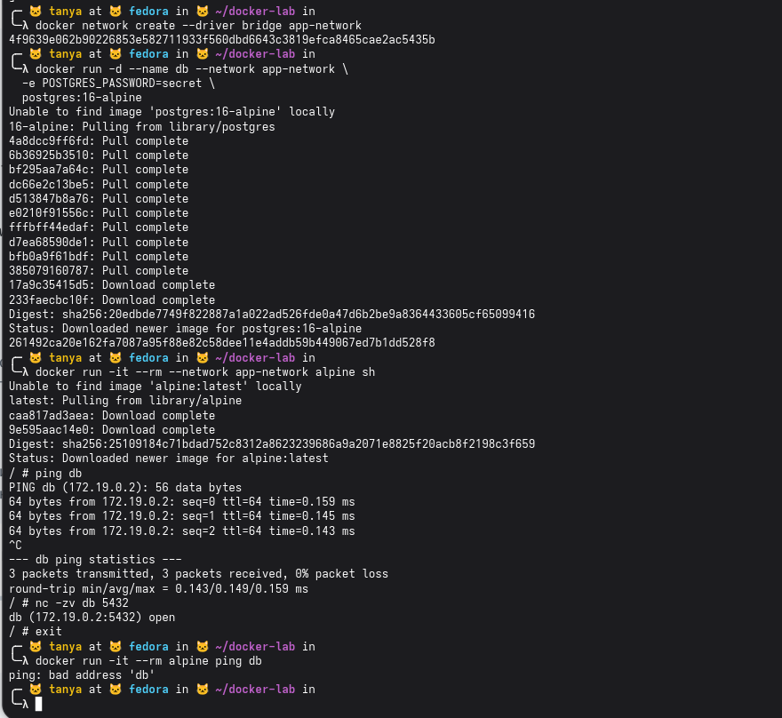
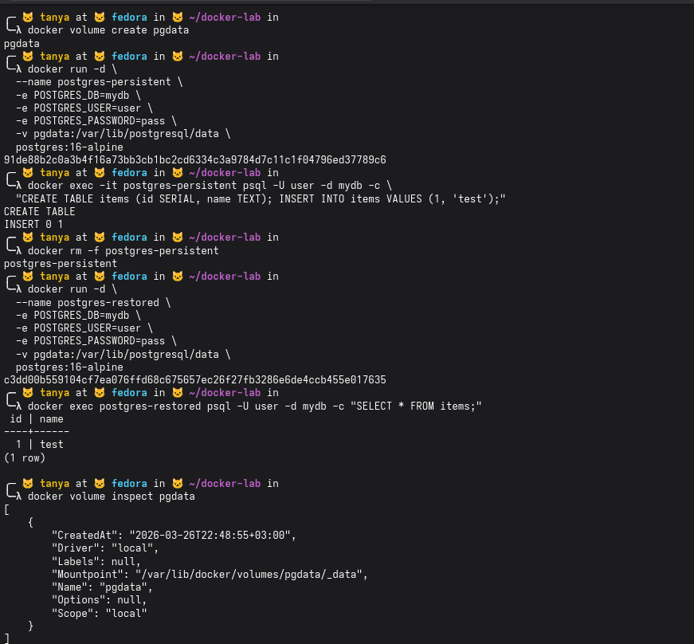
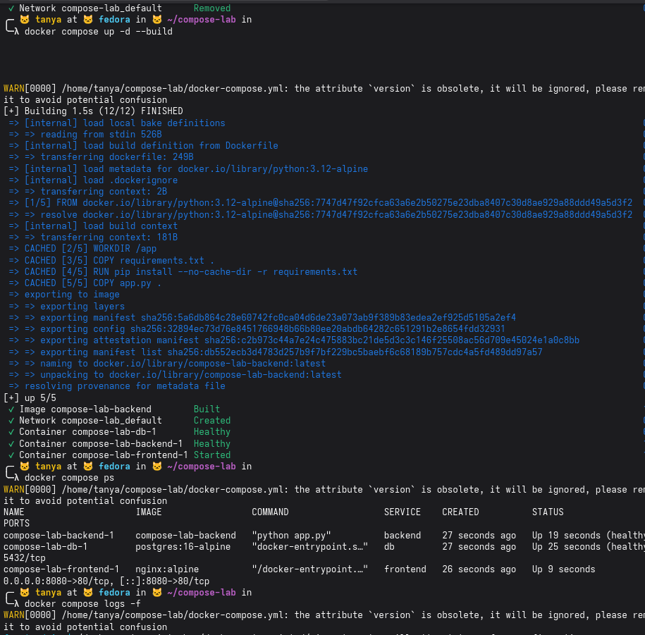
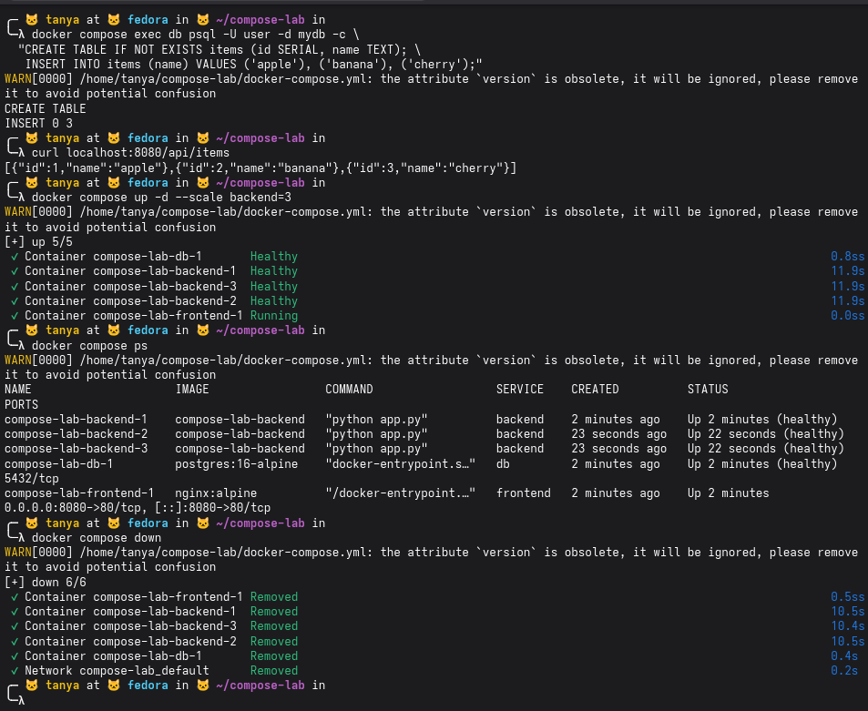
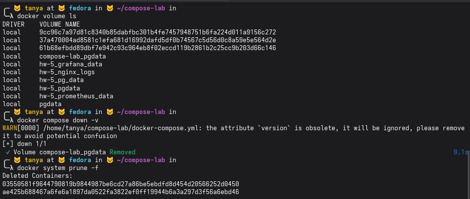

### Блок 1

создали bridge-сеть app-network, запустили postgres в этой сети — образ скачался с hub.

запустили alpine в той же сети и проверили: ping db резолвится в 172.19.0.2 и отвечает, nc показывает что порт 5432 открыт — dns и связность внутри сети работают.

потом запустили alpine без --network app-network и ping db сразу выдал "bad address 'db'" — контейнер вне сети вообще не видит db по имени, изоляция работает как надо

### Блок 2

создали volume pgdata, запустили postgres с этим volume, создали таблицу items и вставили запись. удалили контейнер через rm -f — контейнер умер, volume остался.

подняли новый контейнер postgres-restored с тем же volume, сделали SELECT * FROM items — данные на месте, id=1 name=test живые. это и есть смысл volumes — данные не привязаны к контейнеру.

docker volume inspect показывает что физически volume лежит на хосте в /var/lib/docker/volumes/pgdata/_data

### Блок 3

всё поднялось. все три контейнера живые — db healthy, backend healthy, frontend started. docker compose ps показывает стек: backend на 5000, db на 5432, frontend слушает 8080. healthcheck починился через urllib вместо wget

создали таблицу и вставили три записи, curl localhost:8080/api/items вернул json с apple, banana, cherry — вся цепочка frontend→backend→db работает.

потом масштабировали backend до 3 экземпляров через --scale backend=3, docker compose ps показывает backend-1, backend-2, backend-3 все healthy. db и frontend по одному экземпляру как и было.

в конце docker compose down убрал все 6 контейнеров и сеть

### Блок 4

все остановили и очистили
