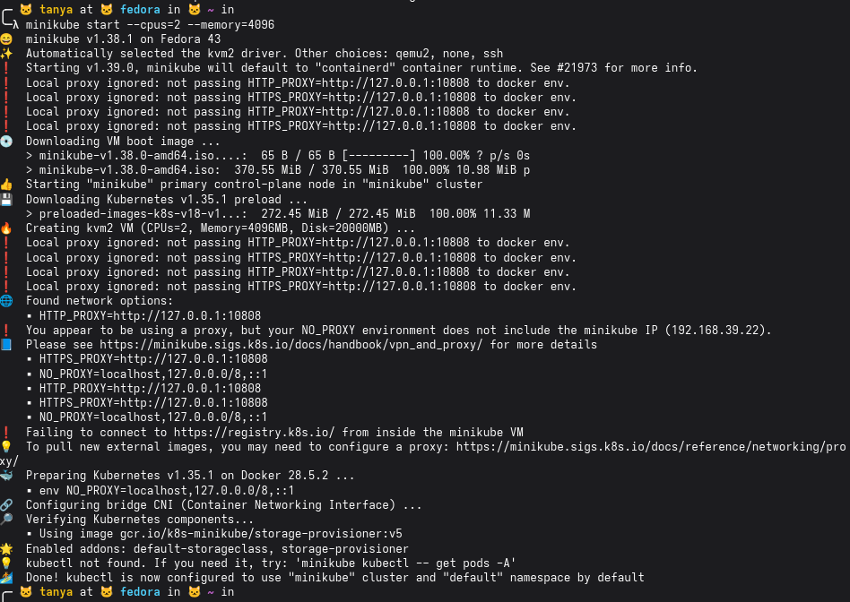
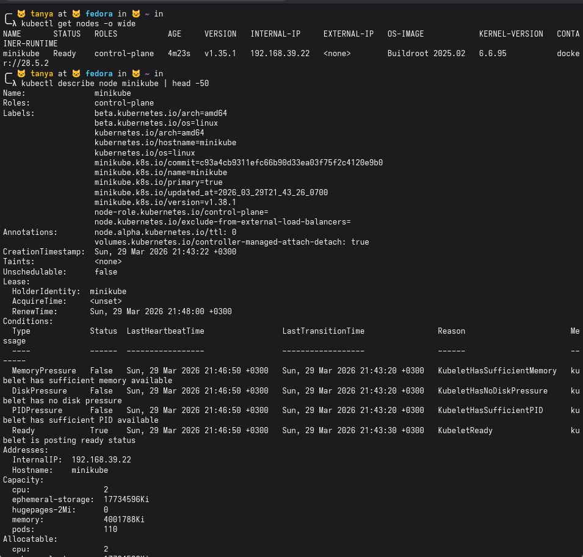
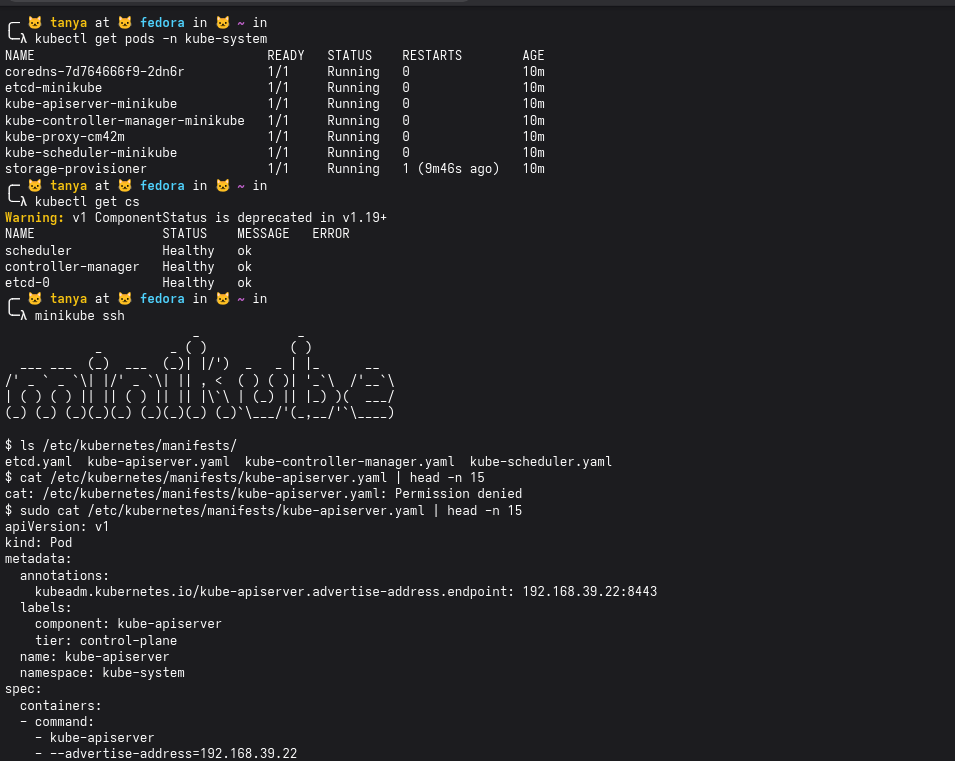
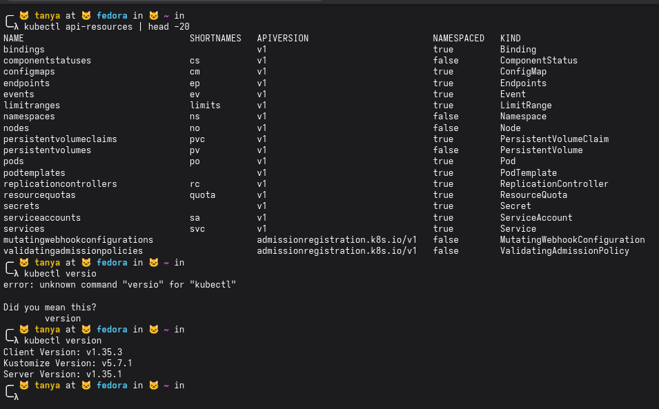
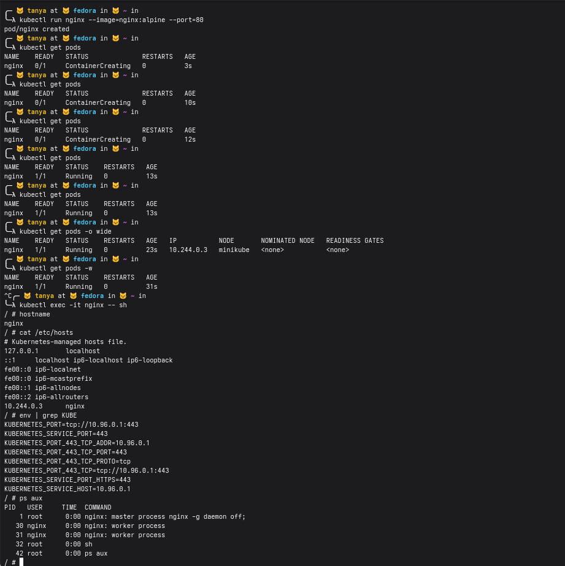
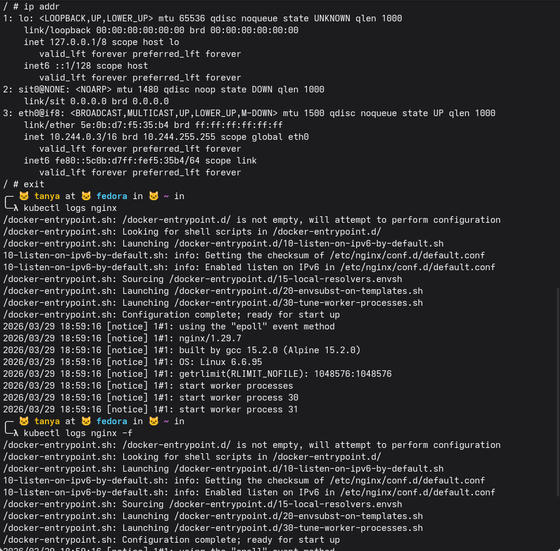
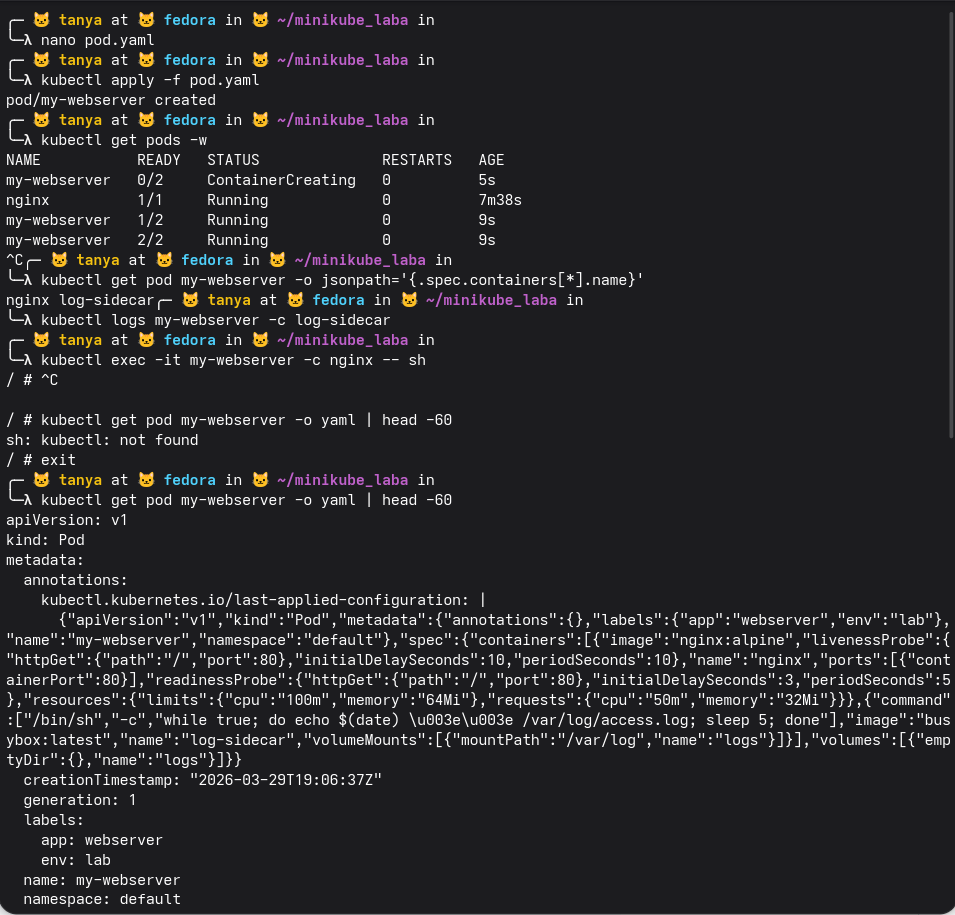
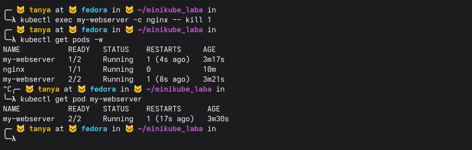

### Окружение

Был установлен minikube (по рекомендации методички) и поднят уже подготовленный кластер.

### Блок 1

kubectl get nodes показывает одну ноду minikube, статус Ready, роль control-plane, версия k8s v1.35.1, ip 192.168.39.22, работает на Buildroot 2025.02 с ядром 6.6.95.

kubectl describe node показывает детали — нода поднялась сегодня в 21:43, все условия в норме: MemoryPressure, DiskPressure, PIDPressure все False (то есть ресурсов хватает), Ready True. ресурсов на ноде: 2 cpu, ~4GB памяти, может держать до 110 подов

kubectl get pods -n kube-system показывает все системные поды — coredns, etcd, kube-apiserver, kube-controller-manager, kube-proxy, kube-scheduler, storage-provisioner, все Running.

kubectl get cs показывает что scheduler, controller-manager и etcd все Healthy, команда deprecated но работает.

minikube ssh — зашли внутрь виртуалки minikube потому что control plane живёт там, а не на хосте, поэтому /etc/kubernetes на хосте и не было. внутри ls /etc/kubernetes/manifests/ показал 4 статических манифеста: etcd, kube-apiserver, kube-controller-manager, kube-scheduler. открыли kube-apiserver.yaml — это обычный Pod манифест, видно что apiserver слушает на 192.168.39.22:8443

kubectl api-resources показывает первые 20 типов объектов которые умеет k8s — pods, services, nodes, secrets, configmaps и тд, у каждого есть короткое имя (po, svc, no) и флаг namespaced — глобальные объекты типа nodes и persistentvolumes не привязаны к namespace. kubectl version показал: клиент v1.35.3, сервер v1.35.1.

Какие поды в kube-system всегда должны быть Running?
в kube-system всегда должны быть Running: kube-apiserver, etcd, kube-controller-manager, kube-scheduler (это control plane), kube-proxy на каждой ноде и coredns для dns внутри кластера. без любого из них кластер либо не работает либо деградирует

### Блок 2

запустили под nginx, несколько раз get pods пока он поднимался — ContainerCreating секунд 13, потом Running. get pods -o wide показал что под живёт на ноде minikube с ip 10.244.0.3.

зашли внутрь через exec -it, посмотрели:

hostname — просто "nginx", совпадает с именем пода
/etc/hosts — k8s сам управляет этим файлом, там прописан ip пода 10.244.0.3 с именем nginx
env | grep KUBE — k8s автоматически прокидывает в каждый под переменные окружения с адресом kubernetes api (10.96.0.1:443)
ps aux — видно только nginx master, два воркера и наш sh, больше ничего — pid namespace изолирован

ip addr внутри пода — видно три интерфейса: lo (loopback), sit0 (туннельный, не используется), eth0 с ip 10.244.0.3 — это и есть ip пода в сети кластера, совпадает с тем что показывал get pods -o wide. сетевой namespace полностью свой.

kubectl logs nginx — стандартный старт nginx: entrypoint настроил конфиги, включил ipv6, запустил воркер процессы 30 и 31. nginx версии 1.29.7 на alpine.

kubectl logs nginx -f — то же самое но в режиме follow, новых запросов не было поэтому вывод идентичный

### Блок 3

создали pod.yaml через nano, применили — pod/my-webserver created. get pods -w показал как поднимался: сначала 0/2 ContainerCreating, через 9 секунд 1/2 потом 2/2 Running — оба контейнера запустились.

jsonpath показал имена контейнеров в поде: nginx и log-sidecar.

зашли в nginx контейнер через exec -it -c nginx, попробовали запустить kubectl внутри — not found, это ожидаемо, в контейнере только nginx, никаких лишних инструментов нет.

kubectl get pod my-webserver -o yaml снаружи показал полный yaml пода — k8s добавил к нашему манифесту кучу дефолтов: annotations с last-applied-configuration, creationTimestamp, generation, labels app:webserver env:lab

### Блок 4

убили nginx процесс через kill 1, get pods -w показал что my-webserver упал до 1/2 и сразу поднялся обратно до 2/2, RESTARTS стал 1.

Почему Pod не удалился, а перезапустился? Кто за это отвечает?
pod не удалился потому что за это отвечает kubelet, он на каждой ноде следит за контейнерами и если контейнер упал — перезапускает его согласно restartPolicy (по умолчанию Always). удалить под может только пользователь или controller, сам по себе он не исчезает

