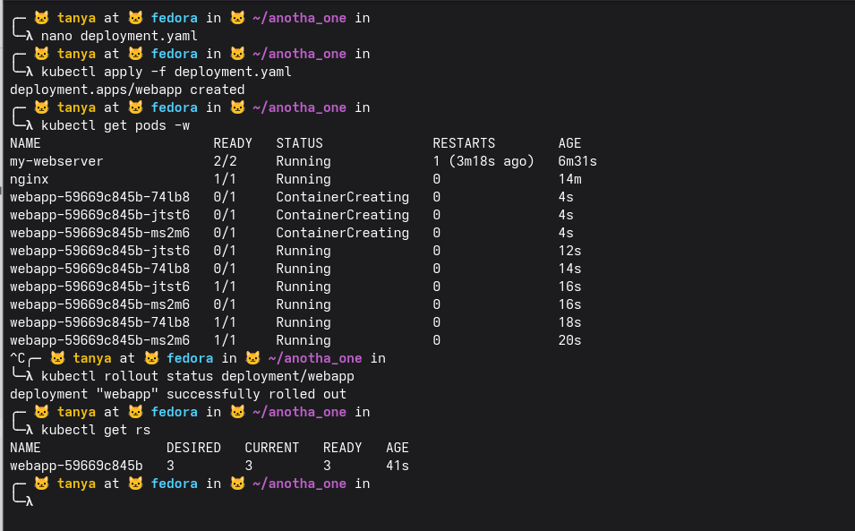
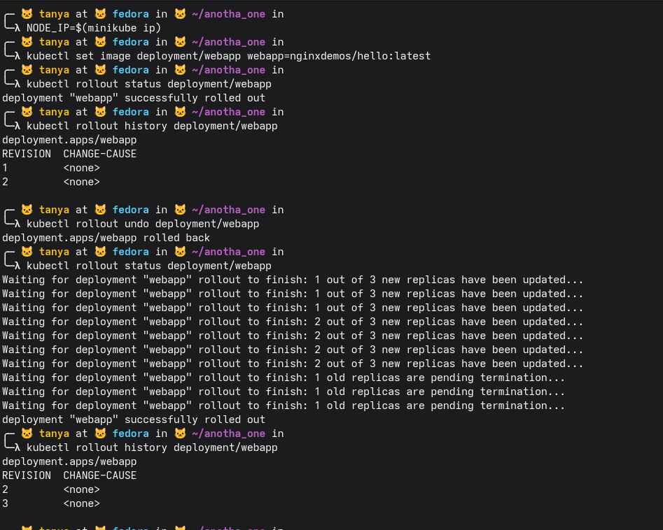
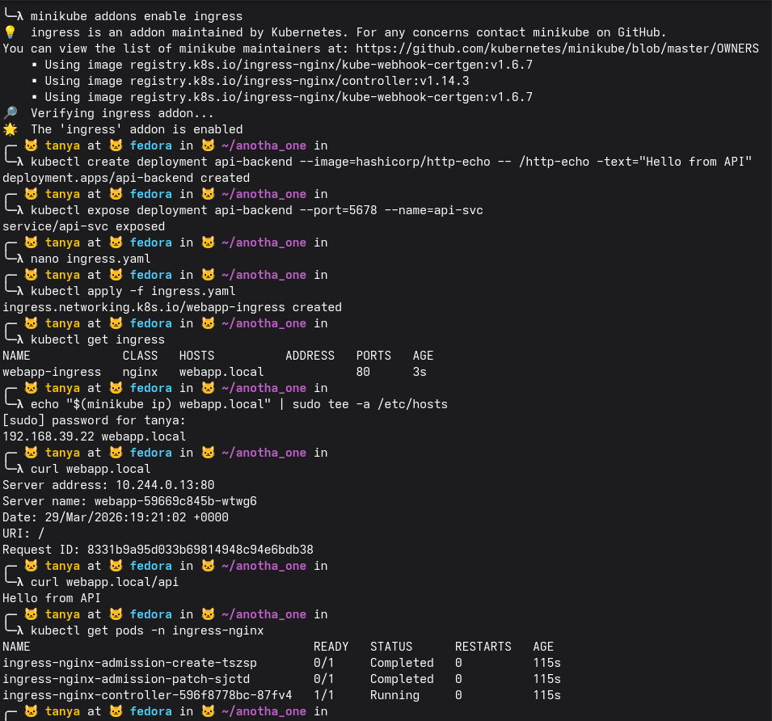
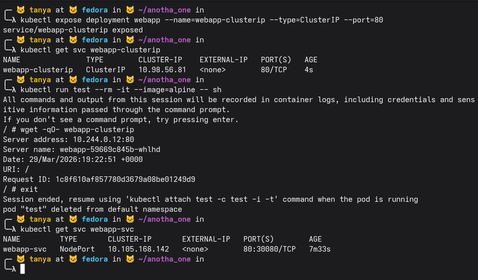

### Блок 1

создали deployment.yaml, применили — deployment.apps/webapp created. get pods -w показал как поднимались 3 пода (webapp-59669c845b-74lb8, jtst6, ms2m6) — сначала все ContainerCreating, через ~15 секунд все 1/1 Running.

rollout status подтвердил что деплоймент успешно раскатился. get rs показывает replicaset webapp-59669c845b с desired=3, current=3, ready=3 — все три пода живые

### Блок 2

получили NODE_IP через minikube ip, обновили образ на nginxdemos/hello:latest через set image — rollout прошёл успешно. history показал две ревизии (1 и 2), change-cause пустой потому что не указывали --record.

сделали rollout undo — откат на предыдущую версию. rollout status показал процесс в реальном времени: сначала обновились 2 из 3 подов, потом старые поды начали уничтожаться по одному. всё прошло без простоев. history теперь показывает ревизии 2 и 3 — старая ревизия 1 стала новой 3

### Блок 3

включили ingress аддон в minikube — поставился nginx ingress controller v1.14.3. создали api-backend деплоймент с http-echo и expose его как api-svc на порту 5678. написали ingress.yaml и применили — webapp-ingress создан.

добавили запись в /etc/hosts: 192.168.39.22 webapp.local.

curl webapp.local вернул ответ от одного из webapp подов (webapp-59669c845b-wtwg6) с его ip и датой — маршрутизация на / работает. curl webapp.local/api вернул "Hello from API" — маршрутизация на /api до api-backend тоже работает.

get pods -n ingress-nginx показывает три пода контроллера: два джоба (Completed) которые настраивали webhook и certgen, и сам ingress-nginx-controller Running

### Блок 4

10:24 PM

создали ClusterIP сервис webapp-clusterip — get svc показывает ip 10.98.56.81, EXTERNAL-IP none, доступен только внутри кластера.

запустили alpine под внутри кластера и wget -qO- webapp-clusterip отработал — получили ответ от пода webapp-59669c845b-whlhd. после exit под удалился (--rm).

get svc webapp-svc показывает NodePort — тоже нет EXTERNAL-IP, но порт 80:30080, то есть доступен снаружи через ip ноды на порту 30080.

ClusterIP это виртуальный ip только внутри кластера, снаружи недоступен вообще, используется для связи между сервисами внутри. NodePort пробрасывает порт на каждую ноду кластера, то есть можно достучаться снаружи через ip_ноды:30080, но это не особо удобно для продакшена — для этого обычно используют LoadBalancer или Ingress поверх ClusterIP

