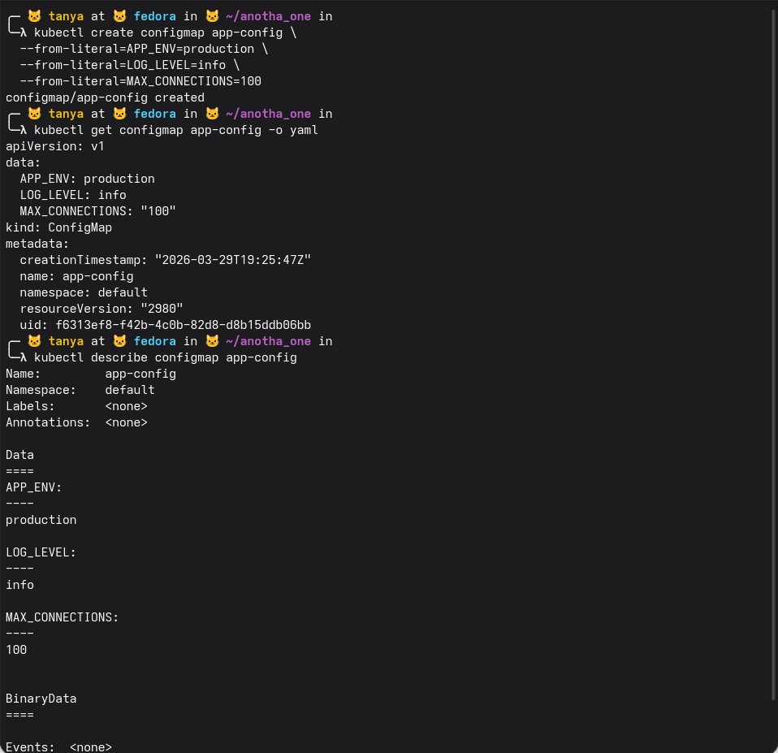
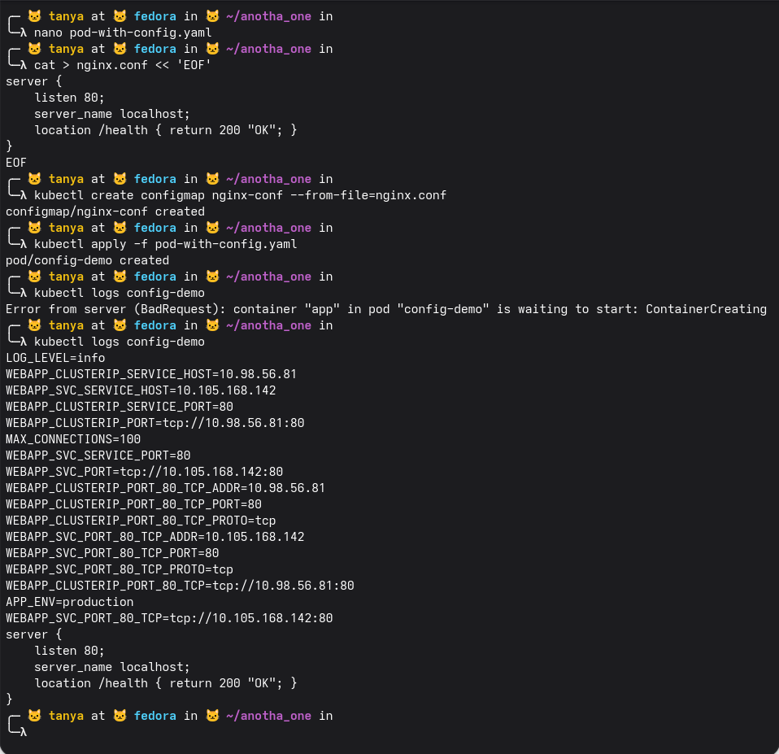
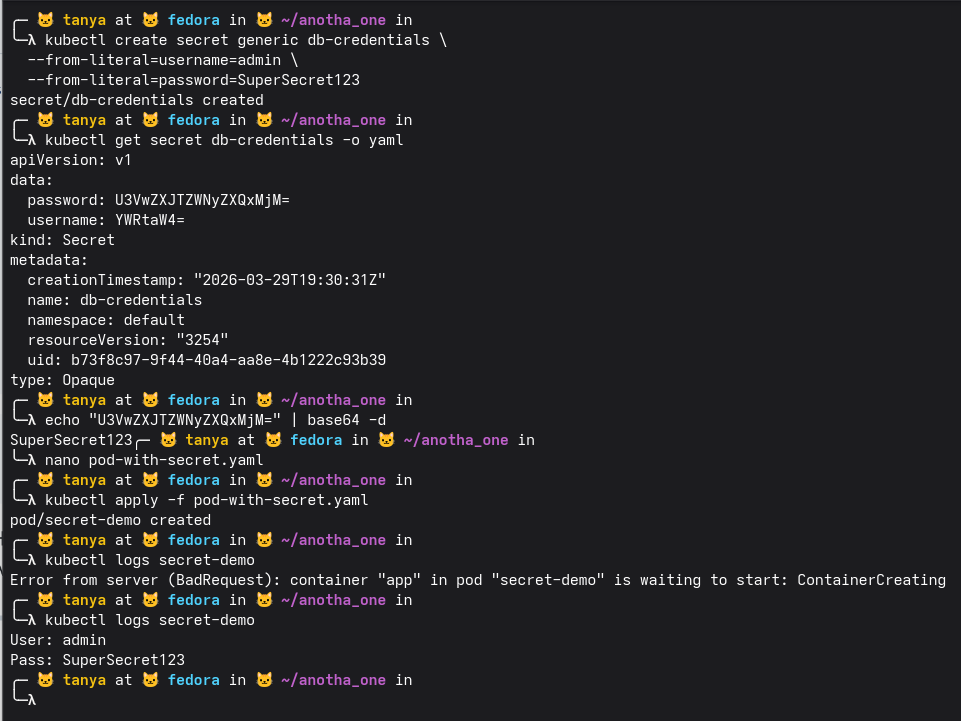
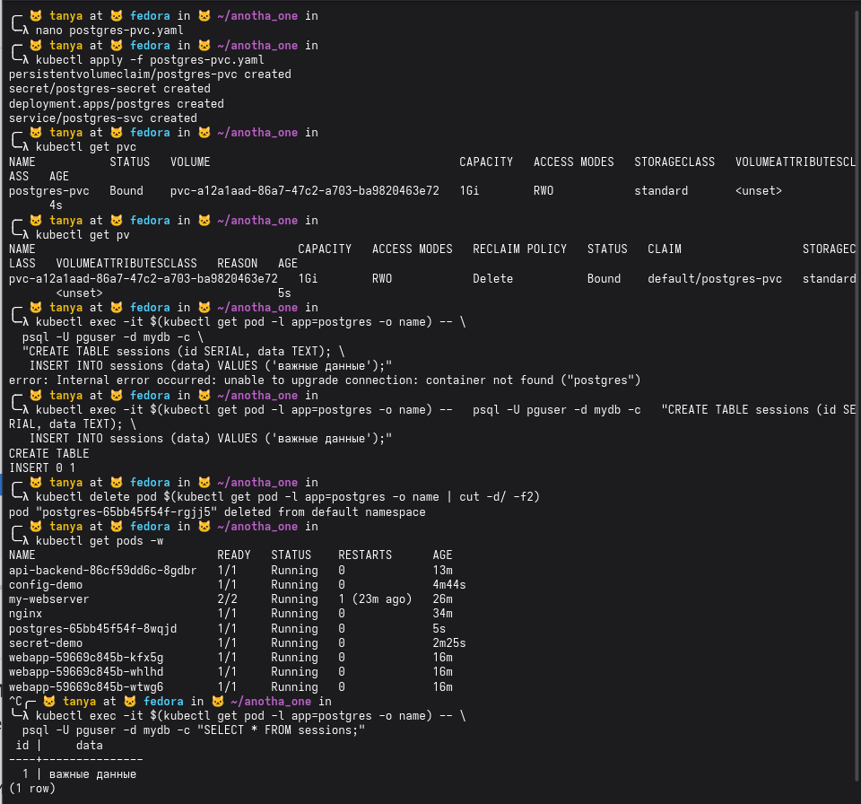

### Блок 1

создали configmap app-config с тремя ключами через --from-literal: APP_ENV=production, LOG_LEVEL=info, MAX_CONNECTIONS=100.

get configmap -o yaml показал содержимое в виде yaml — данные хранятся как обычный текст в поле data. describe показывает то же самое но читабельнее — каждый ключ и его значение отдельно. BinaryData пустой, Events none — configmap просто лежит и ждёт когда его примонтируют в под или прокинут как env переменные

создали nginx.conf через heredoc и сделали из него второй configmap nginx-conf через --from-file. применили pod-with-config.yaml — pod/config-demo created.

первый kubectl logs упал с ошибкой потому что под ещё не поднялся (ContainerCreating), второй уже отработал нормально.

в логах видно что configmap пробросился в под как env переменные — APP_ENV=production, LOG_LEVEL=info, MAX_CONNECTIONS=100 все на месте. плюс k8s автоматически добавил переменные про все сервисы в namespace (WEBAPP_CLUSTERIP и WEBAPP_SVC со всеми их адресами и портами). в конце видно содержимое nginx.conf — он примонтировался как файл внутрь пода

### Блок 2

создали secret db-credentials с username=admin и password=SuperSecret123. get secret -o yaml показывает что значения хранятся в base64 — U3VwZXJTZWNyZXQxMjM= и YWRtaW40=, не в открытом виде.

задекодировали пароль вручную через echo | base64 -d — получили SuperSecret123, то есть base64 это не шифрование а просто кодирование, любой у кого есть доступ к секрету может его прочитать.

создали pod-with-secret.yaml, применили, первый logs упал на ContainerCreating, второй уже показал что секрет пробросился в под — User: admin, Pass: SuperSecret123 в открытом виде внутри контейнера

### Блок 3

10:34 PM

применили postgres-pvc.yaml — создались сразу 4 объекта: pvc, secret, deployment и service. pvc Bound, pv создался автоматически на 1Gi.

первый exec упал потому что под ещё не был готов, второй без многострочного переноса отработал — CREATE TABLE и INSERT 0 1 прошли.

удалили под вручную через delete pod — deployment тут же поднял новый (postgres-65bb45f54f-8wqjd), это и есть суть deployment. get pods -w показал что новый под уже Running через 5 секунд.

SELECT * FROM sessions на новом поде вернул данные — id=1, data="важные данные". данные пережили удаление пода потому что лежат в PVC, который к поду не привязан

