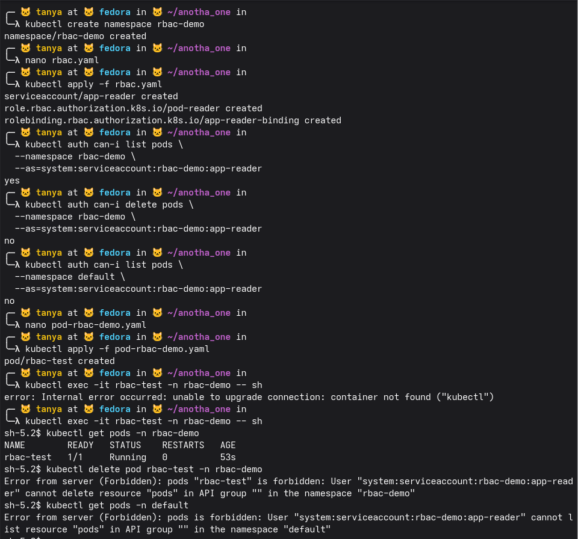
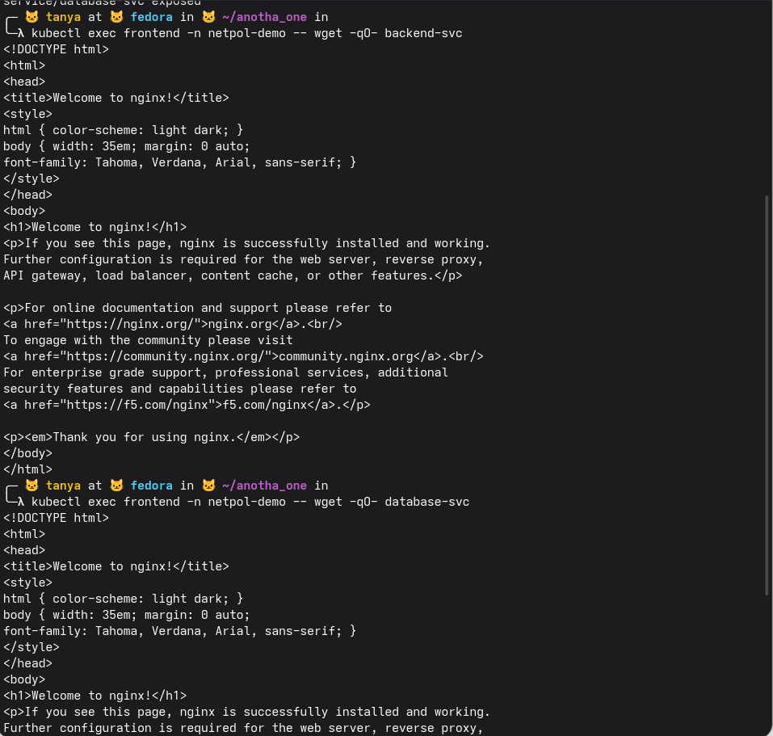
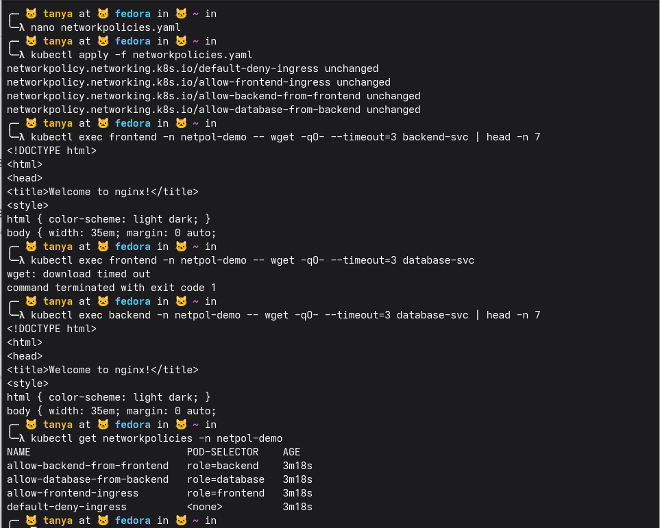
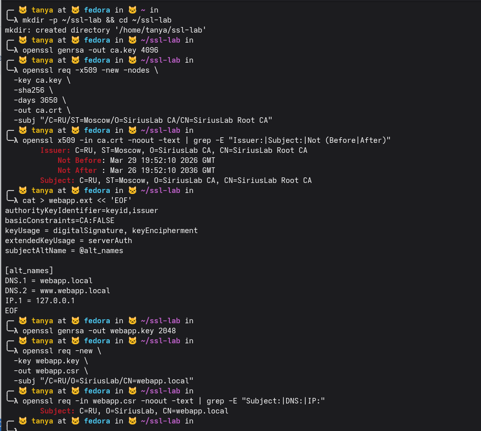
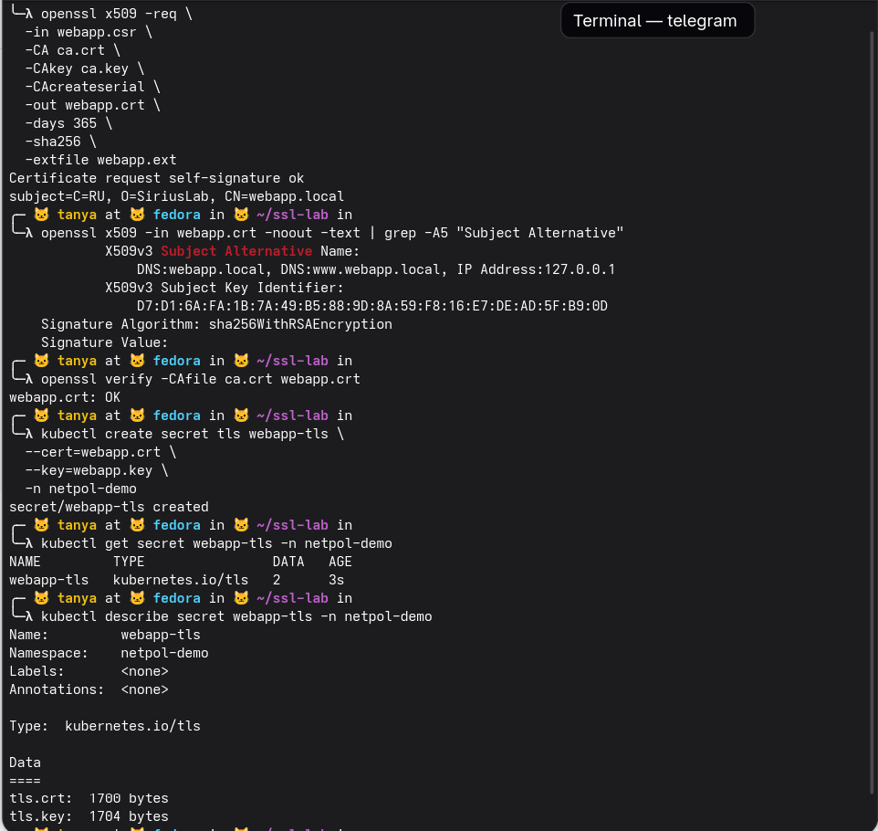
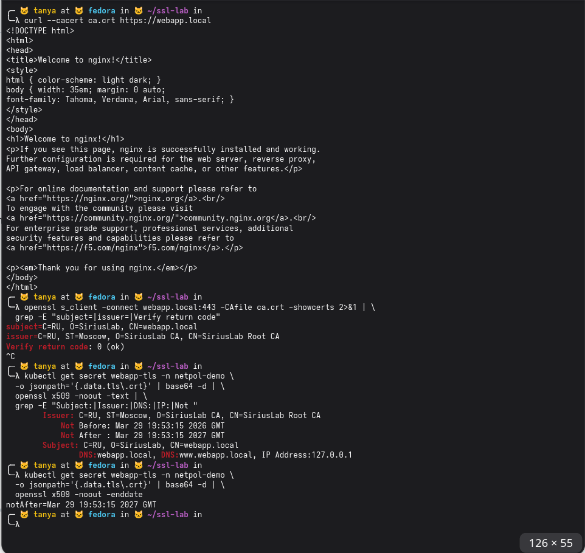

### Блок 1

создали namespace rbac-demo, применили rbac.yaml — создались serviceaccount app-reader, role pod-reader и rolebinding app-reader-binding.

проверили права через auth can-i: list pods в rbac-demo — yes, delete pods в rbac-demo — no, list pods в default — no. всё точно по роли, только чтение подов только в своём namespace.

создали под rbac-test в rbac-demo, первый exec упал (контейнер ещё не готов), второй зашёл. внутри пода под serviceaccount app-reader: kubectl get pods -n rbac-demo отработал — видит rbac-test. kubectl delete pod — Forbidden, нет прав на удаление. kubectl get pods -n default — тоже Forbidden, роль не распространяется на другие namespace. rbac работает как надо

### Блок 2

поды были созданы и они могут общаться друг с другом (до политик).

после пересоздания с calico networkpolicies заработали. применили yaml — все 4 политики unchanged (уже были).

проверили три сценария: frontend → backend-svc — отдал html, работает. frontend → database-svc — wget timed out, заблокировано. backend → database-svc — работает.

get networkpolicies показывает все 4 политики с их селекторами. изоляция работает как задумано — цепочка frontend→backend→database соблюдается, прямой доступ frontend к database закрыт

### Блок 3

создали директорию ssl-lab, сгенерировали приватный ключ CA на 4096 бит через openssl genrsa. создали самоподписанный корневой сертификат CA на 10 лет с subj SiriusLab Root CA.

проверили сертификат — Issuer и Subject одинаковые (это и есть самоподписанный), действует с 29 марта 2026 по 26 марта 2036.

создали webapp.ext с SAN — прописали DNS.1=webapp.local, DNS.2=www.webapp.local, IP.1=127.0.0.1. сгенерировали ключ сервера на 2048 бит и CSR для webapp.local. проверили CSR — Subject содержит CN=webapp.local

подписали CSR нашим CA — webapp.crt создан. проверили сертификат — Subject Alternative Name содержит DNS:webapp.local, DNS:www.webapp.local и IP:127.0.0.1, всё как прописывали в webapp.ext. подпись sha256WithRSAEncryption.

openssl verify -CAfile ca.crt webapp.crt вернул OK — цепочка доверия валидна.

создали TLS secret в k8s: kubectl create secret tls webapp-tls с нашими crt и key в namespace netpol-demo. get secret показывает тип kubernetes.io/tls, describe — внутри два поля tls.crt 1700 байт и tls.key 1704 байта, хранятся в base64

всё заработало. curl --cacert ca.crt https://webapp.local вернул html — TLS соединение установлено с нашим сертификатом.

openssl s_client подтвердил: subject это webapp.local, issuer это SiriusLab Root CA, Verify return code: 0 (ok) — цепочка доверия валидна.

декодировали сертификат прямо из k8s secret через jsonpath + base64 -d — видно Issuer, Subject, SAN (DNS:webapp.local, DNS:www.webapp.local, IP:127.0.0.1) и срок действия. enddate показал что сертификат истекает 29 марта 2027

