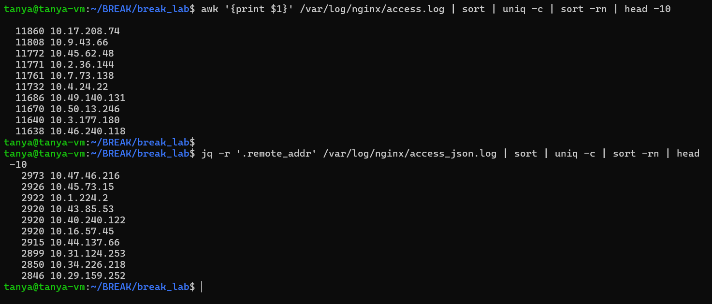

две команды для получения топ-10 IP по количеству запросов.
первая через awk - берёт первое поле (ip) из классического access.log, сортирует, считает uniq -c, сортирует по убыванию и берёт топ 10. лидер 10.17.208.74 с ~11860 запросами, все ip примерно одинаково активны.
вторая через jq - то же самое но из json лога, достаёт поле remote_addr. количества заметно меньше (~2973 у лидера) - json лог гораздо меньше

