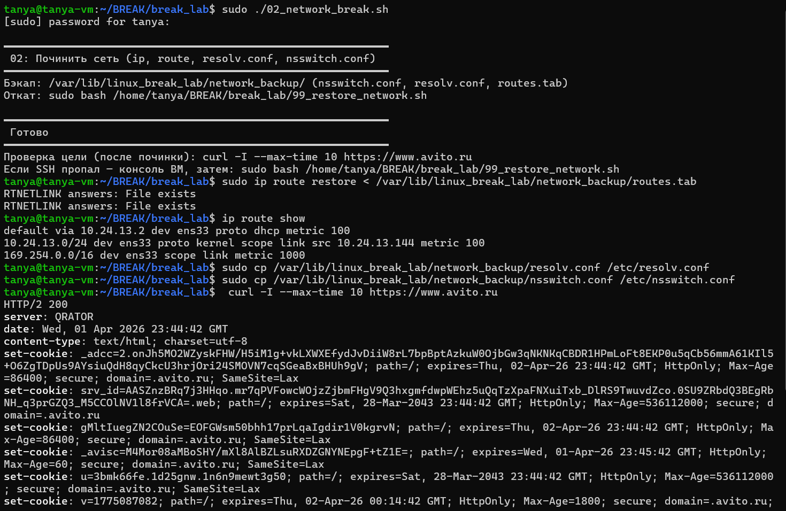

скрипт 02_network_break.sh сломал сеть - маршруты, resolv.conf и nsswitch.conf. задача починить.
восстановили маршруты через ip route restore из бэкапа, ip route show показал что default gateway через 10.24.13.2 на ens33 вернулся. скопировали resolv.conf и nsswitch.conf из бэкапа обратно в /etc.
проверка curl -I https://www.avito.ru вернула HTTP/2 200 - сеть работает, dns резолвится, интернет есть

не знаю предполагалось ли восстановление из бэкапов, но как будто это единственное, что стоит делать в данной ситуации (если бэкапы есть).
если же бы их не было, то можно было бы в resolv.conf поставить днс какой нибудь гугла 8.8.8.8 либо локальный днс компании или что то такое...
по аналогии и с другим

