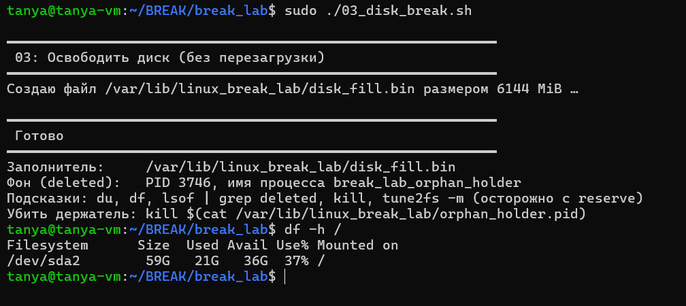
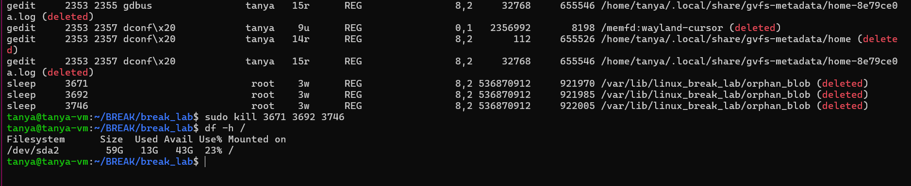

скрипт 03 создал файл, который заполнил диск, как я поняла он должен был заполнить весь диск, но вышло только 6 гигов... сделаем вид типо у нас фулл диск заполнен и это мы увидели после вывода df -h /. начала искать в /var/lib/linux_break_lab чтобы команда выполнялась не слишком долго, нашли и удалили файл.

файл держал процесс, поэтому была запущена команда sudo lsof | grep deleted, и снизу было как раз три процесса, которые держат наш файл, их 3, т.к. скрипт запускался 3 раза в целях проверки, все процессы были убиты и место освободилось

