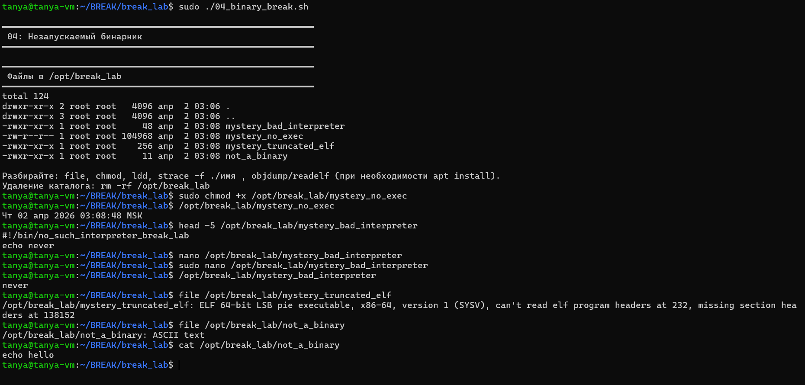

скрипт 04_binary_break.sh создал 4 сломанных файла в /opt/break_lab, задача разобраться с каждым.
mystery_no_exec - не имел бита исполнения, починили через chmod +x, запустился и вывел текущее время.
mystery_bad_interpreter - head показал shebang #!/bin/no_such_interpreter_break_lab, интерпретатора не существует. исправили через nano на #!/bin/bash, запустился и вывел "never"
mystery_truncated_elf - запустив команду file, она определила что отстутствуют заголовки - файл повреждён, запустить невозможно.
not_a_binary - file показал ASCII text, внутри просто "echo hello", это скрипт без shebang а не бинарник вообще.

