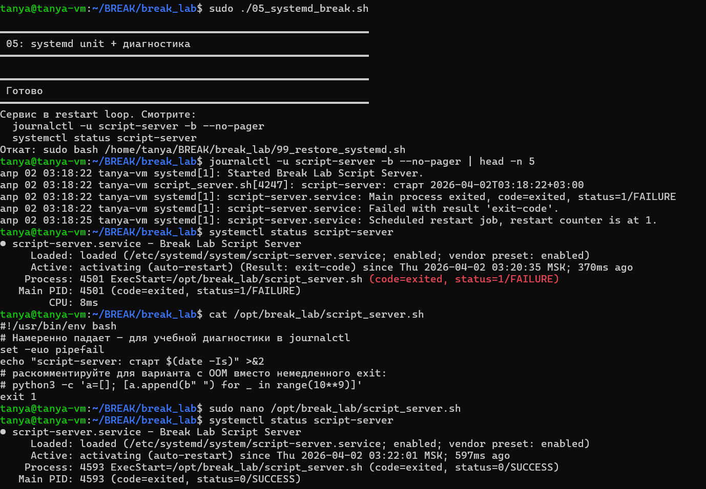

journalctl показал что сервис стартует и сразу падает с exit code 1. cat скрипта показал причину - в конце явный exit 1.
починили через sudo nano - exit 1 на exit 0. после этого systemctl status показывает code=exited, status=0/SUCCESS - сервис завершается успешно, цикл рестартов прекратился

