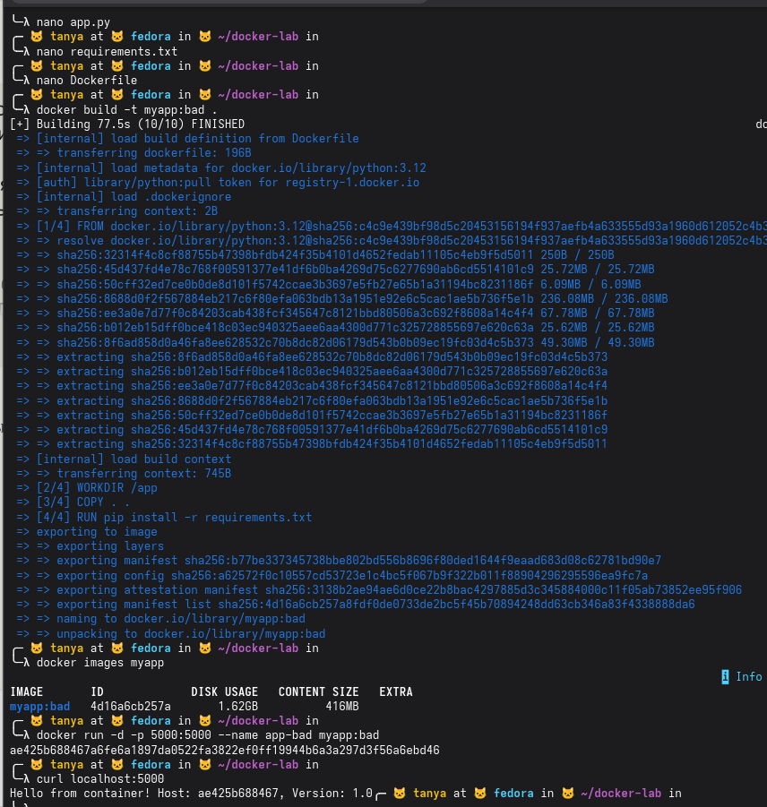
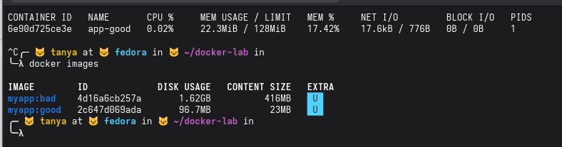
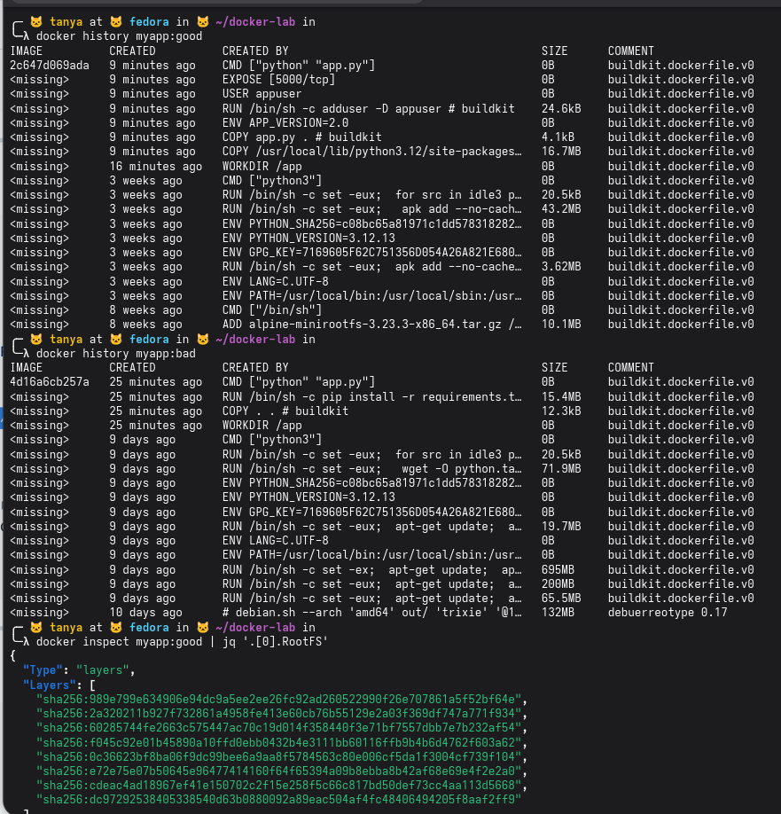
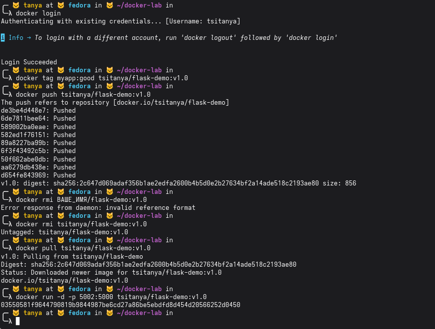

### Блок 1
создали три файла через nano — app.py, requirements.txt и Dockerfile. собрали образ myapp:bad — docker скачал python:3.12, прогнал 4 шага (FROM, WORKDIR, COPY, RUN pip install), всё собралось.

docker images показывает размер — 1.62GB disk usage, 416MB content size. это и есть "плохой" образ — базовый python:3.12 тянет за собой полный debian со всеми инструментами, компиляторами и прочим мусором который для запуска flask вообще не нужен.

запустили контейнер, curl localhost:5000 вернул ответ — приложение работает, hostname это id контейнера, версия 1.0 как и задано по дефолту в коде.

Почему образ такой большой?

образ большой именно потому что FROM python:3.12 это полный образ на базе debian, внутри gcc, make, куча системных либ. всё это нужно для сборки но не для запуска

### Блок 2
всё заработало. docker stats показывает app-good живёт, жрёт 0.02% cpu и 22.3MB из выделенных 128MB памяти, лимиты применились.

docker images показывает разницу — myapp:bad весит 1.62GB, myapp:good всего 96.7MB, то есть образ уменьшился примерно в 17 раз за счёт multistage build и alpine базы

### Блок 3
docker history показывает слои обоих образов.

у myapp:good видно всю цепочку — снизу вверх: alpine базовый образ (10MB), потом системные слои python, потом наши: COPY site-packages (16.7MB — это flask и зависимости), COPY app.py (4.1kB), ENV, adduser (24kB), EXPOSE, CMD. всё чистенько и компактно.

у myapp:bad картина другая — базовый debian уже тянет несколько жирных слоёв: apt-get update на 200MB, ещё один apt на 695MB, wget 71MB, и сверху наши pip install на 15MB и COPY. вот откуда 1.62GB.

docker inspect показывает RootFS — это список sha256 хешей всех слоёв образа, по ним docker понимает какие слои уже есть локально и не скачивает их повторно если они совпадают с другим образом

### Блок 4

залогинились в dockerhub под tsitanya, затегировали образ как tsitanya/flask-demo:v1.0 и запушили — все 9 слоёв ушли на хаб.

удалили локальный образ

запуллили образ обратно с hub — скачался успешно, запустили на порту 5002
