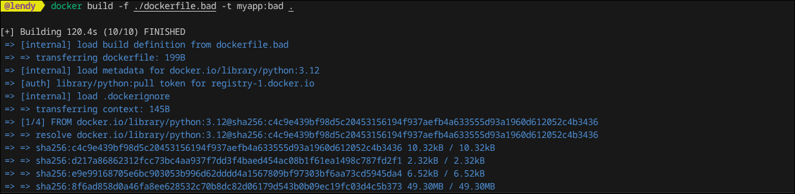
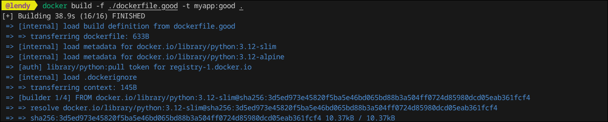
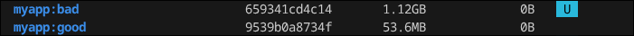
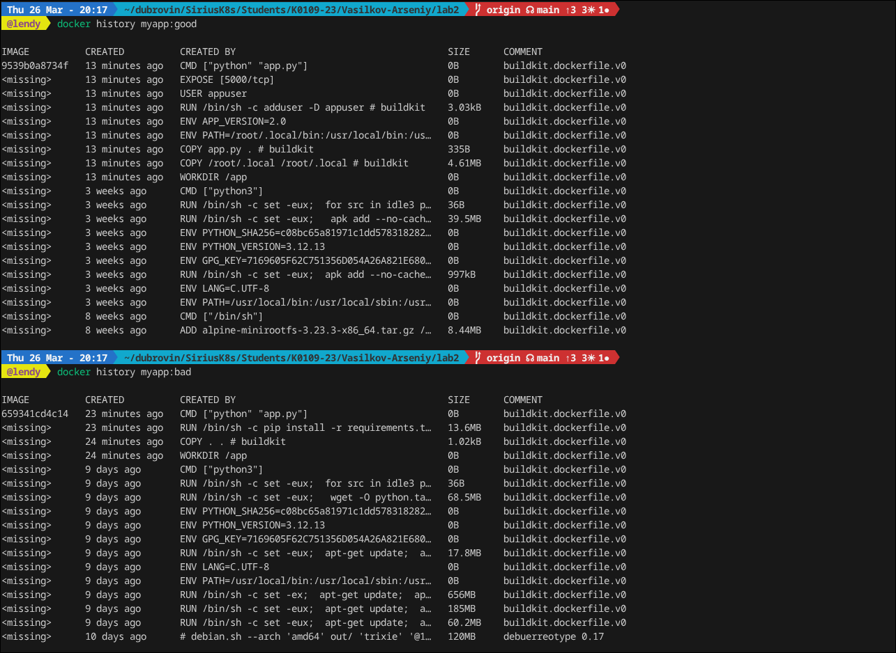
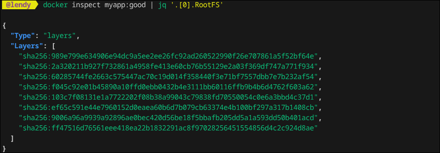
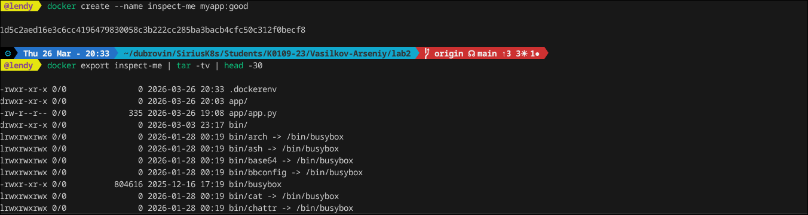
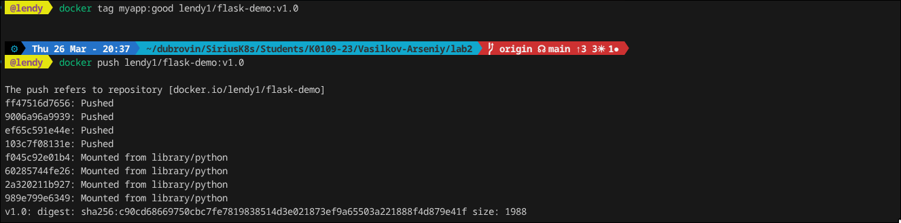
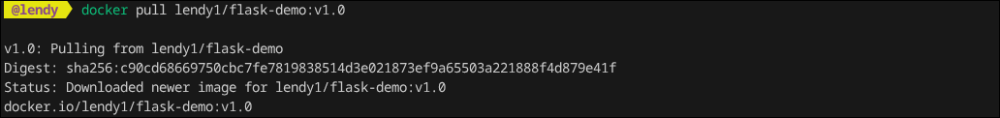

## Laba 2

### В данной лабе будет выполняться сравнение между сборкой плохого контейнера и адекватного (мужского), я про multi stage.

В дирректории ./lab2 будут находится конфиги, которые будут использоваться


Для начала соберем плохой докер контейнер



Почему он плохой, да потому что мы запихиваем все в него, зависимости, разные конфиги и после того как собираем контейнер не удаляем весь этот шлак, из за этого он получается таким большим

Соберем хороший контейнер, так скажем как правильный


Как можно заметить из вывода image ps хороший образ весит совсем мало, около 50 мб, а вот плохой больше +1GB.
Ответ на этот вопрос описан выше. 



### Далее можно запустить с ограничениями ресурсов 
```bash
docker run -d \
  -p 5001:5000 \
  --name app-good \
  --memory="128m" \
  --cpus="0.5" \
  --restart=unless-stopped \
  myapp:good

curl localhost:5001
docker stats app-good  # и посмотреть лимиты
```

После запуска можно посмотреть детальную инфомарцию по слоям контейнеров



Можно еще глянуь хэши уровней



Можно провернуть такую штуку, как не запуская контейнер глянуть его содержимое при помощи создания inspect



### После сборки и сравнения образов запушим их на докер хаб



Чтобы проверить что все ок, запулим образ




URL docker hub: https://hub.docker.com/r/lendy1/