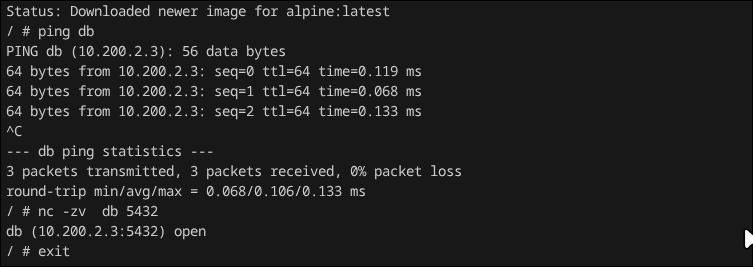
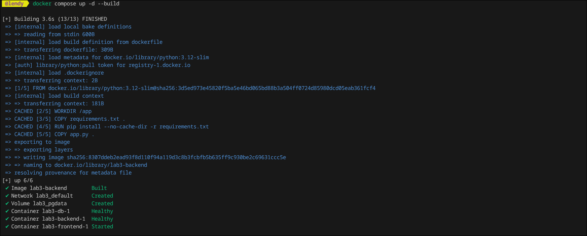
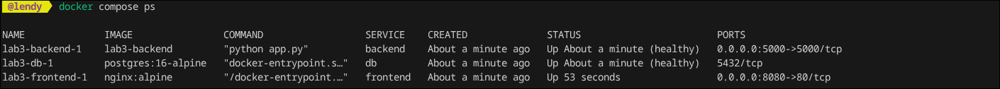
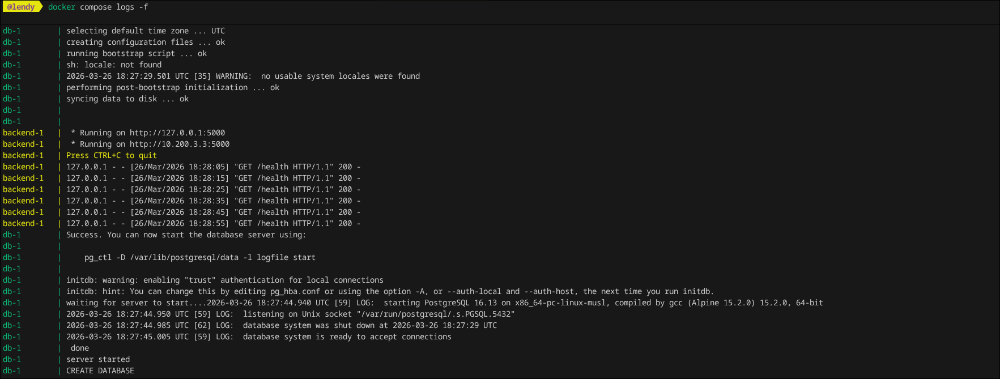
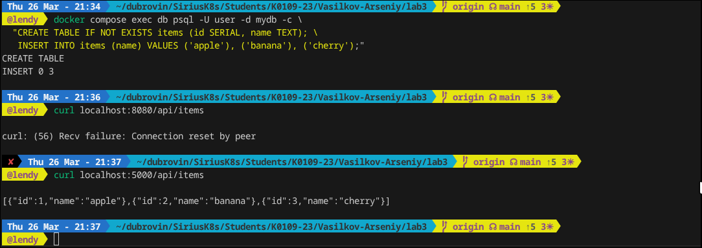
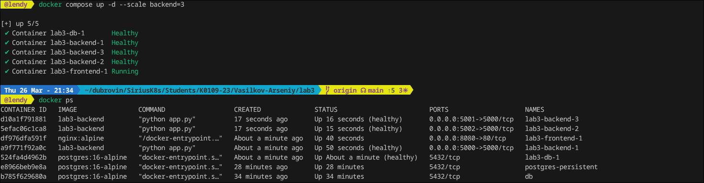

## Laba 3

В этой лабе будет рассмотрен базовый стек из 3 сервисов (frontend nginx + backend Flask + database PostgreSQL), поднятый через docker-compose в одной сетке.

Разберем Docker Networking, мы можем запускать контейнеры в одной сетке и стучаться друг в друга, пример запуска двух контейнера, с одного из которого показан успешный пинг к другому:

Такую же тему как с сетью можно проварачивать с volumes и persistent data, условно чтобы несколько контейнеров могли использовать те же данные, плюс если удалить контейнер, но не вольюм, то данные сохраняться. Вообщем вайб тема.

Создадим docker compose, это инcтрумент для централизованного запуска нескольких контейнеров и их управление.

Сборка прошла успешна. Проведем проверку контейнеров

Проверим также логи контейнеров

Проверим работу цепочки, созадим тест базу с тест таблицей и кинем запрос

Как можно заметить все ок, мы вывели из базы данные

Помимо простого создания контейнеров в docker compose можно их масштабировать при помощи scale, как можно заметить мы увеличили число контейнеров с бэком на 3

