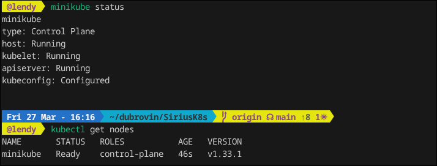
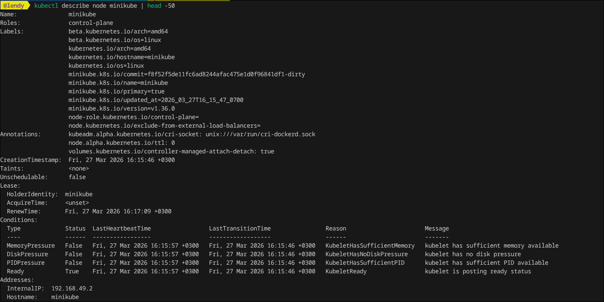
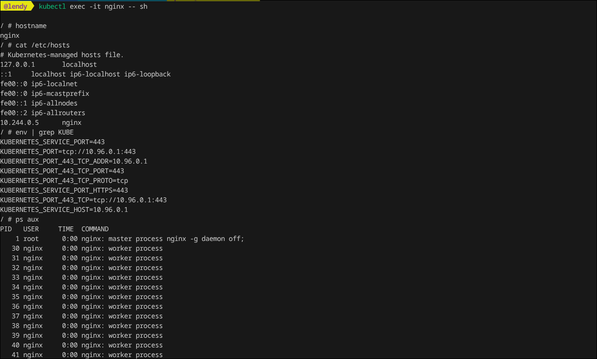
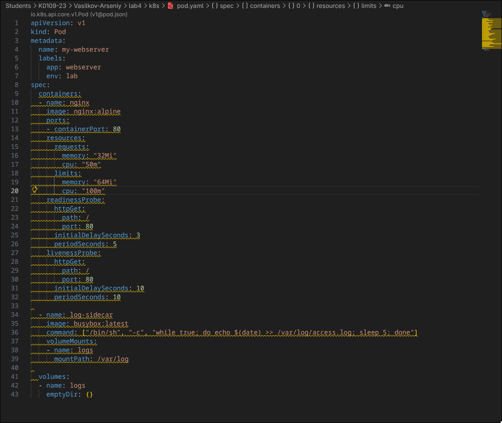
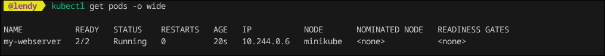
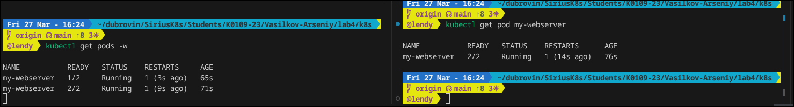

## Laba 4

#### В данной лабе будет разобрано несколько механик создания подов и их манипуляция в домашнем кластере куба (**minikube**). 

Для начало стоит его установить, это можно сделать на разные диструбутивы. Установить можно по данному мануалу: https://kubernetes.io/ru/docs/tasks/tools/install-minikube/

## Инфа про ноду
После установки необходимо его проверить, что он запустился и вывести инфу про кластер, глянуть ноды при помощи утилиты kubectl:



Как можно заметить кластер запустился, нода появилась, все ок

Помимо банального вывода можно детально дескрайбнуть ноду и вывести полную инфу про нее:



## Первый под

Создадим первый под, а также проверим его запуск командой:
```bash
kubectl run nginx --image=nginx:alpine --port=80
# проверка
kubectl get pods
```

После успещного запуска подключимся к нему и выполним ряд тестовых команд:




## Поднятие Pod через YAML 

В прошлом примере мы спулили под и запустили его, кроме пула, поды можно самому создавать и описывать их работу в специальных yaml файлах, манифестов.

Опишим работу пода:




После создания ямл файлика запустим его и проверим работу:



Как можно заметить, под работает, все ок

## Самовосстановление

У куба есть такая прикольная штука, как самовосстановление, а именно если под упадет или его намеренно удалить, то кластер его пересоздаст (рестарнет).

Удалим под 
```bash
kubectl exec my-webserver -c nginx -- kill 1
```

Смотрим в консоль


Как можно заметить мы удалили под, а он просто взял и перезапустился, вот так вот, бай бай. Увидимся в некст лабе.