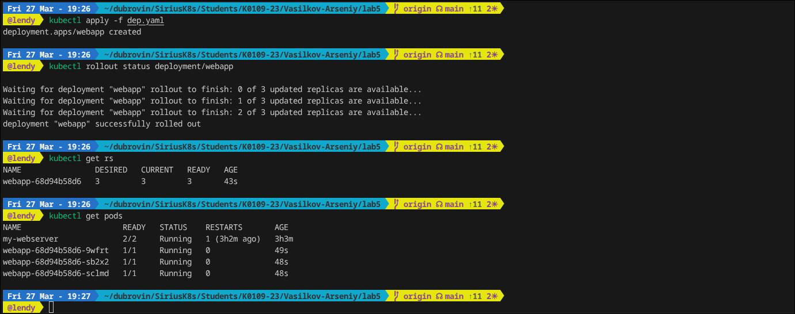
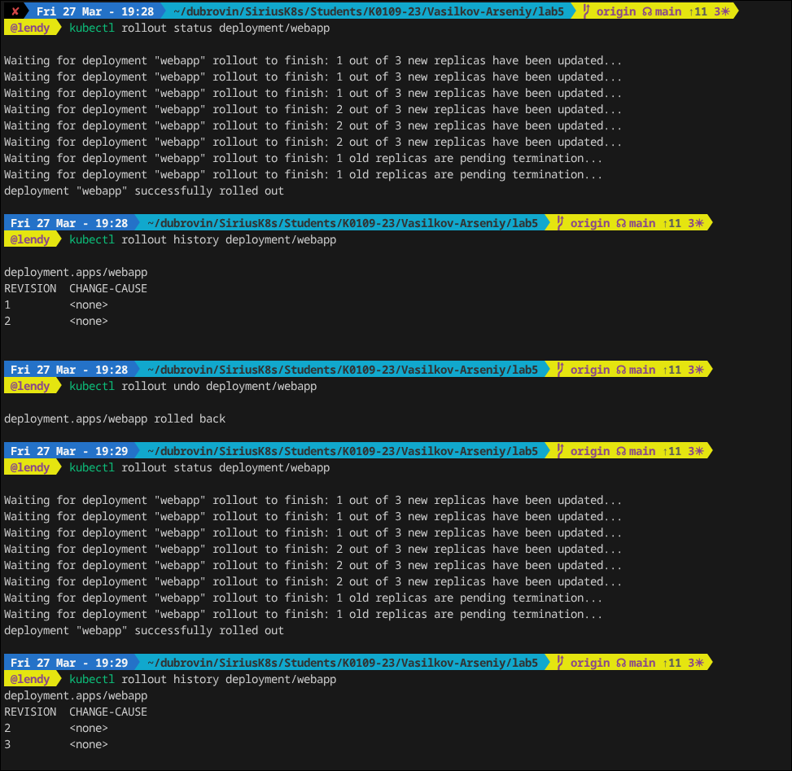
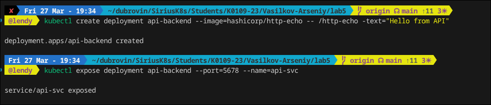
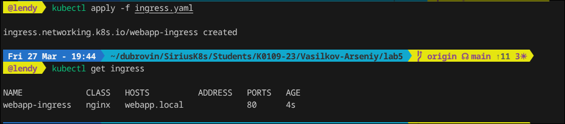
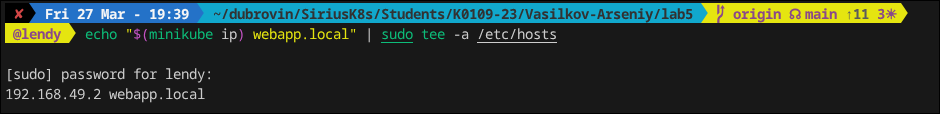
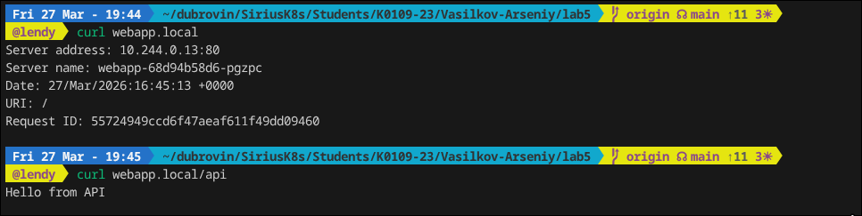

## Laba 5

В данной лабе будет рассмотрен один из механизмов для обновления конфигурации пода, а именно rolling update, также будет рассмотрено как откатывать версию и настраивать маршрутизацию трафика через Ingress.

### Блок 1 deployment

Создадим простой ямлик с данной конфигурацией:

```bash
apiVersion: apps/v1
kind: Deployment
metadata:
  name: webapp
  labels:
    app: webapp
spec:
  replicas: 3
  selector:
    matchLabels:
      app: webapp
  strategy:
    type: RollingUpdate
    rollingUpdate:
      maxSurge: 1        # на 1 под больше разрешённых во время обновления
      maxUnavailable: 0  # ни один под не падает во время обновления
  template:
    metadata:
      labels:
        app: webapp
        version: v1
    spec:
      containers:
      - name: webapp
        image: nginxdemos/hello:plain-text   # показывает имя хоста
        ports:
        - containerPort: 80
        resources:
          requests: { cpu: "50m", memory: "32Mi" }
          limits:   { cpu: "100m", memory: "64Mi" }
        readinessProbe:
          httpGet: { path: /, port: 80 }
          initialDelaySeconds: 3
          periodSeconds: 3
```

Применим его и проверим его статус:



Как можно увидеть у нас все запустилось, а также можно увидеть что у нас 3 реплики.

### Блок 2 — Service + Rolling Update

Создадим сервис с данной конфигурацией:

```bash
apiVersion: v1
kind: Service
metadata:
  name: webapp-svc
spec:
  selector:
    app: webapp
  type: NodePort
  ports:
  - port: 80
    targetPort: 80
    nodePort: 30080
```

Применим манифест и сделаем rolling update:



Здесь мы смотрим статус апдейта, далее смотрим на историю и откатываемся на прошлую версию. Очень удобная штука, если мы при каком либо изменение сделали что то не так, и можно спокойно откатиться на предыдущею версию.

### Блок 3 — Ingress

Создадим второй сервис для демонстрации маршрутизации:



Далее созданим манифест с ingress controller, это сущность для предоставления доступа в кластер из вне.

```bash
apiVersion: networking.k8s.io/v1
kind: Ingress
metadata:
  name: webapp-ingress
  annotations:
    nginx.ingress.kubernetes.io/rewrite-target: /
spec:
  ingressClassName: nginx
  rules:
  - host: webapp.local
    http:
      paths:
      - path: /
        pathType: Prefix
        backend:
          service:
            name: webapp-svc
            port:
              number: 80
      - path: /api
        pathType: Prefix
        backend:
          service:
            name: api-svc
            port:
              number: 5678
```

Применим его и проверим:



После проверки и успешного запуска добавим доменное имя в /etc/hosts, чтобы можно было к нему обратиться:



Проверяем, что все работает:




Мы усешно рассмотрели механизм для обновления конфигурации пода, а именно rolling update, также рассмотрели и выполнили процесс откатки версии и как настраивать маршрутизацию трафика через Ingress.

Объяснить: в чём разница ClusterIP и NodePort (устно)

Основная разница в том, что кластерайпи дает нам вирутальные айпи адреса для связи сервисов в кластере, а nodeport выделяет пул портов от 30к-32к, который можно использовать и давать сервисам, удобная штука для тестирования.


