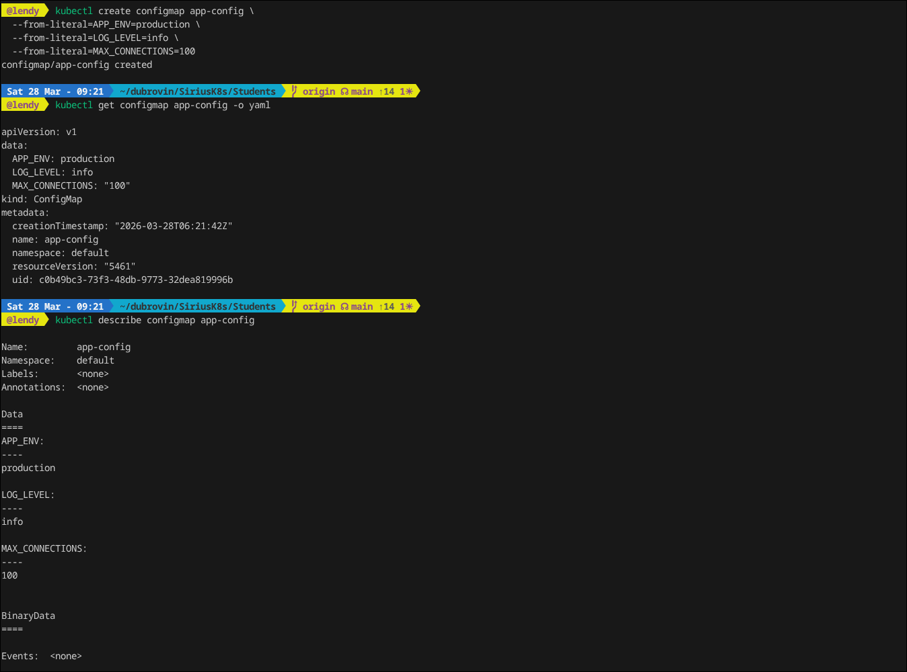
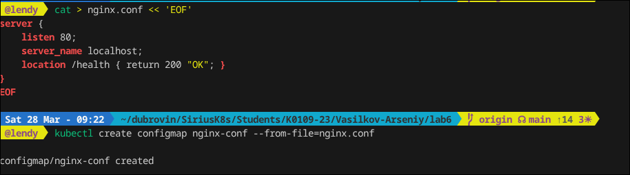
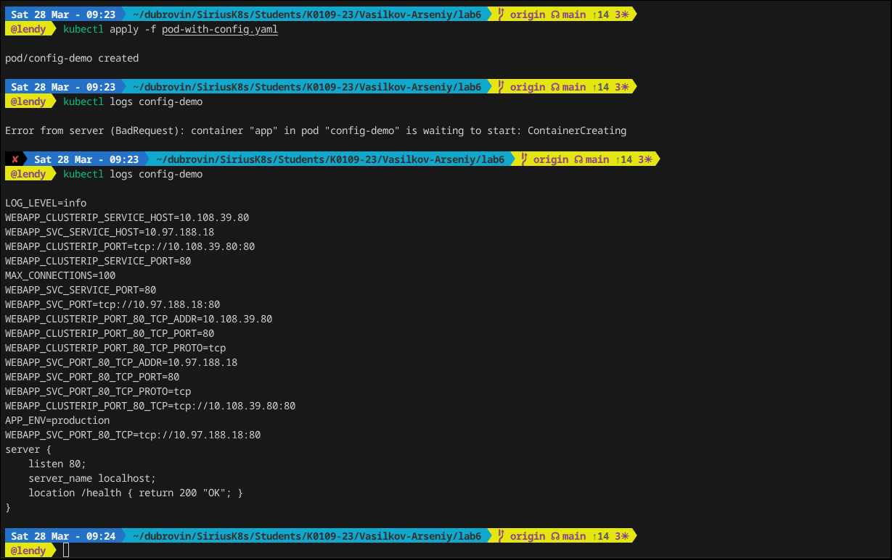
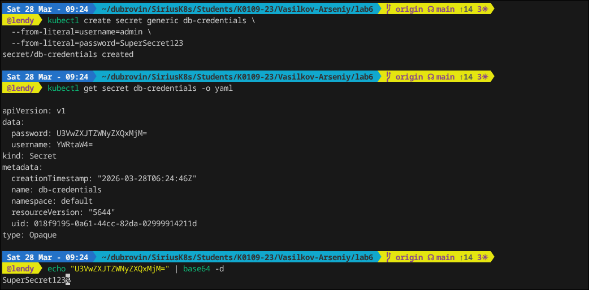
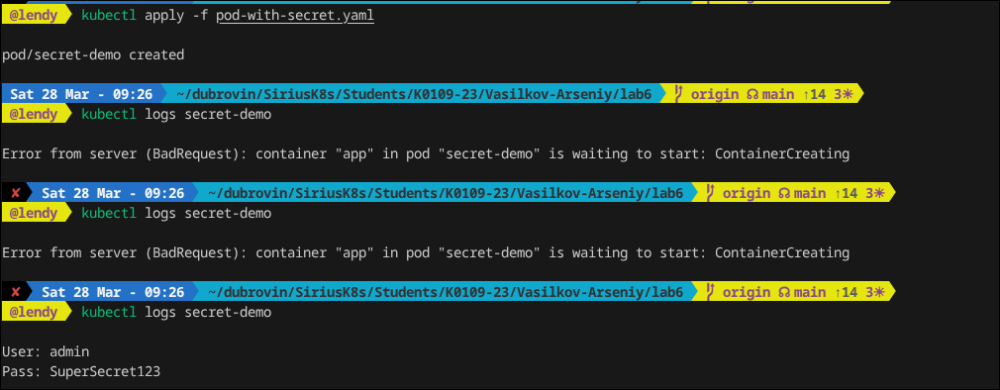
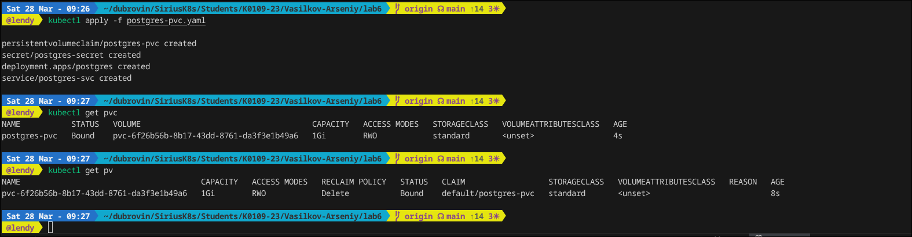
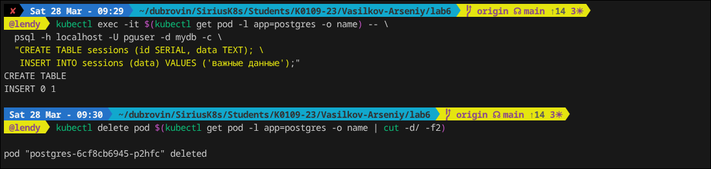
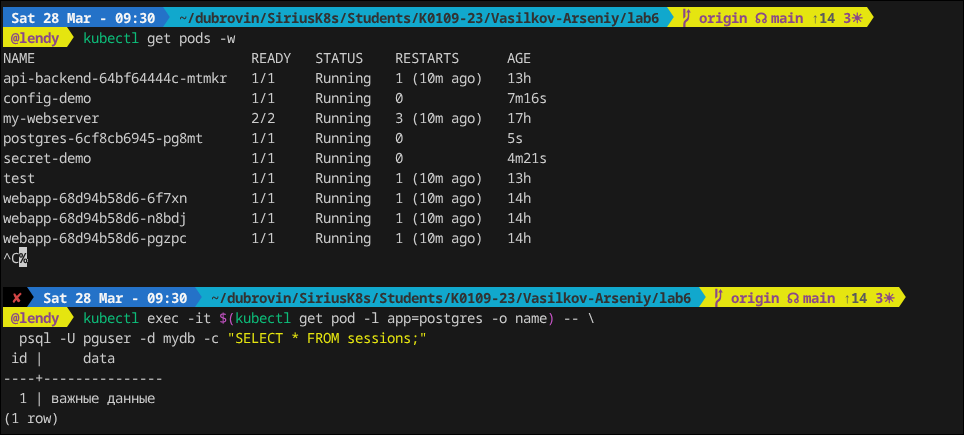

## Laba 6

В данной лабе будет разобрано управление конфигурацией приложения через ConfigMap/Secret, а также какподключать постоянное хранилище.


### Блок 1 — ConfigMap

Создадим ConfigMap это сущность куба для хранения конфиденциальных данных.
Создадим его и выведем полное описание:



Мы создали 3 переменные, которые не являются важными и будут использоваться просто для удобства.

Создадим yaml manifest:

```bash
apiVersion: v1
kind: Pod
metadata:
  name: config-demo
spec:
  containers:
  - name: app
    image: busybox
    command: ["/bin/sh", "-c", "env | grep -E 'APP|LOG|MAX'; cat /etc/config/nginx.conf; sleep 3600"]

    # Способ 1: все ключи как переменные окружения
    envFrom:
    - configMapRef:
        name: app-config

    # Способ 2: конкретный ключ под своим именем
    env:
    - name: MY_ENV
      valueFrom:
        configMapKeyRef:
          name: app-config
          key: APP_ENV

    # Способ 3: смонтировать как файл
    volumeMounts:
    - name: config-volume
      mountPath: /etc/config

  volumes:
  - name: config-volume
    configMap:
      name: nginx-conf
```

Далее создадим ConfigMap из файла и применим его



Выведем логи, можно будет увидеть переменное окружение и содержимое файла



### Блок 2 — Secrets

Создадим секрет и расшифруем данные которые положим туда. Секрет уже более надежная штука и можно туда класть что нибудь существенное, по типу ключей.



Создадим yaml manifest для теста:

```bash
apiVersion: v1
kind: Pod
metadata:
  name: config-demo
spec:
  containers:
  - name: app
    image: busybox
    command: ["/bin/sh", "-c", "env | grep -E 'APP|LOG|MAX'; cat /etc/config/nginx.conf; sleep 3600"]

    # Способ 1: все ключи как переменные окружения
    envFrom:
    - configMapRef:
        name: app-config

    # Способ 2: конкретный ключ под своим именем
    env:
    - name: MY_ENV
      valueFrom:
        configMapKeyRef:
          name: app-config
          key: APP_ENV

    # Способ 3: смонтировать как файл
    volumeMounts:
    - name: config-volume
      mountPath: /etc/config

  volumes:
  - name: config-volume
    configMap:
      name: nginx-conf
```

Применим его и глянем логи



### Блок 3 — PersistentVolume

Создадим postgres-pvc.yaml:

```bash
---
apiVersion: v1
kind: PersistentVolumeClaim
metadata:
  name: postgres-pvc
spec:
  accessModes:
    - ReadWriteOnce
  storageClassName: standard   # для minikube; для k3s: "local-path"
  resources:
    requests:
      storage: 1Gi
---
apiVersion: v1
kind: Secret
metadata:
  name: postgres-secret
type: Opaque
stringData:
  POSTGRES_DB: mydb
  POSTGRES_USER: pguser
  POSTGRES_PASSWORD: pgpassword
---
apiVersion: apps/v1
kind: Deployment
metadata:
  name: postgres
spec:
  replicas: 1
  selector:
    matchLabels:
      app: postgres
  template:
    metadata:
      labels:
        app: postgres
    spec:
      containers:
      - name: postgres
        image: postgres:16-alpine
        envFrom:
        - secretRef:
            name: postgres-secret
        ports:
        - containerPort: 5432
        volumeMounts:
        - name: data
          mountPath: /var/lib/postgresql/data
        resources:
          requests: { memory: "128Mi", cpu: "100m" }
          limits:   { memory: "256Mi", cpu: "200m" }
      volumes:
      - name: data
        persistentVolumeClaim:
          claimName: postgres-pvc
---
apiVersion: v1
kind: Service
metadata:
  name: postgres-svc
spec:
  selector:
    app: postgres
  ports:
  - port: 5432
    targetPort: 5432
```

В этом блоке рассмотрим хранилище для постоянного хранения данных. В основном оно нужно для БД.

Применим его и проверим что pvc и pv задеплоились



Далее создадим данные и удалим под, для проверки хранилища



После наш под пересоздаться, и как можно заметить все данные на месте

