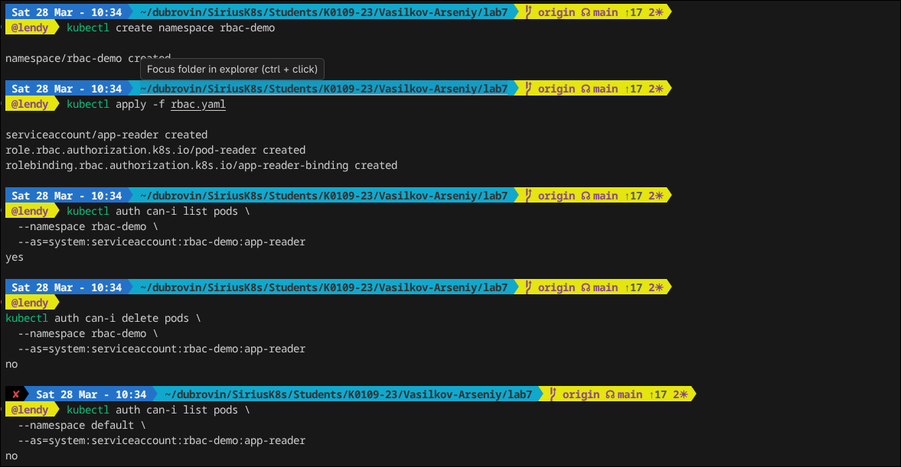
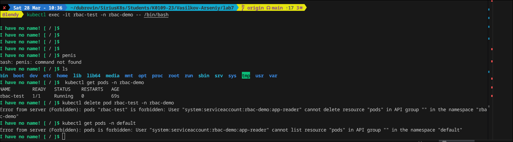
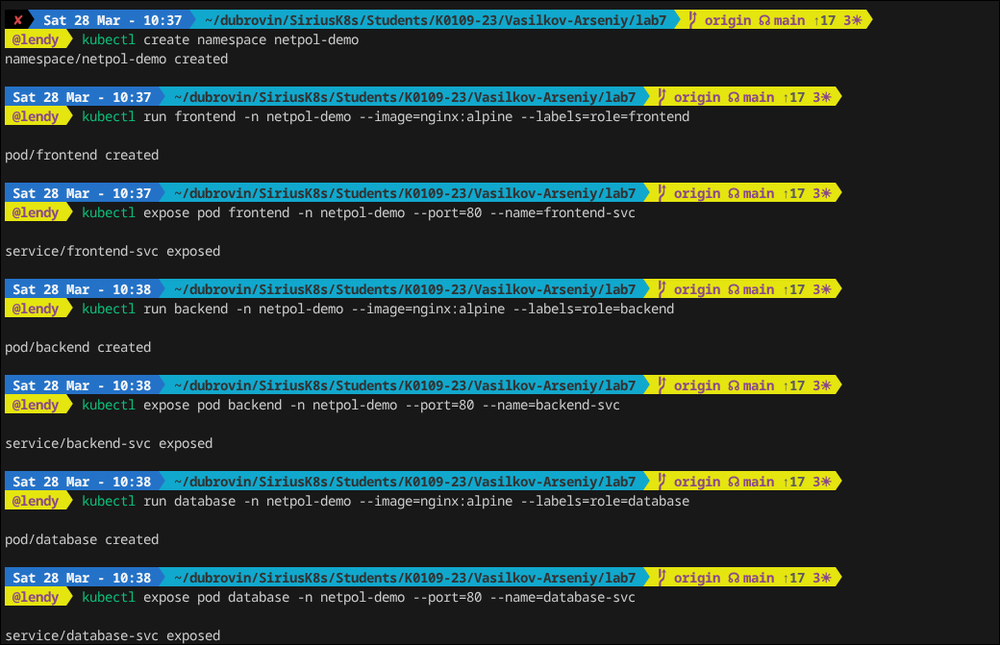
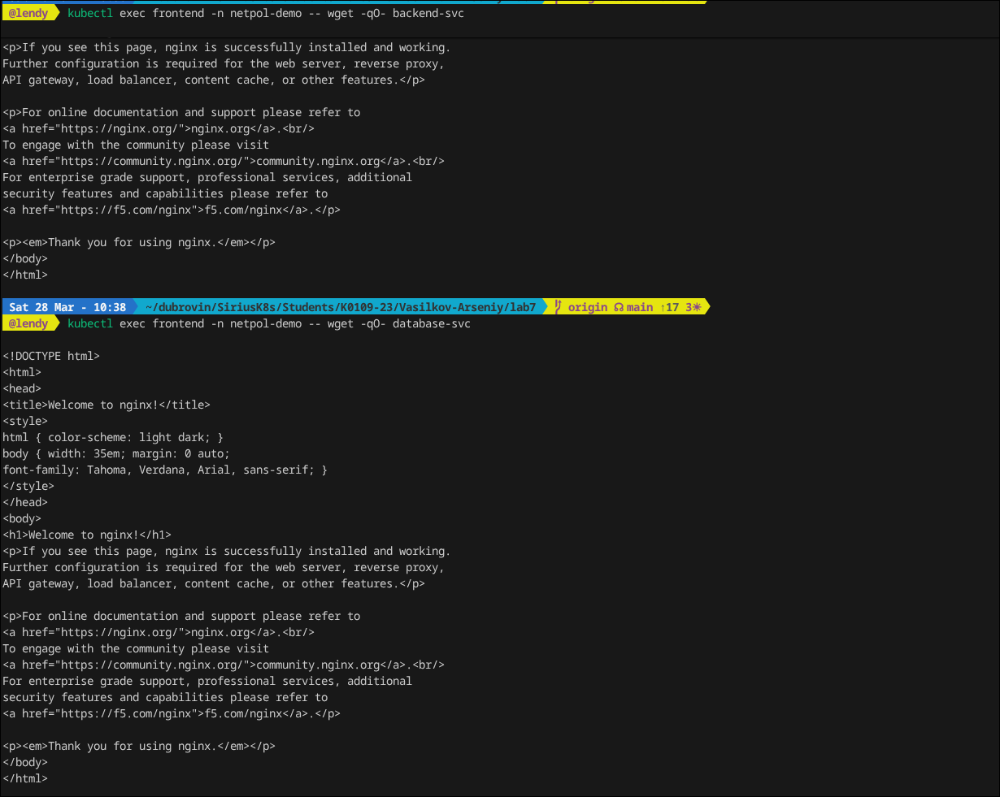
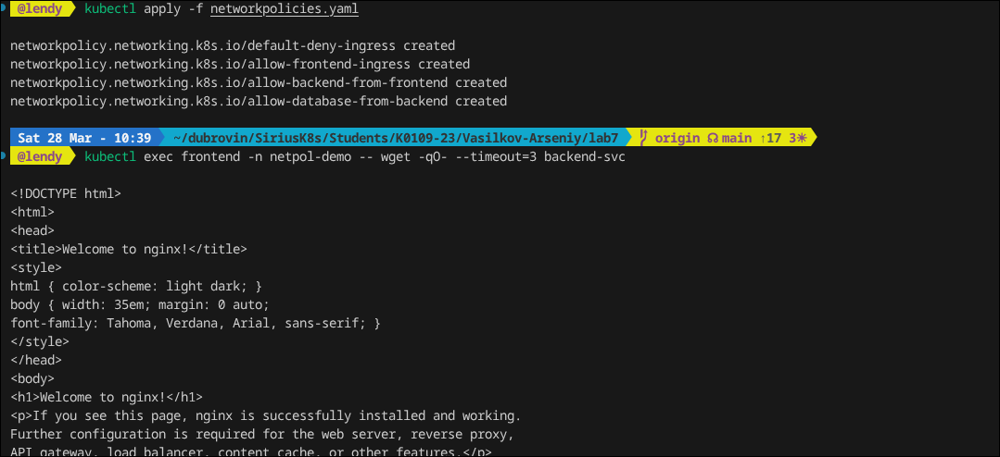
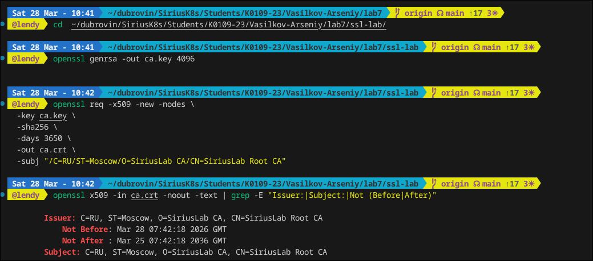
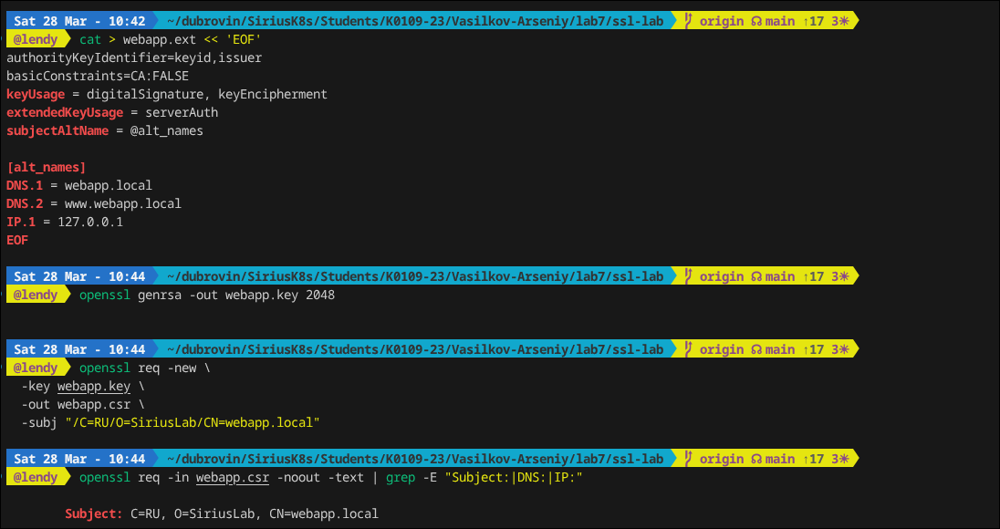
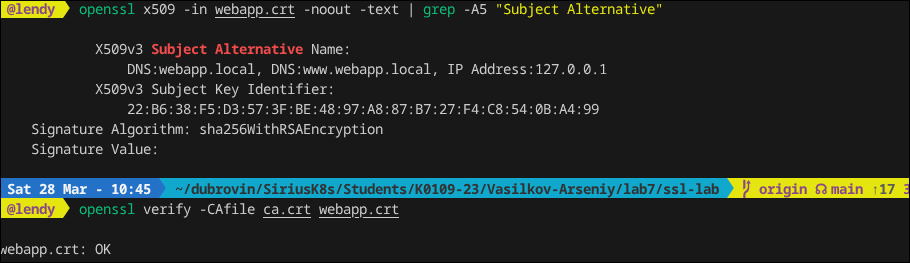
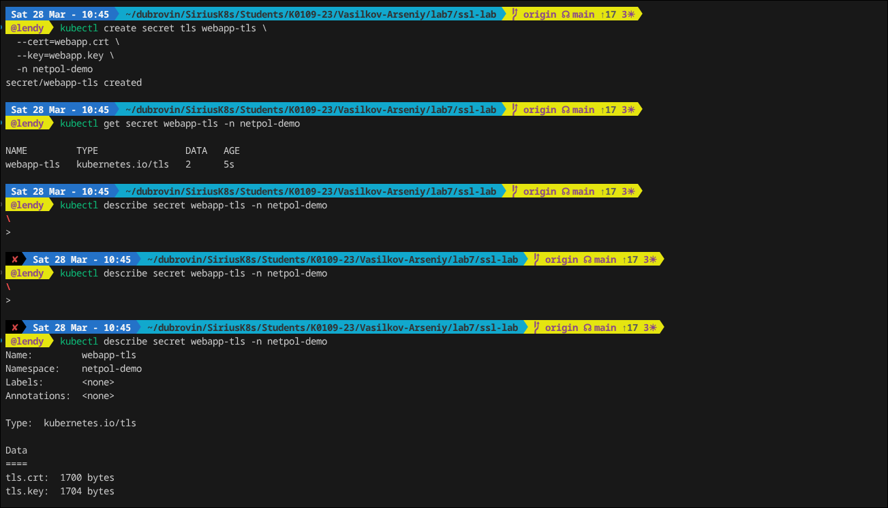
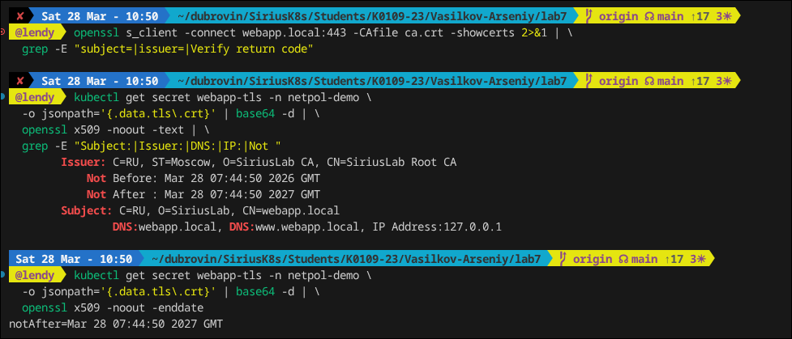

## Laba 7

В данной лабе разберем RBAC, что за темка, в чем прикол, также проведем изоляцию сетевого трафика между подами.

### Блок 1 — RBAC

Создадим rbac:

```bash
---
# ServiceAccount для нашего приложения
apiVersion: v1
kind: ServiceAccount
metadata:
  name: app-reader
  namespace: rbac-demo
---
# Role: только чтение подов в этом namespace
apiVersion: rbac.authorization.k8s.io/v1
kind: Role
metadata:
  name: pod-reader
  namespace: rbac-demo
rules:
- apiGroups: [""]
  resources: ["pods", "pods/log"]
  verbs: ["get", "list", "watch"]
# Специально НЕ даём: create, delete, update
---
# RoleBinding: связываем SA с Role
apiVersion: rbac.authorization.k8s.io/v1
kind: RoleBinding
metadata:
  name: app-reader-binding
  namespace: rbac-demo
subjects:
- kind: ServiceAccount
  name: app-reader
  namespace: rbac-demo
roleRef:
  kind: Role
  name: pod-reader
  apiGroup: rbac.authorization.k8s.io
```

Применим его и проверим права:



Далее создадим под, чтобы можно было его запускать от имени ServiceAccount.

```bash
# pod-rbac-demo.yaml
apiVersion: v1
kind: Pod
metadata:
  name: rbac-test
  namespace: rbac-demo
spec:
  serviceAccountName: app-reader
  containers:
  - name: kubectl
    image: bitnami/kubectl:latest
    command: ["/bin/sh", "-c", "sleep 3600"]
```

Применим его и войдем в под, чтобы тестануть апишку, как мы можем заметить у нас есть права на чтение пода, просмотра логов rbac, все остальные действия по типу уделания, изменения запрещены



### Блок 2 — NetworkPolicy

Поработаем с сеткой, сделаем отдельный ns и запустим тестовые поды



Далее проверим, что поды могут общаться между собой до политик, наш фронт имеет права на обращение к бэку, к базе нет.



Создадим networkpolicies.yaml для контроля трафика:

 

И проверим изоляцию, если коротко, то frontend не может напрямую обращаться к database, связь backend → database разрешена и frontend может напрямую обращатьс к бэку.

### Блок 3 — TLS Сертификаты с OpenSSL

Создадим свой собственный CA для того, чтобы настроить защищенное подключение через ингрес

 

Далее создидим CSR для веб-сервера

 

И подпишим его

 

После создания и подписаная мы получаем готовый и рабочий сертификат, который можно подключать к Kubernetes Ingress. Для этого нужно создать секрет с созданным сертификатом и проверить его.

 

Далее создаем ингресс куда подкидываем сертификат и кайфуем, так как мы получили защищенное подключение. Плюс декодируем сертификат из K8s Secret

 
