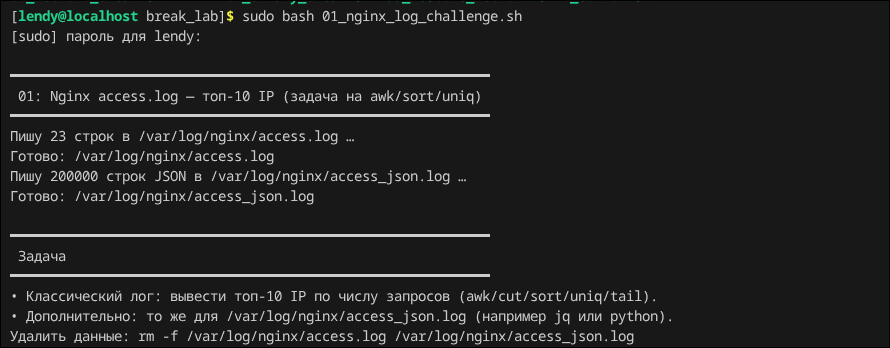
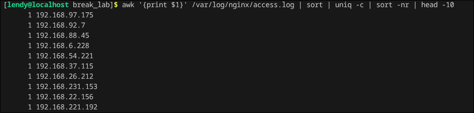
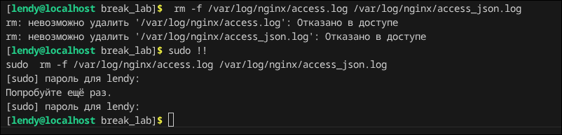

## Break_lab 1

### Всем коничива, в данной лабе будет рассматриваться как юзать утилитку awk.

Выполним скрипт, который будет писать сколько то строк в файл логов nginx, то есть отправлять какие то запросы, нам нужно вывести топ-10 IP по числу запросов

Для того, чтобы это сделать можно использовать утилиту awk, то есть нам надо вывести первый столбец, 10 уникальных, отсортированных ip адресов

Небольшая справочка: awk это скриптовый язык, который нужен для построчной обработки, фильтрации и преобразования структурированных данных (логов, таблиц, конфигураций) в Unix/Linux системах

После выполнения удалим файлы

Лаба легкая, чисто для понимания что за утилитка, зачем нужна.