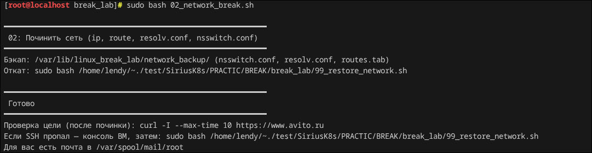
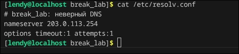
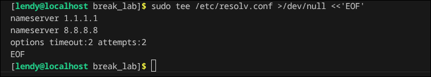
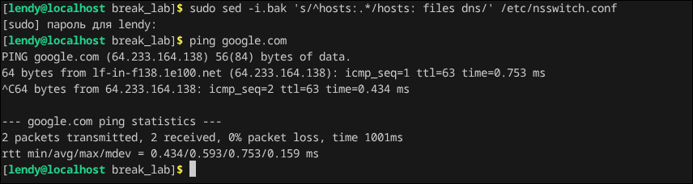
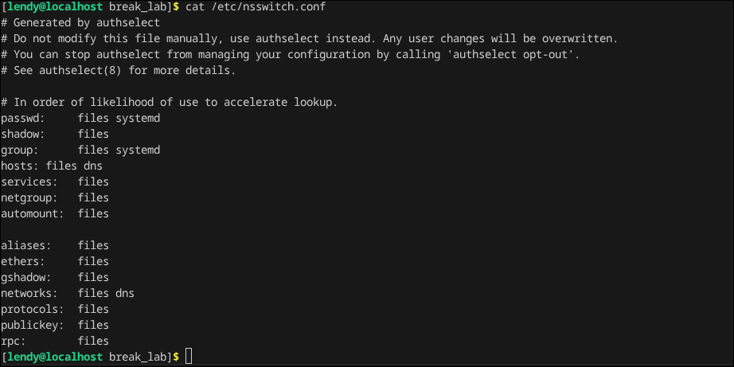

## Break_lab 2

### Нихао всем, в даной лабе мы сломаем себе сетку с помощью скрипта и починим все как трушные сис админы

Для начала запустим скрипт:

Как мы видим у нас сломалась сетка, можно откатиться, запустив обратный скрипт, который находится в той же дирректории, что и прошлый, но это для слабаков. Так что чиним все ручками.

Первое, что можно и нужно сделать это проверить файлик с dns записями (/etc/resolve.conf)

Как можно заметить имя днс сервера неправильное, обычно ставим что то мост популяряти типо гугловских (8.8.8.8) или любых других, поменяем веб сервер:

Поменяем запись и чекнем, пинг проходит, если мы попробуем пингануть любое доменное име, то у нас не получится это сделать, чтобы фиксануть это, нужно зайти в файлик /etc/nsswitch.conf и там прописыть, где именно искать имена типа google.com. 

В самом файле, когда мы сломали систему, было испорчено и написано hosts: files, что не правильно нужно чтобы явно было указано hosts: files dns

Всем чао, увидимся в некст лабе

