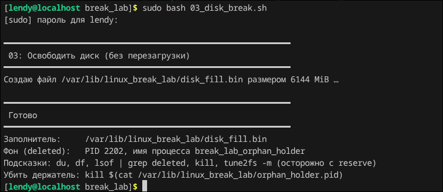
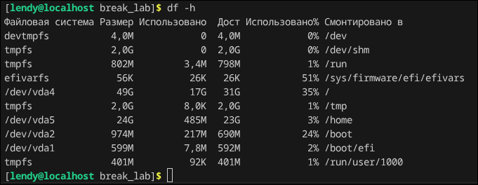
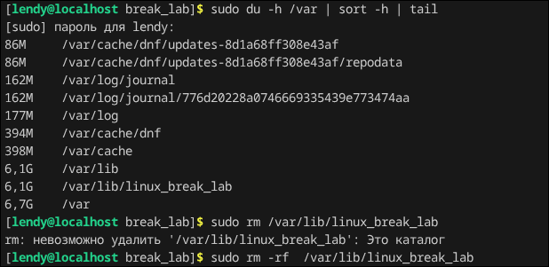

## Break_lab 3

### Всем саламчик в данной лабе мы сломаем наше дисковое пространство, то есть завполним чем то нашу виртуалку

Запустим скриптик и посмотрим, что вообще будет сделано



Как мы видим, что то создалось, давайте глянем заполненность диска утилитой df:



Как видно, место полностью не запомнилось, но увеличилось.

Найдем самый большой файл в системе, утилитой du и удалим его, также можно найти самые большие файлы командой du -sh /var/*:



Также я глянул описание скрипта и там добавляется какой-то фоновый процесс, который скорее всего держит файл, его можно вывести и увидеть пид процесса и потом кильнуть

```bash
cat /var/lib/linux_break_lab/orphan_holder.pid #далее kill <PID>
```

У меня данного пида нет, ну и ладно.

Далее чекним опять командой df -h и увидим, что все ок и диск уменьшился. 


