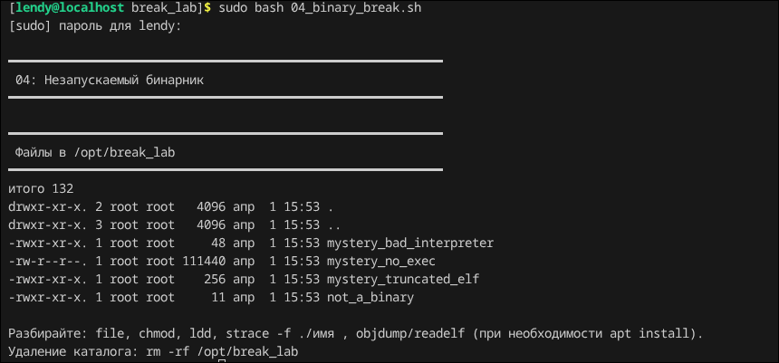
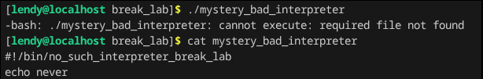
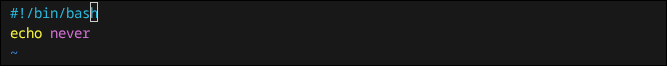
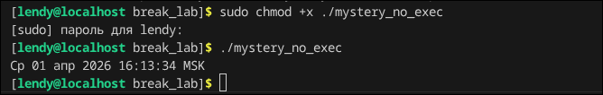
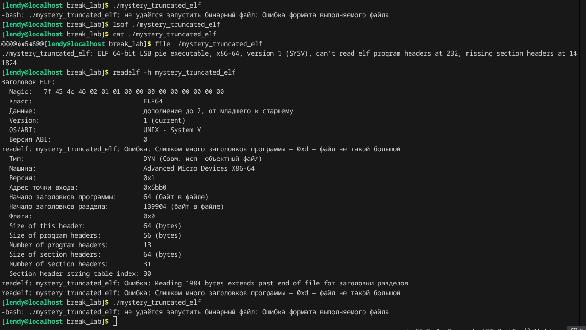

## Break_lab 4

### Всем васап, в данной лабе будем работать со скриптами, будем их фиксить, а что поделать

Для начала как обыяно запустим скрипт.

У нас есть пару файлов их все нужно запустить, перейдем в каталог и начнем с первого.

Как видно он у нас не запустился, мы его катнули и как можно заметить в коментарии написано какая то шляпа, нужно чтобы было вот так 

#!/bin/bash - это специальная инструкция для системы Unix/Linux, указывающая, какой интерпретатор использовать для запуска скрипта. Условно у нас это не бинарник а скрипт на баше, который что то выводит в консоль, это не бинарник.

После того как мы поменяем и поставим нормальный интерпритатор /bin/bash, так что все ок, можно перейти к следующему файлу.

В некст файле нужно просто дать права на исполнение, +x и все

3 файлик у нас болле интересны, можно проверить что это вообще при помощи утилиты file, можно заметить, что он обрезанный (как мусульманин), соотвественно 

Командой readelf -h мы смотрим структура ELF (стандартный формат исполняемых файлов в Linux/Unix, который делит программу на логические блоки для загрузки и линковки)

И по факту данная утилита как file, но подробно показывает структуру ELF для reverse engineering, отладки или обучения.

Перейдем к ласт бинарнику, там просто выводится hello и все, ну как бы ладно, всем пока