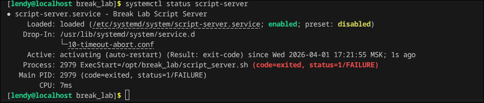
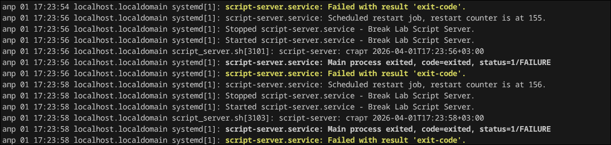
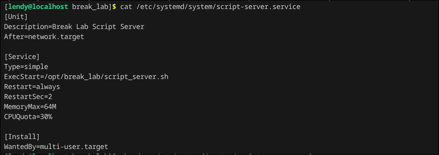
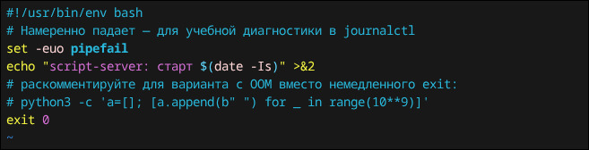
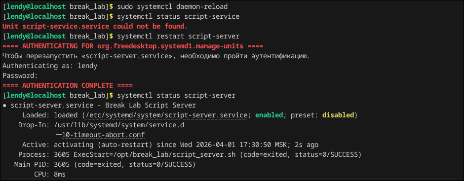

## Break_lab 5

### Всем хао, в данной лабе будем разбирать падающий сервер и фиксить его

После запуска скрипта у нас в системе появится процесс, глянем его статус

Как можно заметить по его коду, он запустился и сразу упал. Есть разные причины почему так, лучше всего глянуть его логи, утилиткой journalctl.

Ошибка таже, но написано чуть более понятнее, катнем сервис, который мы запустили скриптом и увидим по какому пути распологается запускаемый файл.

Перейдем в него и поменяем exit на 0

Перезапустим систему фоновых сервисов и сам сервис

Все хорошо, всем покэ