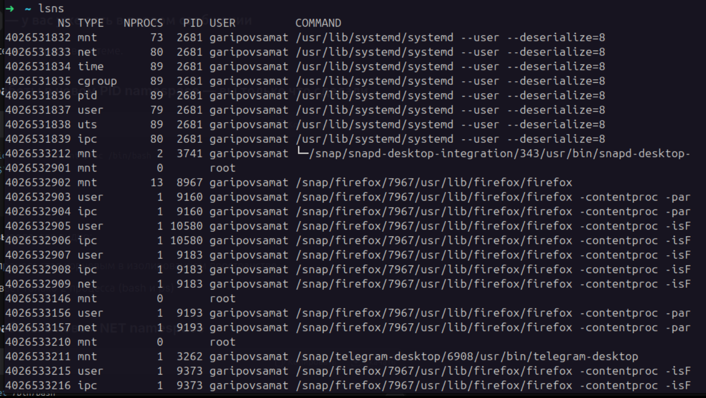
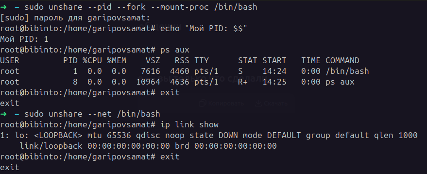
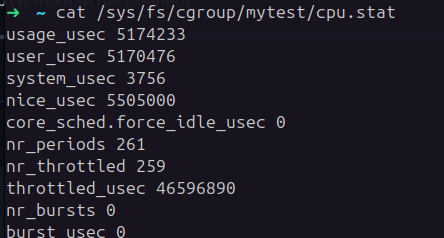
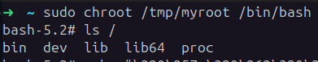
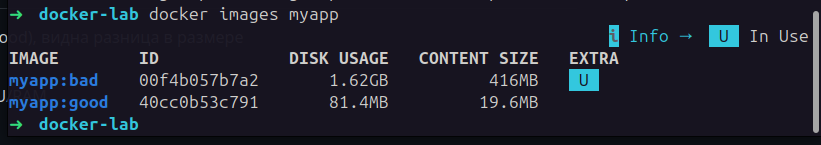
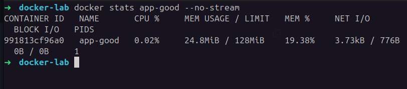
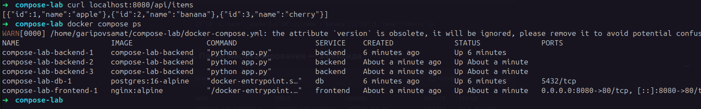

# Лабораторная 1 — что там внутри Linux
## 1. Посмотрели namespaces
Команда: 
```bash 
ls -la /proc/$$/ns/
```
Что было: 8 ссылок — cgroup, ipc, mnt, net, pid, time, user, uts. 8 разных комнат, где живут процессы.

Команда: lsns

Что увидел: Огромный список. Firefox, Telegram, systemd — каждый работает в своей изоляции. 



## 2. Запустили процесс в новом PID namespace
Команда: sudo unshare --pid --fork --mount-proc /bin/bash
Что увидел:

```bash
echo $$ # показал 1 — процесс стал корневым
```
ps aux показал только bash и ps — остальные процессы хоста не видны

## 3. Запустили процесс в новом NET namespace
Команда: 
```bash 
sudo unshare --net /bin/bash 
ip link show
```
Что увидел: Только lo (loopback). Все нормальные интерфейсы (eth0, wlan0) пропали.



## 4. Ограничили процесс по CPU через cgroup
Команды:

```bash
sudo mkdir /sys/fs/cgroup/mytest
echo "20000 100000" | sudo tee /sys/fs/cgroup/mytest/cpu.max
stress-ng --cpu 1 --timeout 30s &
echo $! | sudo tee /sys/fs/cgroup/mytest/cgroup.procs
```
Что увидел:

```bash 
cat /sys/fs/cgroup/mytest/cpu.max ## → 20000 100000 (это 20% CPU)
```


``` bash 
cat /sys/fs/cgroup/mytest/cpu.stat ## → nr_throttled 259 из 261 периодов — процесс постоянно ограничивали
```


## 5. Сделали chroot
Команды:

```bash
mkdir -p /tmp/myroot/{bin,lib,lib64,proc,dev}
cp /bin/bash /tmp/myroot/bin/
cp /bin/ls /tmp/myroot/bin/
cp /lib/x86_64-linux-gnu/* /tmp/myroot/lib/
sudo chroot /tmp/myroot /bin/bash
ls /
```
Что увидел: Только bin dev lib lib64 proc — те папки которые сами создали. Никакого /home, /etc, /usr нет.


## 6. Чем namespace отличается от cgroup
Namespace — отвечает за что видит процесс. Типо закрой глаза ты один в комнате. Процесс думает что он первый, что сеть только его, что файловая система только его.

cgroup — отвечает за сколько можно жрать ресурсов. Типо ешь не больше 20%, а то остальным не хватит.

# Лабораторная 2 — Docker: как мы образы делали
## 1. Написали Dockerfile и собрали плохой образ
Сначала сделали тупой Dockerfile — взяли полный Python (1GB), скопировали всё подряд.

```bash
docker build -t myapp:bad .
```
## 2. Запустили и проверили что работает
```bash
docker run -d -p 5000:5000 --name app-bad myapp:bad
curl localhost:5000  # вернуло Hello from container!
```
## 3. Сделали хороший образ
Добавили:

* .dockerignore — чтобы не копировать мусор
* Взяли python:3.12-slim вместо полного
* Использовали --no-cache-dir

Сделали два этапа: сначала установка, потом копирование только нужного

Сравнение размеров:


## 4. Запустили с ограничениями CPU/RAM
bash
docker run -d -p 5001:5000 --name app-good --memory="128m" --cpus="0.5" myapp:good


Видно что память ограничена 128MB, процесс использует 24MB.

## 5. Посмотрели слои образа
```bash
docker history myapp:good
```
Показало:

* Базовый слой (debian) — 87MB
* Установка Python — 41MB
* Установка Flask — 15MB
* Копирование app.py — 12kB

```bash ➜  docker-lab docker history myapp:good
IMAGE          CREATED          CREATED BY                                      SIZE      COMMENT
46c29c449535   5 minutes ago    CMD ["python" "app.py"]                         0B        buildkit.dockerfile.v0
<missing>      5 minutes ago    EXPOSE [5000/tcp]                               0B        buildkit.dockerfile.v0
<missing>      5 minutes ago    ENV APP_VERSION=2.0                             0B        buildkit.dockerfile.v0
<missing>      5 minutes ago    COPY app.py . # buildkit                        12.3kB    buildkit.dockerfile.v0
<missing>      5 minutes ago    RUN /bin/sh -c pip install --no-cache-dir -r…   15.1MB    buildkit.dockerfile.v0
<missing>      5 minutes ago    COPY requirements.txt . # buildkit              12.3kB    buildkit.dockerfile.v0
<missing>      25 minutes ago   WORKDIR /app                                    8.19kB    buildkit.dockerfile.v0
<missing>      9 days ago       CMD ["python3"]                                 0B        buildkit.dockerfile.v0
<missing>      9 days ago       RUN /bin/sh -c set -eux;  for src in idle3 p…   16.4kB    buildkit.dockerfile.v0
<missing>      9 days ago       RUN /bin/sh -c set -eux;   savedAptMark="$(a…   41.4MB    buildkit.dockerfile.v0
<missing>      9 days ago       ENV PYTHON_SHA256=c08bc65a81971c1dd578318282…   0B        buildkit.dockerfile.v0
<missing>      9 days ago       ENV PYTHON_VERSION=3.12.13                      0B        buildkit.dockerfile.v0
<missing>      9 days ago       ENV GPG_KEY=7169605F62C751356D054A26A821E680…   0B        buildkit.dockerfile.v0
<missing>      9 days ago       RUN /bin/sh -c set -eux;  apt-get update;  a…   4.94MB    buildkit.dockerfile.v0
<missing>      9 days ago       ENV LANG=C.UTF-8                                0B        buildkit.dockerfile.v0
<missing>      9 days ago       ENV PATH=/usr/local/bin:/usr/local/sbin:/usr…   0B        buildkit.dockerfile.v0
<missing>      10 days ago      # debian.sh --arch 'amd64' out/ 'trixie' '@1…   87.4MB    debuerreotype 0.17
```
## 6. Опубликовали на Docker Hub
```bash
docker tag myapp:good samatgaripov/flask-demo:v1.0
docker push samatgaripov/flask-demo:v1.0
```
# Ссылка: https://hub.docker.com/r/samatgaripov/flask-demo

# Ошибки и как их чинили
Что сломалось

Alpine не запускался (adduser не работал) - взял python:3.12-slim вместо alpine

Flask не находился после multistage	- упростил Dockerfile


# Лабораторная 3 — Docker Compose: подняли три сервиса
## 1. Создали сеть и проверили что контейнеры видят друг друга
```bash
docker network create app-network
docker run -d --name db --network app-network -e POSTGRES_PASSWORD=secret postgres
docker run -it --rm --network app-network alpine ping db 
```
## 2. Написали docker-compose.yml с тремя сервисами
db — PostgreSQL с volume

backend — наше Flask-приложение

frontend — nginx который проксирует запросы

### Структура:

compose-lab/

    backend/
        Dockerfile
        app.py
        requirements.txt
    frontend/
        nginx.conf
    docker-compose.yml

## 3. Подняли стек
```bash
docker compose up -d --build
```
До масштабирования:
```bash 
compose-lab docker compose ps
WARN[0000] /home/garipovsamat/compose-lab/docker-compose.yml: the attribute `version` is obsolete, it will be ignored, please remove it to avoid potential confusion.
NAME    IMAGE    COMMAND    SERVICE    CREATED    STATUS    PORTS
compose-lab-backend-1  compose-lab-backend "python app.py"    backend    5 minutes ago    Up 5 minutes    -
compose-lab-db-1    postgres:16-alpine "docker-entrypoint.s…"    db    5 minutes ago    Up 5 minutes   5432/tcp
compose-lab-frontend-1  nginx:alpine "/docker-entrypoint…"    frontend    56 seconds ago   Up 56 seconds   0.0.0.0:8080->80/tcp, [::]:8080->80/tcp
```

## 4. Создали данные в БД
```bash
docker compose exec db psql -U user -d mydb -c "CREATE TABLE items (id SERIAL, name TEXT); INSERT INTO items (name) VALUES ('apple'), ('banana'), ('cherry');"
```
## 5. Проверили что API работает через nginx
```bash
curl localhost:8080/api/items
```

## 6. Масштабировали backend до 3 экземпляров
```bash
docker compose up -d --scale backend=3
```


