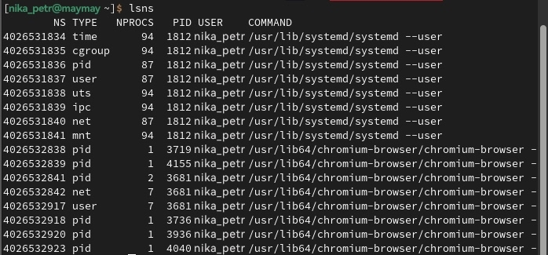
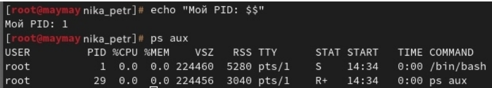
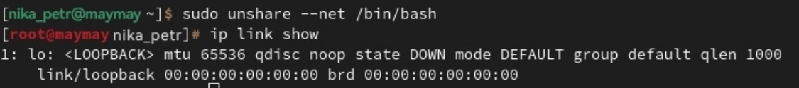
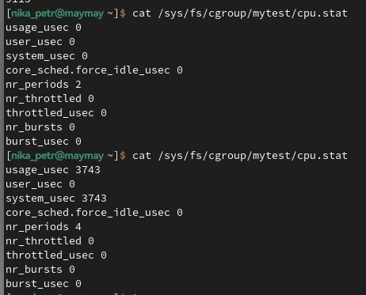
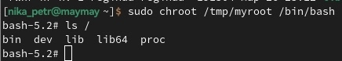

# Лабораторная №1: Основы контейнеризации

Ловите отчет о том, как я игралась с изоляцией в Linux.

---

## Блок 1. Namespaces (Изоляция процессов)

В этом блоке мы разбирались, как Linux изолирует процессы друг от друга с помощью **Namespaces**. Это такой механизм ядра, который создает для процесса свой собственный «пузырь».

**Что я делала:**
1.  Сначала посмотрела, в каких namespace находится мой текущий shell, а затем вывела список всех активных namespace в системе.
2.  С помощью команды `unshare` запустила новый `bash` в изолированном **PID namespace**. Внутри этого окружения мой процесс стал **PID 1**, а все процессы хоста исчезли из видимости. Магия!
3.  То же самое повторила для **NET namespace**. Внутри оказался только `loopback`-интерфейс (`lo`). Это подтверждает, что сеть тоже полностью изолирована.

Вывод lsns и проверка PID 1 внутри unshare

PID namespace (внутри PID=1):

NET namespace (только lo) 

**Важный момент:** После выхода (`exit`) из изолированной оболочки процессы на хосте остались нетронутыми. Это потому, что `unshare` создает namespace для дочерних процессов, а родительские никто не трогает. Всё чисто!

---

## Блок 2. Cgroups (Ограничение ресурсов)

Здесь учились ограничивать аппетиты процессов.

**Эксперимент:**
1.  Выставила лимит на процессор — **20%**.
2.  Запустила стресс-тестирование (нагрузку), чтобы проверить, насколько честно работает ограничение.
3.  Через `top` monitored процесс: он правда не превышал 20%, хотя очень хотел.

Процессор урезан до 20% в top

**Теория:** Если превысить лимит памяти, процесс, как я поняла, просто будет убит (OOM Killer). Точно не уверена, но звучит логично — нарушил правила, будь наказан.

---

## Блок 3. Chroot (Изоляция файловой системы)

Тут создавали изолированное окружение через **chroot**.

**Как это работает:**
1.  Создала папку `/tmp/myroot` и положила туда `bash`, `ls` и все необходимые им библиотеки.
2.  Запустила внутри этой папки `bash` через команду `chroot`.
3.  Для этого процесса папка `/tmp/myroot` стала настоящим корнем `/`. Он думает, что находится в обычной Linux-системе, но на самом деле видит только то, что я туда положила.

Внутренности chroot окружения

**Вывод:** `chroot` ограничивает доступ процессам к файлам. У них есть только то, что есть в новом корневом каталоге. Никаких лишних глаз в системные папки!
