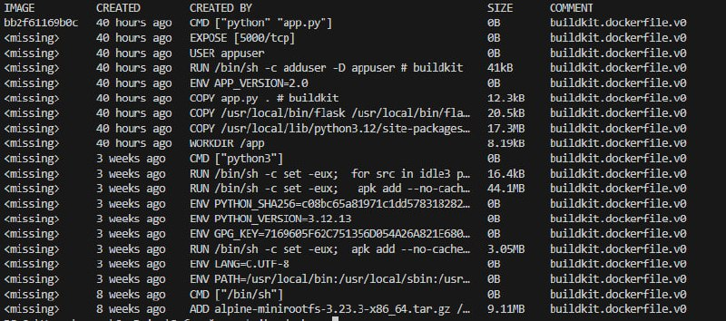
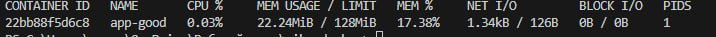

#  Лабораторная №2: Docker 

Эта лаба оказалась даже круче первой! Собрала свой первый образ. Погнали по порядку!

---

## Блок 1. Плохой Dockerfile (намеренно )

Сначала сделала всё «как попало» — взяла полный образ `python:3.12`, скопировала всё подряд и установила зависимости. 

**Результат:** Образ весил **1.62GB**! 😱 
Это как скачать три фильма в HD, чтобы запустить одно Flask-приложение на 20 строк кода.


 docker images myapp:bad — 1.62GB ужаса

Запустила контейнер, всё работало, но мне было стыдно за такой размер.

---

## Блок 2. Multistage build

Тут началось интересное! Переписала Dockerfile с multistage build:

1.  **Stage 1 (builder):** Взяла `python:3.12-slim`, установила туда зависимости.
2.  **Stage 2 (final):** Взяла лёгкий `python:3.12-alpine`, скопировала только нужное из builder'а.
3.  Добавила `.dockerignore`, чтобы не тащить в образ `.git`, `__pycache__` и прочий мусор.
4.  Создала пользователя `appuser` и запустила от его имени (безопасность — это важно!).

**Результат:** Образ стал весить **96.6MB** вместо 1.62GB!   
Это в **16 раз меньше**!

 
Сравнение myapp:bad (1.62GB) vs myapp:good (96.6MB)*

Запустила с ограничениями ресурсов:
```bash
docker run -d -p 5001:5000 --name app-good --memory="128m" --cpus="0.5" myapp:good
```
Через `docker stats` увидела, что контейнер честно ест не больше 128MB RAM и 0.5 CPU.


 docker stats — лимиты работают!