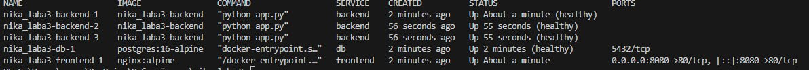
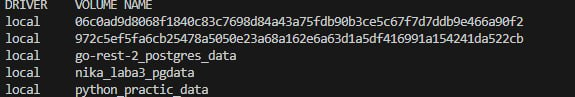
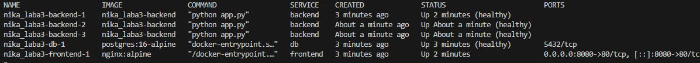

#  Лабораторная №3: Docker — сети, volumes и docker-compose

---

## Блок 1. Docker Networking (Изоляция сетей)

В этом блоке разбирались, как контейнеры видят друг друга через сети.

**Что я делала:**
1.  Сначала посмотрела список всех сетей через `docker network ls` и изучила стандартную `bridge` сеть.
2.  Создала свою изолированную сеть `app-network` и запустила в ней PostgreSQL и Alpine.
3.  Внутри Alpine пинганула базу данных по имени `ping db` — и это сработало! DNS внутри сети реально работает.
4.  Проверила порт: `nc -zv db 5432` — соединение установлено.

Вывод `docker compose ps` — видно все 5 контейнеров (3 backend, 1 db, 1 frontend), работающих в одной сети. Контейнеры имеют статус "Up" и правильно проброшены порты.

**Важный момент:** Когда я запустила контейнер БЕЗ указания сети, он не увидел `db`. Это подтверждает, что каждая network — это отдельный мир со своим DNS.

---

## Блок 2. Volumes (Сохранение данных)

Здесь учились делать так, чтобы данные не пропадали после удаления контейнера.

**Эксперимент:**
1.  Создала volume `pgdata` и запустила PostgreSQL с монтированием этого тома.
2.  Создала тестовую таблицу `items` и добавила туда запись `'test'`.
3.  Удалила контейнер командой `docker rm -f`, но volume остался!
4.  Подняла новый контейнер с тем же volume — и данные на месте! 

Вывод `docker volume ls` — создан volume `nika_laba3_pgdata` для сохранения данных PostgreSQL. Также видны другие volumes в системе.

**Вывод:** Volume — это как внешнее хранилище. Контейнер можно убить, но данные живут отдельно и переживают перезапуски. Через `docker volume inspect` можно даже узнать, где физически лежат данные на диске.

---

## Блок 3. Docker Compose (Оркестрация стека)

Самая интересная часть — подняла всё приложение одной командой!

**Структура проекта:**
- **backend** — Flask приложение на Python
- **frontend** — Nginx, который проксирует запросы на backend
- **db** — PostgreSQL с persistent volume

**Что сделала:**
1.  Написала `docker-compose.yml` с тремя сервисами.
2.  Настроила **healthcheck** для каждого сервиса, чтобы они запускались в правильном порядке (сначала БД, потом backend, потом frontend).
3.  Запустила всё командой `docker compose up -d --build`.
4.  Проверила цепочку: `curl localhost:8080/api/items` — данные из БД приходят через Nginx!

Повторный вывод `docker compose ps` через некоторое время — видно, что все контейнеры стабильно работают, время аптайма увеличилось. Статус всех сервисов "(healthy)".

 Детальная проверка состояния — все 5 контейнеров показывают статус **Healthy**. Backend масштабинирован до 3 экземпляров, frontend и db работают корректно.

**Масштабирование:**
Запустила `docker compose up --scale backend=3` и теперь у меня 3 экземпляра backend работают параллельно! Все они healthy и готовы обрабатывать запросы.