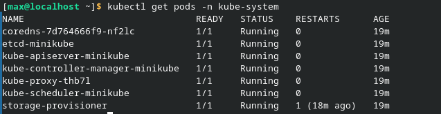

### Блок 1 — Состояние кластера:
#### Какие поды в kube-system всегда должны быть Running?
Для стабильной работы кластера критически важны следующие компоненты:
1) kube-apiserver: Центральный узел управления (API).
2) etcd: База данных состояния кластера.
3) kube-scheduler: Алгоритм распределения подов по нодам.
5) kube-controller-manager: Управление жизненным циклом ресурсов.
5) kube-proxy: Сетевой балансировщик и правила маршрутизации.
6) CoreDNS: Внутренняя служба имен (DNS).
7) Network Plugin (например, Kindnet или Calico): Обеспечивает связь между подами.

### Что сдать преподавателю?
**1. Состояние узлов (Nodes):**
   
**2. Системные компоненты:**
    
**3. Список запущенных пользовательских подов:**

**4. Подтверждение перезапуска (Restarts):**
