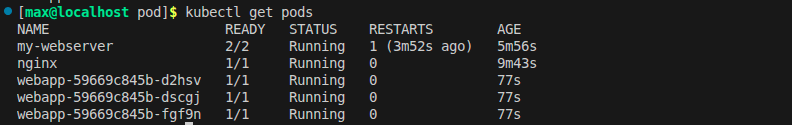
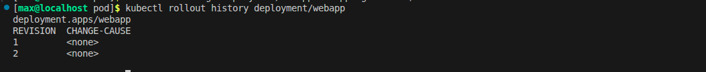
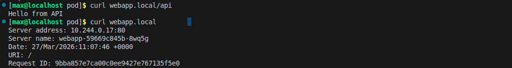

1. Выводим список всех запущенных процессов где есть 3 пода веб апп в статусе раннинг

2. Тут должен быть выведен список ревизий подтверждающий факт обновления или отката, но у меня там пусто хотя типо все работает и откат работал, короче очень странно.

3. Первая команда выводит ответ от nginx. А вторая от api (backend):

4. clusterIP доступен только внутри кластера. Типо это нужно для связи между микросервисами например фронтенд обращается к базе данных. Снаружи этот ip не виден.
nodeport виден снаружи кластера через ip любой ноды и специальный порт (диапозон 30000-32767). Это можно сказать самый простой способ получить доступ к приложени. из внешней сети без облачного балансировщика.