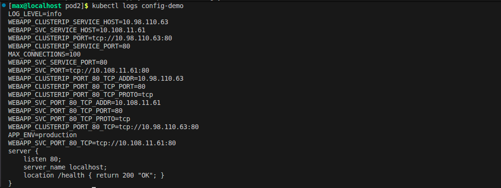
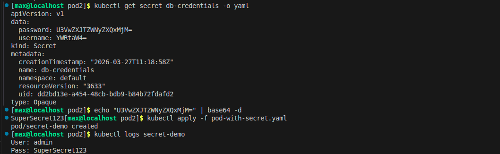
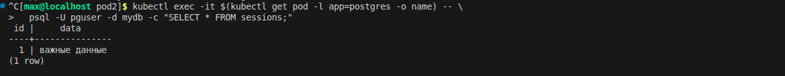

1. Выводим логи пода config-demo. Здесь видно, что переменные подтянулись (env), а файл конфигурации успешно прочитан из смонтированного тома (volume). Это доказывает, что все 3 способа передачи настроек работают.

2. Показываем секрет в формате YAML. Данные пароля и логина выглядят как абракадабра, потому что они в base64. Важно помнить, что это не шифрование, а просто кодирование — любой может их декодировать обратно.

3. Проверяем статус PVC для базы данных Postgres. Статус должен быть Bound. Это значит, что кластер успешно выделил реальный виртуальный диск под нашу заявку.

4. Самый главный момент: я зашел в новый под Postgres (который пересоздался после удаления старого) и сделал SELECT. Данные на месте. Это доказывает, что даже если «убить» сервер базы данных, данные не пропадут, потому что они хранятся на внешнем диске (PV), а не внутри контейнера.
