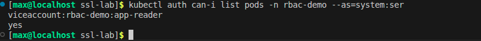
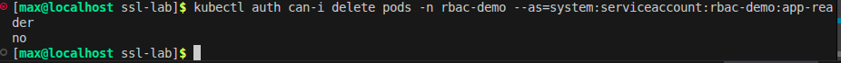
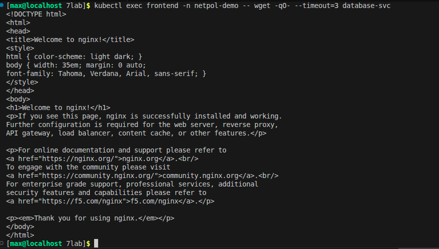
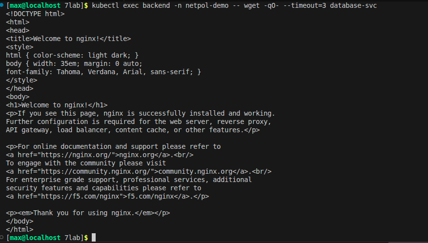
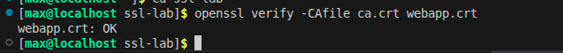
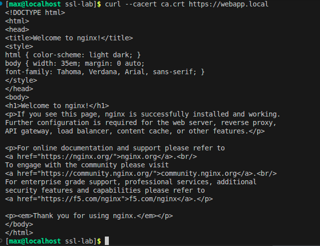

1. Выполняю проверку прав доступа указанного сервисного аккаунта на получение списка объектов типа pods в заданном пространстве имен. Типо данная утилита имитирует запрос от имени сервисного аккаунта и возвращает логическое подтверждение или отказ в выполнении данной операции.
   
1. Здесь я решил проверить наличие у сервисного аккаунта app-reader прав на безвозвратное удаление ресурсов типа pods в пространстве имен rbac-demo. А вот нельзя, сказали нет значит нет. Короч утилита сопоставляет текущие правила RBAC с запрошенным действием и выводит утвердительный или отрицательный ответ.

1. Вот тут инициируем выполнение утилиты wget внутри контейнера пода с именем frontend для проверки сетевой доступности сервиса database-svc. Вообще команда изначально не работала пришлось обратиться к высшей силе и магии древних сидхов и она заработала.

1. Тут также нициируем выполнение утилиты wget внутри контейнера пода с именем backend для проверки сетевой доступности сервиса database-svc. Это фигня тоже не работала, все не нравилось и пришлось также пошаманить на ней в итоге все успешно.

5. Тут команда выполняет процедуру проверки цепочки доверия сертификата webapp.crt с использованием корневого сертификата ca.crt. Утилита подтверждает математическую подлинность подписи и валидность срока действия сертификата относительно предоставленного доверенного центра сертификации. (очень умно описал)

1. Здесь выполненяем сетевой запрос к ресурсу по протоколу HTTPS с использованием файла ca.crt для верификации SSL-сертификата сервера.
