# Практика 2 -  Docker: образы, Dockerfile, запуск

Создается папка для практической работы по докеру:\
mkdir ~/docker-lab && cd ~/docker-lab\
Также мы в нее переходим, чтобы все изменения конечно же происходили в этой директории.

Затем создается файл app.py для простого flask-приложения, которое является тестовым веб-приложением для проверки докера:\

from flask import Flask\
import os, socket

app = Flask(__name__)

@app.route('/')\
def hello():\
    return f"Hello from container! Host: {socket.gethostname()}, Version: {os.getenv('APP_VERSION', '1.0')}"

@app.route('/health')\
def health():\
    return {"status": "ok"}
if __name__ == '__main__':\
    app.run(host='0.0.0.0', port=5000)

Я создал его в IDE PyCharm
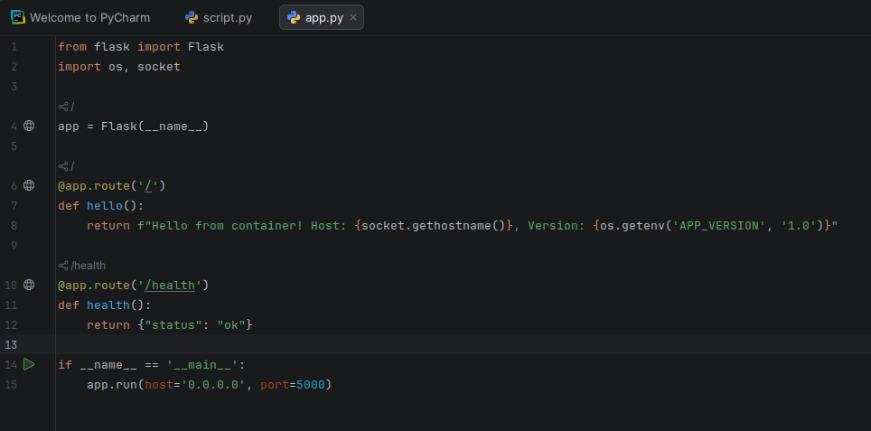

в файле requirements.txt должна быть только одна строчка flask==3.0.0. requirements.txt — это стандартный файл в Python, который содержит список всех зависимостей (библиотек), необходимых для работы проекта.

Создается плохой докерфайл намеренно, чтобы посмотреть как билдятся "хорошие" докер-контейнеры и плохие. \
Его содержание:\
FROM python:3.12\
WORKDIR /app\
COPY . .\
RUN pip install -r requirements.txt\
CMD ["python", "app.py"]

Затем нужно забилдить наш докерфайл. Это делается командой "docker build -t myapp:bad .". Также можно использовать ключ -f для указания докерфайла, по которому будет билдиться контейнер.\
Изначально у нас не будет доступа к группе docker, поэтому забилдить контейнер не получится, поэтому выполняем команду "sudo usermod -aG docker $USER", чтобы добавить в эту группу нашего пользователя. После этого только он сможет создавать докер контейнеры без sudo. 
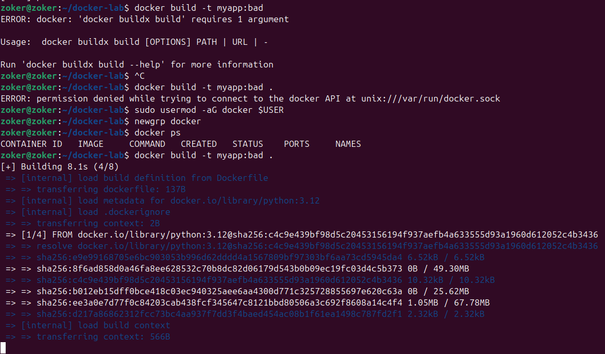

Просмотрим размер файла с помощью docker images myapp

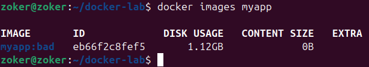

Как мы видим, у нас просто огромный размер файла 1.12 ГБ, поэтому мы создаем докер-контейнер без всего лишнего, чтобы он был минимальным для работы нашего приложения.\
Но перед тем как создавать "хороший" контейнер, конечно же убедимся в работоспособности приложения в контейнере.\
Запустим контейнер с помощью docker run -d -p 5000:5000 --name app-bad myapp:bad\
Уже после этого мы подключаемся с помощью curl к нашему приложению. Указываем порт 5000, так как это стандартный порт, на котором работает дев-сервер Flask.
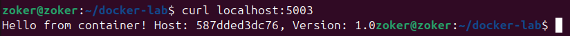

Остановим плохой докер контейнер командой docker stop app-bad.\
Если попытаться подключиться еще раз, то у нас это не получится, т. к. контейнер уже не работает.

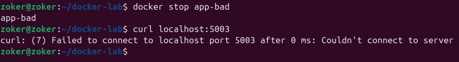

## Блок 2 - Multistage Build
Для хорошего докерфайла мы создаем файл с такой конфигурацией:\
FROM python:3.12-alpine
WORKDIR /app

"# 1. Копируем файл зависимостей"\
COPY requirements.txt .

"# 2. Делаем тот самый единственный install"\
RUN pip install --no-cache-dir -r requirements.txt

"# 3. Настраиваем пользователя и копируем код"\
RUN adduser -D appuser\
COPY --chown=appuser:appuser app.py .

USER appuser\
EXPOSE 5000\
CMD ["python", "app.py"]

Кавычки в данном случае выступают комментариями, потому что иначе по синтаксису .md файлов превьюшка бы считала их заголовками первого уровня.
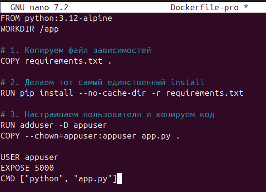

Создается затем в этой же рабочей папке файл .dockerignore\
`__pycache__/`\
`*.pyc`\
`.git/`\
`.env`\
`*.md`\
`Dockerfile*`

.dockerignore — это файл, который указывает Docker, какие файлы и директории НЕ нужно копировать в образ при сборке.

Билдим контейнер:

docker build -t myapp:good . \
docker images myapp  # сравнить размеры!

Затем снова проверяем размеры контейнеров командой docker images myapp

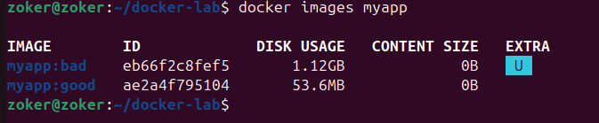

Как мы видим, размер у контейнера гуд гораздо меньше, значит все выполнено правильно.

Запускаем контейнер с ограничением ресурсов:\
`docker run -d \`\
  `-p 5001:5000 \`\
  `--name app-good \`\
  `--memory="128m" \`\
  `--cpus="0.5" \`\
  `--restart=unless-stopped \`\
  `myapp:good`

  Затем подключаемся к нашему серверу опять с помощью curl, но только уже по 5001 порту, потому что он у нас запущен на 5001 порту на хоста, но транслируется на 5000 порт (пробрасывается) в контейнере.
  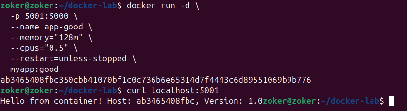

Просмотрим также лимиты: docker stats app-good
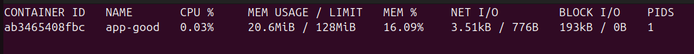

## Блок 3 — Исследование образа

Посмотрим слои докер-контейнеров:\
docker history myapp:good
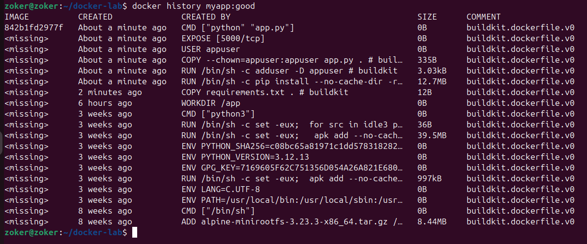

docker history myapp:bad
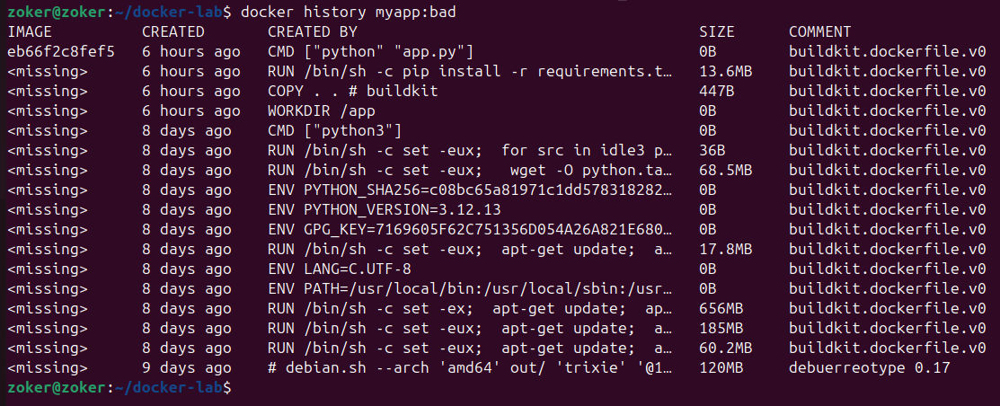

Получим детальную информацию: docker inspect myapp:good | jq '.[0].RootFS'

Затем установим dive для визуализации слоев:\
wget -q https://github.com/wagoodman/dive/releases/download/v0.12.0/dive_0.12.0_linux_amd64.deb
sudo dpkg -i dive_0.12.0_linux_amd64.deb
dive myapp:good

Вот как она выглядит:
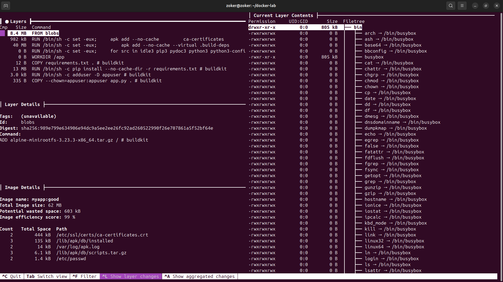

Посмотрим что внутри контейнера без его запуска:\
docker create --name inspect-me myapp:good\
docker export inspect-me | tar -tv | head -30\
docker rm inspect-me
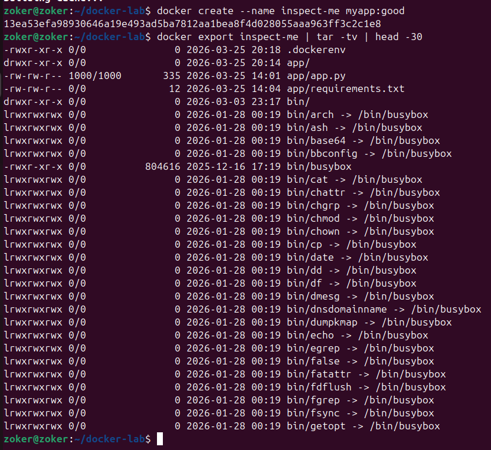

Далее нам нужно залить проект на докерхаб. Нам нужно создать аккаунт. После того, как аккаунт уже создан, логинимся на хостовой машине с помощью команды docker login.

Затем тегируем и публикуем проект:\
docker tag myapp:good ВАШЕ_ИМЯ/flask-demo:v1.0\
docker push ВАШЕ_ИМЯ/flask-demo:v1.0
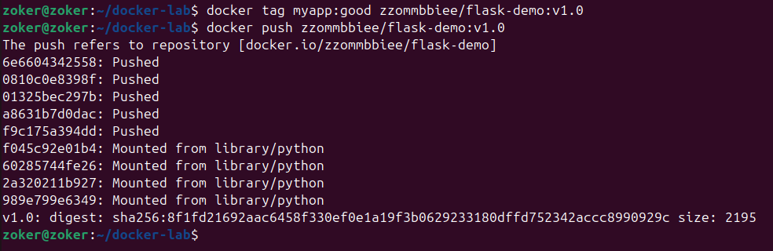

Удалим проект локально и скачаем его, чтобы проверить работоспособность. Можно его только включить, это будет означать, что все сделано верно:\
docker rmi ВАШЕ_ИМЯ/flask-demo:v1.0\
docker pull ВАШЕ_ИМЯ/flask-demo:v1.0\
docker run -d -p 5002:5000 ВАШЕ_ИМЯ/flask-demo:v1.0
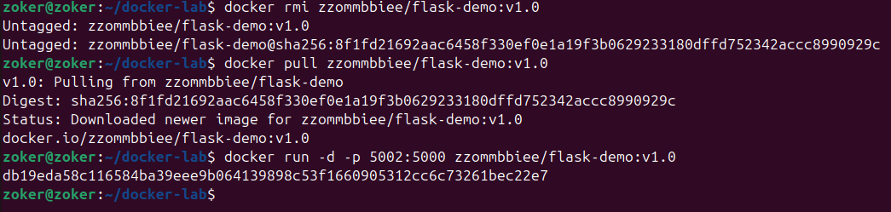

URL на проект в докерхабе: https://hub.docker.com/r/zzommbbiee/flask-demo

