# Docker: сети, volumes, docker-compose
Цель: поднять стек из 3 сервисов (frontend nginx + backend Flask + database PostgreSQL) через docker-compose и понять как контейнеры общаются между собой.

## Блок 1 — Docker networking
Сначала посмотрим сети\
docker network ls
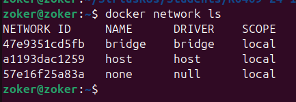

Показывает список всех сетей в Docker.

    bridge — стандартная сеть по умолчанию для контейнеров

    host — контейнер использует сеть хостовой машины

    none — изолированная сеть, только loopback

    overlay — для связи контейнеров на разных хостах (Swarm/Kubernetes)
docker network inspect bridge
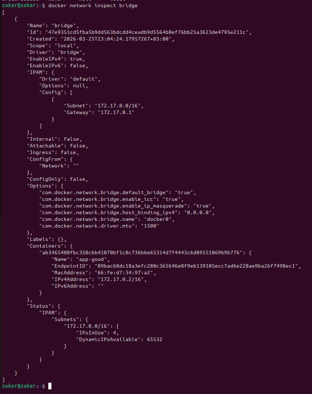

Показывает детальную информацию о сети bridge:

    Подсеть (subnet)

    Шлюз (gateway)

    Подключенные контейнеры

    Настройки драйвера

Создадим изолированную сеть: docker network create --driver bridge app-network
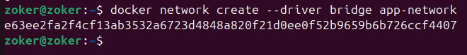

Запустим два контейнера в данной сети: \
`docker run -d --name db --network app-network \`\
  `-e POSTGRES_PASSWORD=secret \`\
  `postgres:16-alpine`

  Запускает контейнер PostgreSQL.

    -d — detach mode, контейнер работает в фоне

    --name db — имя контейнера (будет использоваться как DNS имя)

    --network app-network — подключает контейнер к нашей сети

    -e POSTGRES_PASSWORD=secret — переменная окружения для пароля

    postgres:16-alpine — образ PostgreSQL на Alpine Linux (маленький размер)

`docker run -it --rm --network app-network alpine sh`

Запускает Alpine Linux в интерактивном режиме.

    -it — интерактивный режим с псевдо-TTY

    --rm — автоматически удалить контейнер после выхода

    --network app-network — подключает к нашей сети

    alpine sh — образ Alpine, запускаем shell
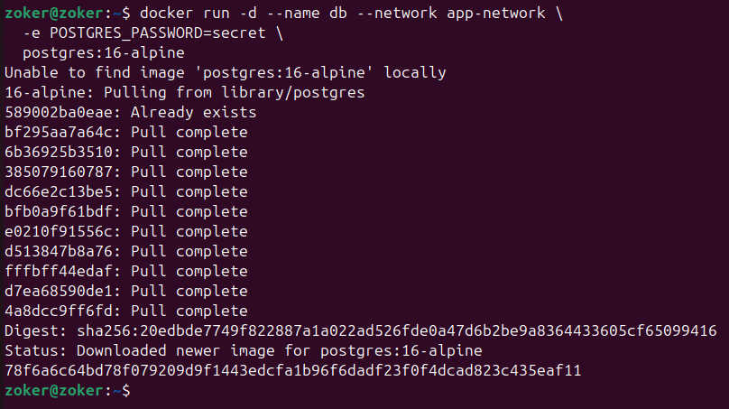

Внутри alpine — пробуем достучаться до db по имени\
ping db          # DNS работает внутри сети!\
nc -zv db 5432   # порт открыт\
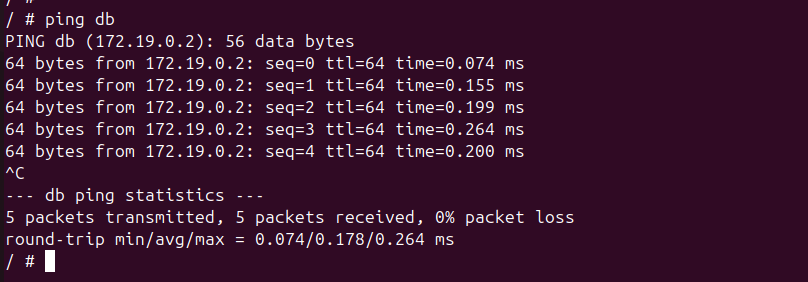

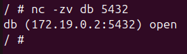

Сравнить: контейнер без нашей сети НЕ видит db\
docker run -it --rm alpine ping db  # не найдёт

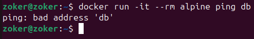

## Блок 2 — Volumes и persistent data

Создадим volume:\
docker volume create pgdata

Создает именованный volume pgdata.

    Volumes хранятся в /var/lib/docker/volumes/

    Не удаляются при удалении контейнера

    Монтируются в контейнер через -v volume_name:/path

Затем запустим PostgreSQL с этим Volume и создадим тестовые данные

`docker run -d \`\
  `--name postgres-persistent \`\
  `-e POSTGRES_DB=mydb \`\
  `-e POSTGRES_USER=user \`\
  `-e POSTGRES_PASSWORD=pass \`\
  `-v pgdata:/var/lib/postgresql/data \`\
  `postgres:16-alpine`

Создаем тестовые данные\
`docker exec -it postgres-persistent psql -U user -d mydb -c \`\
  `"CREATE TABLE items (id SERIAL, name TEXT); INSERT INTO items VALUES (1, 'test');"`

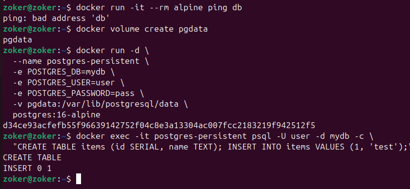

Удалим контейнер (ИМЕННО ДОКЕР, А НЕ ВОЛЮМЕ)\
docker rm -f postgres-persistent

Затем поднимем контейнер еще раз, как мы это уже делали. Далее требуется извлечь данные запросом SELECT из созданной таблички:\
`docker exec postgres-restored psql -U user -d mydb -c "SELECT * FROM items;"`\
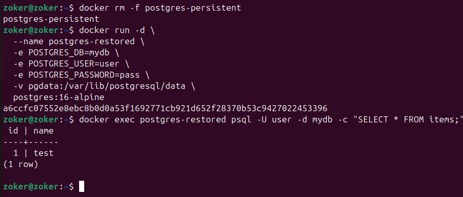

Посмотрим, где физически лежит volume: docker volume inspect pgdata

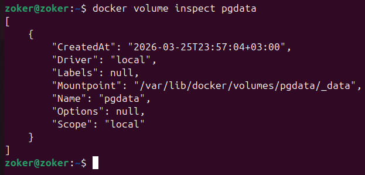

Показывает детали volume:

    Путь на хосте: /var/lib/docker/volumes/pgdata/_data

    Тип драйвера

    Метки (labels)

## Блок 3 — docker-compose

Создадим структуру проекта:\
mkdir ~/compose-lab && cd ~/compose-lab\
mkdir -p backend frontend

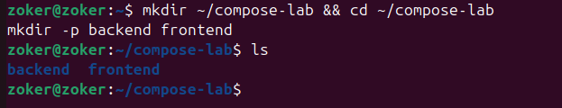

затем создаем файл backend/app.py:
```
from flask import Flask, jsonify
import psycopg2, os

app = Flask(__name__)

def get_db():
    return psycopg2.connect(
        host=os.getenv("DB_HOST", "db"),
        database=os.getenv("DB_NAME", "mydb"),
        user=os.getenv("DB_USER", "user"),
        password=os.getenv("DB_PASS", "pass")
    )

@app.route('/api/items')
def items():
    conn = get_db()
    cur = conn.cursor()
    cur.execute("SELECT id, name FROM items")
    rows = cur.fetchall()
    conn.close()
    return jsonify([{"id": r[0], "name": r[1]} for r in rows])

@app.route('/health')
def health():
    return {"status": "ok"}

if __name__ == '__main__':
    app.run(host='0.0.0.0', port=5000)
```

Создаем файл backend/requirements.txt:
```
flask==3.0.0
psycopg2-binary==2.9.9
```

Затем создаем backend/Dockerfile
```
FROM python:3.12-alpine
WORKDIR /app
COPY requirements.txt .
RUN pip install --no-cache-dir -r requirements.txt
COPY app.py .
CMD ["python", "app.py"]
```
Создадим конфиг nginx (frontend/nginx.conf)
```
server {
    listen 80;
    location /api/ {
        proxy_pass http://backend:5000/api/;
        proxy_set_header Host $host;
    }
    location / {
        return 200 '<h1>Frontend OK</h1><p>API: <a href="/api/items">/api/items</a></p>';
        add_header Content-Type text/html;
    }
}
```
Затем уже в основной папке проекта compose-lab создаем файл docker-compose.yml:
```
version: '3.9'

services:
  db:
    image: postgres:16-alpine
    environment:
      POSTGRES_DB: mydb
      POSTGRES_USER: user
      POSTGRES_PASSWORD: pass
    volumes:
      - pgdata:/var/lib/postgresql/data
    healthcheck:
      test: ["CMD-SHELL", "pg_isready -U user -d mydb"]
      interval: 5s
      timeout: 3s
      retries: 5

  backend:
    build: ./backend
    environment:
      DB_HOST: db
      DB_NAME: mydb
      DB_USER: user
      DB_PASS: pass
    depends_on:
      db:
        condition: service_healthy
    healthcheck:
      test: ["CMD", "wget", "-qO-", "http://127.0.0.1:5000/health"]
      interval: 10s
      timeout: 3s
      retries: 3

  frontend:
    image: nginx:alpine
    ports:
      - "8080:80"
    volumes:
      - ./frontend/nginx.conf:/etc/nginx/conf.d/default.conf:ro
    depends_on:
      backend:
        condition: service_healthy

volumes:
  pgdata:
  ```

Нужно в строке http поменять localhost на 127.0.0.1, потому что требование локалхоста там - быть в IPv4, но если мы напишем localhost, то он преобразуется в IPv6, и у нас будет умирать контейнер, это видно по следующему скрину (как умирает контейнер):
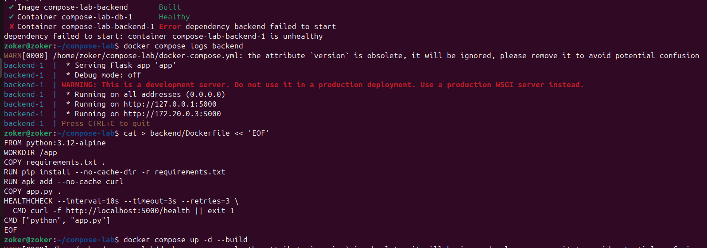

После данных изменений весь стек поднимается и контейнер не умирает:\
docker compose up -d --build
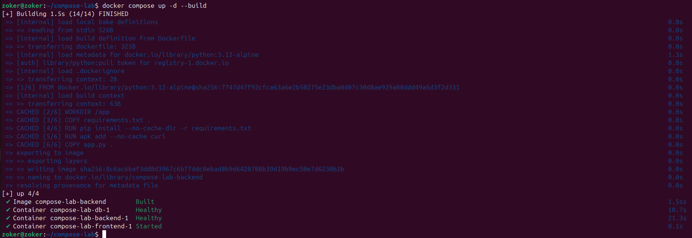

Проследим за состоянием:\
docker compose ps
Показывает статус всех сервисов:

    состояние (up/exited/healthy)

    порты

    имена контейнеров
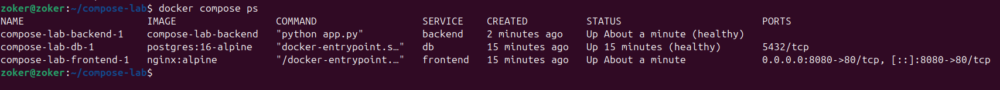


docker compose logs -f

Показывает логи всех сервисов.

    -f — follow, следить за новыми логами в реальном времени
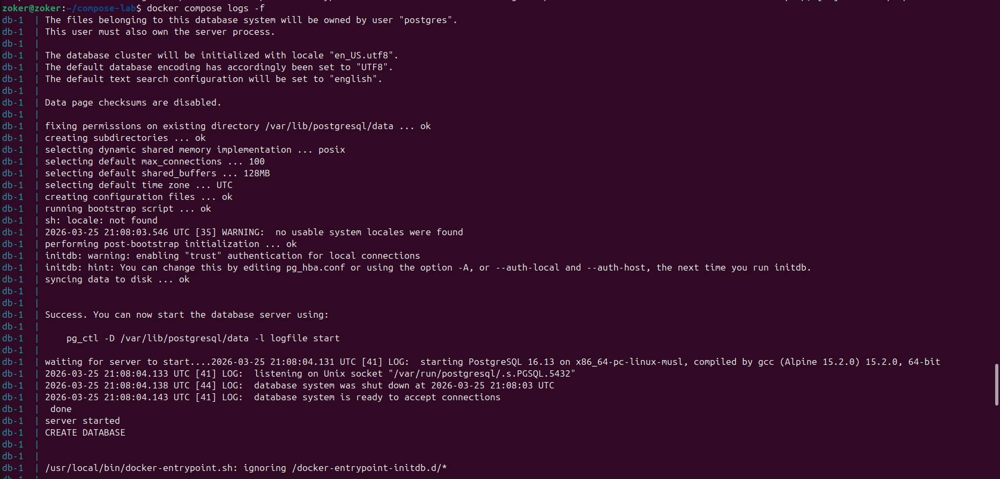

Создадим данные в нашей БД:
```
docker compose exec db psql -U user -d mydb -c \
  "CREATE TABLE IF NOT EXISTS items (id SERIAL, name TEXT); \
   INSERT INTO items (name) VALUES ('apple'), ('banana'), ('cherry');"
```

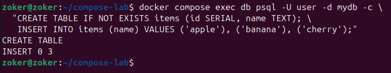

Проверим цепочку: frontend → backend → db

curl localhost:8080/api/items
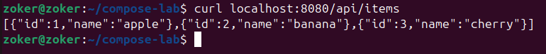

Отправляет HTTP запрос к frontend, который проксирует его к backend, который забирает данные из PostgreSQL.

Масштабируем бэкенд:\
docker compose up -d --scale backend=3\
--scale backend=3 — запускает 3 контейнера backend\
Nginx автоматически балансирует нагрузку между ними\
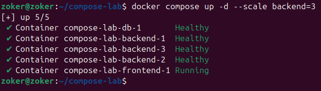
docker compose ps  # видим 3 экземпляра\
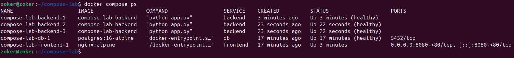
Остановим контейнеры:\
docker compose down
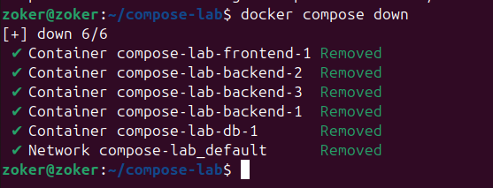
Эта команда останавливает и удаляет контейнеры, но сохраняет volumes.

Просмотрим все volumes: docker volume ls\
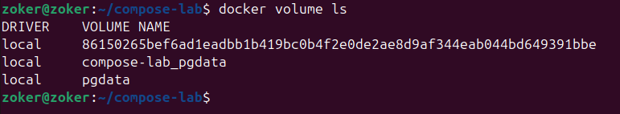

Так как мы уже закончили работу, очистим всё (включая volumes)\
docker compose down -v\
docker system prune -f\

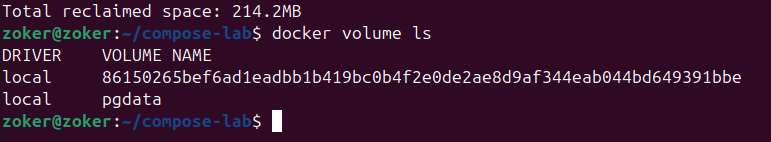

На данном этапе выполнение лабораторной работы заканчивается. 


