# Kubernetes: установка кластера, первые поды
Нужно использовать уже подготовленный кластер, но так как у нас его нет, поднимаем minikube (minikube start --cpus=2 --memory=4096)

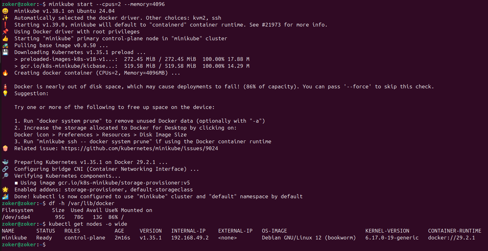

Просмотрим ноды кластера: kubectl get nodes -o wide\
У нас там конечно же одна нода minikube, потому что других не создавалось. Прикол самого по себе миникуба в том, что он является одноузловым, то есть single-node кластером Kubernetes, работающим локально. По факту миникуб сочетает в себе функции и Master Node и Worker Node (как я понял).\
Посмотрим описание ноды: kubectl describe node <имя-ноды> | head -50
```
zoker@zoker:~$ kubectl describe node minikube | head -50
Name:               minikube
Roles:              control-plane
Labels:             beta.kubernetes.io/arch=amd64
                    beta.kubernetes.io/os=linux
                    kubernetes.io/arch=amd64
                    kubernetes.io/hostname=minikube
                    kubernetes.io/os=linux
                    minikube.k8s.io/commit=c93a4cb9311efc66b90d33ea03f75f2c4120e9b0
                    minikube.k8s.io/name=minikube
                    minikube.k8s.io/primary=true
                    minikube.k8s.io/updated_at=2026_03_29T22_57_34_0700
                    minikube.k8s.io/version=v1.38.1
                    node-role.kubernetes.io/control-plane=
                    node.kubernetes.io/exclude-from-external-load-balancers=
Annotations:        node.alpha.kubernetes.io/ttl: 0
                    volumes.kubernetes.io/controller-managed-attach-detach: true
CreationTimestamp:  Sun, 29 Mar 2026 22:57:31 +0300
Taints:             <none>
Unschedulable:      false
Lease:
  HolderIdentity:  minikube
  AcquireTime:     <unset>
  RenewTime:       Sun, 29 Mar 2026 23:00:06 +0300
Conditions:
  Type             Status  LastHeartbeatTime                 LastTransitionTime                Reason                       Message
  ----             ------  -----------------                 ------------------                ------                       -------
  MemoryPressure   False   Sun, 29 Mar 2026 22:57:44 +0300   Sun, 29 Mar 2026 22:57:30 +0300   KubeletHasSufficientMemory   kubelet has sufficient memory available
  DiskPressure     False   Sun, 29 Mar 2026 22:57:44 +0300   Sun, 29 Mar 2026 22:57:30 +0300   KubeletHasNoDiskPressure     kubelet has no disk pressure
  PIDPressure      False   Sun, 29 Mar 2026 22:57:44 +0300   Sun, 29 Mar 2026 22:57:30 +0300   KubeletHasSufficientPID      kubelet has sufficient PID available
  Ready            True    Sun, 29 Mar 2026 22:57:44 +0300   Sun, 29 Mar 2026 22:57:37 +0300   KubeletReady                 kubelet is posting ready status
Addresses:
  InternalIP:  192.168.49.2
  Hostname:    minikube
Capacity:
  cpu:                12
  ephemeral-storage:  99123344Ki
  hugepages-1Gi:      0
  hugepages-2Mi:      0
  memory:             24301640Ki
  pods:               110
Allocatable:
  cpu:                12
  ephemeral-storage:  99123344Ki
  hugepages-1Gi:      0
  hugepages-2Mi:      0
  memory:             24301640Ki
  pods:               110
System Info:
  Machine ID:                 86e0bfeb3f77427722393c2969964edb
  System UUID:                e6603ed0-e32b-4604-978e-e3102b0e4a6d
```

Посмотрим какие у нас есть системные поды с помощью kubectl: kubectl get pods -n kube-system

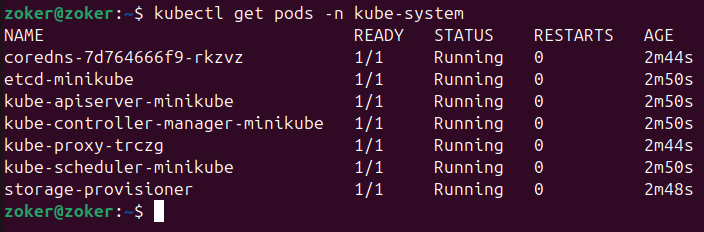

Посмотрим статусы компонентов Control Plane: kubectl get componentstatuses

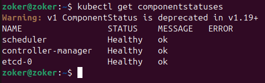

Теперь посмотрим конфиги статических подов Control Plane ls /etc/kubernetes/manifests/\
Изначально мы это сделать не сможем, так как не находимся внутри самого кластера minikube, поэтому подключаемся к нему командой minikube ssh

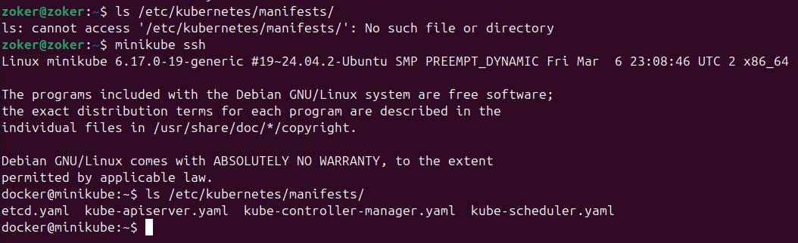

Посмотрим конфиг API-сервера\
cat /etc/kubernetes/manifests/kube-apiserver.yaml | grep -A5 "- --"

```
docker@minikube:~$ cat /etc/kubernetes/manifests/kube-apiserver.yaml | grep -A5 -e "- --"
cat: /etc/kubernetes/manifests/kube-apiserver.yaml: Permission denied
docker@minikube:~$ sudo cat /etc/kubernetes/manifests/kube-apiserver.yaml | grep -A5 -e "- --"
    - --advertise-address=192.168.49.2
    - --allow-privileged=true
    - --authorization-mode=Node,RBAC
    - --client-ca-file=/var/lib/minikube/certs/ca.crt
    - --enable-bootstrap-token-auth=true
    - --etcd-cafile=/var/lib/minikube/certs/etcd/ca.crt
    - --etcd-certfile=/var/lib/minikube/certs/apiserver-etcd-client.crt
    - --etcd-keyfile=/var/lib/minikube/certs/apiserver-etcd-client.key
    - --etcd-servers=https://127.0.0.1:2379
    - --kubelet-client-certificate=/var/lib/minikube/certs/apiserver-kubelet-client.crt
    - --kubelet-client-key=/var/lib/minikube/certs/apiserver-kubelet-client.key
    - --kubelet-preferred-address-types=InternalIP,ExternalIP,Hostname
    - --proxy-client-cert-file=/var/lib/minikube/certs/front-proxy-client.crt
    - --proxy-client-key-file=/var/lib/minikube/certs/front-proxy-client.key
    - --requestheader-allowed-names=front-proxy-client
    - --requestheader-client-ca-file=/var/lib/minikube/certs/front-proxy-ca.crt
    - --requestheader-extra-headers-prefix=X-Remote-Extra-
    - --requestheader-group-headers=X-Remote-Group
    - --requestheader-username-headers=X-Remote-User
    - --secure-port=8443
    - --service-account-issuer=https://kubernetes.default.svc.cluster.local
    - --service-account-key-file=/var/lib/minikube/certs/sa.pub
    - --service-account-signing-key-file=/var/lib/minikube/certs/sa.key
    - --service-cluster-ip-range=10.96.0.0/12
    - --tls-cert-file=/var/lib/minikube/certs/apiserver.crt
    - --tls-private-key-file=/var/lib/minikube/certs/apiserver.key
    - --enable-admission-plugins=NamespaceLifecycle,LimitRanger,ServiceAccount,DefaultStorageClass,DefaultTolerationSeconds,NodeRestriction,MutatingAdmissionWebhook,ValidatingAdmissionWebhook,ResourceQuota
    image: registry.k8s.io/kube-apiserver:v1.35.1
    imagePullPolicy: IfNotPresent
    livenessProbe:
      failureThreshold: 8
      httpGet:
```

Смотрим API-ресурсы кластера: kubectl api-resources | head -20

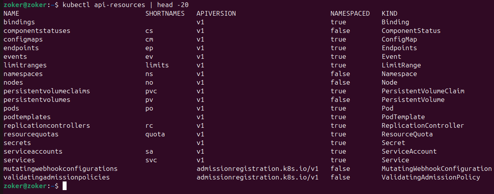

Версию посмотрим с помощью kubectl version, потому что флаг --short не работает

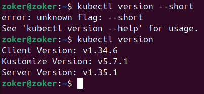

Запускаем свой первый под (мой первый под, очень волнуюсь хд): kubectl run nginx --image=nginx:alpine --port=80\
Че оно делает?\
Запускает под с веб-сервером nginx на alpine linux, слушающий 80-й порт.\
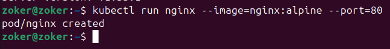\
kubectl get pods позволит нам посмотреть все поды, созданные нами (у нас пока что только один под с nginx)\
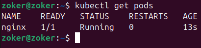\
Можно также воспользоваться расширенным вариантом вывода инфы о поде: kubectl get pods -o wide\
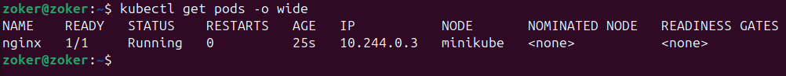\
Тут например мы можем увидеть, на какой ноде у нас существует этот под.\
Зайдем внутрь этого пода: kubectl exec -it nginx -- sh\
Разберем че ваще за команда.
```
kubectl exec: Главное слово. Говорит: «Выполни (execute) команду в контейнере».
-i (interactive): Этот ключ держит ввод открытым, когда мы пишем команды в терминал, все перенаправляется в контейнер
-t (tty): Создает виртуальный терминал
nginx: Имя пода, в который мы заходим
--: Просто разделитель после настроек
sh: Комманда. Мы конкретно запускаем командную оболочку, чтобы в ней непосредственно выполнять команды
```

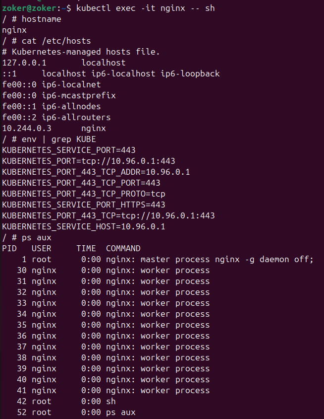

Внутри выполняются следующие команды:
```
# внутри:
  hostname         # имя пода
  cat /etc/hosts   # IP пода и DNS
  env | grep KUBE  # переменные окружения от K8s
  ps aux           # только наши процессы (PID namespace)
  ip addr          # свой IP (NET namespace)
  exit
```

Вывод команды ip addr на скрин не попал, поэтому прикрепляю его ниже:

```
/ # ip addr
1: lo: <LOOPBACK,UP,LOWER_UP> mtu 65536 qdisc noqueue state UNKNOWN qlen 1000
    link/loopback 00:00:00:00:00:00 brd 00:00:00:00:00:00
    inet 127.0.0.1/8 scope host lo
       valid_lft forever preferred_lft forever
    inet6 ::1/128 scope host 
       valid_lft forever preferred_lft forever
2: eth0@if6: <BROADCAST,MULTICAST,UP,LOWER_UP,M-DOWN> mtu 1500 qdisc noqueue state UP qlen 1000
    link/ether f6:db:32:67:3c:89 brd ff:ff:ff:ff:ff:ff
    inet 10.244.0.3/16 brd 10.244.255.255 scope global eth0
       valid_lft forever preferred_lft forever
    inet6 fe80::f4db:32ff:fe67:3c89/64 scope link 
       valid_lft forever preferred_lft forever
/ # exit
```

Можно также посмотреть логи:\
kubectl logs nginx\
kubectl logs nginx -f - для того чтобы следить в реальном времени за логами

Далее у нас создается файл pod.yaml с вот такой конфигурацией:
```
apiVersion: v1
kind: Pod
metadata:
  name: my-webserver
  labels:
    app: webserver
    env: lab
spec:
  containers:
  - name: nginx
    image: nginx:alpine
    ports:
    - containerPort: 80
    resources:
      requests:
        memory: "32Mi"
        cpu: "50m"
      limits:
        memory: "64Mi"
        cpu: "100m"
    readinessProbe:
      httpGet:
        path: /
        port: 80
      initialDelaySeconds: 3
      periodSeconds: 5
    livenessProbe:
      httpGet:
        path: /
        port: 80
      initialDelaySeconds: 10
      periodSeconds: 10

  - name: log-sidecar
    image: busybox:latest
    command: ["/bin/sh", "-c", "while true; do echo $(date) >> /var/log/access.log; sleep 5; done"]
    volumeMounts:
    - name: logs
      mountPath: /var/log

  volumes:
  - name: logs
    emptyDir: {}
```

Применяем файлик для создания пода: kubectl apply -f pod.yaml\
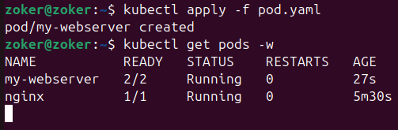\
Посмотрим оба контейнера в этом поде:
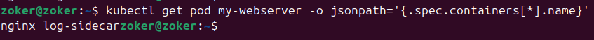

Убьем основной процесс nginx, после чего кубер должен его перезапустить:\
kubectl exec my-webserver -c nginx -- kill 1\
И проследим, что происходит\
kubectl get pods -w\
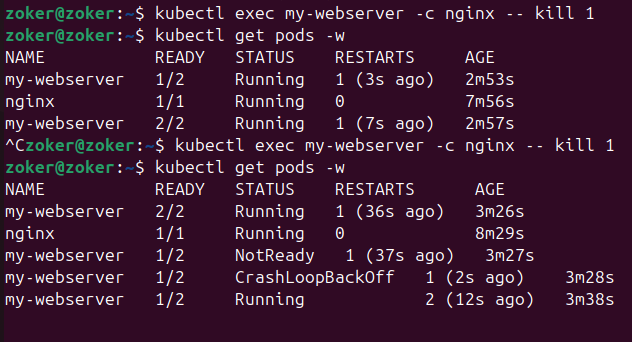
Для того, чтобы подробнее посмотреть, что происходит при самовосстановлении, я убил my-webserver 2 раза.


И финальный скрин, который как по лабе нужно сдать:\
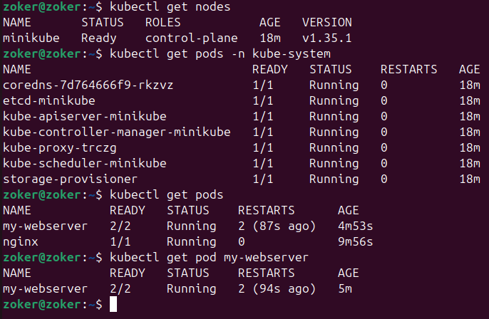


