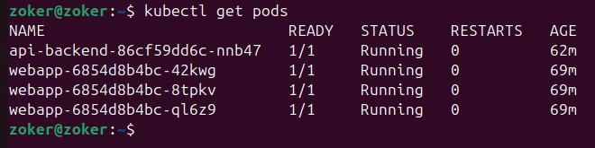
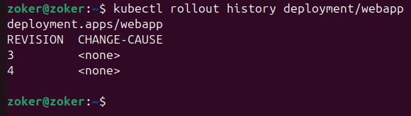
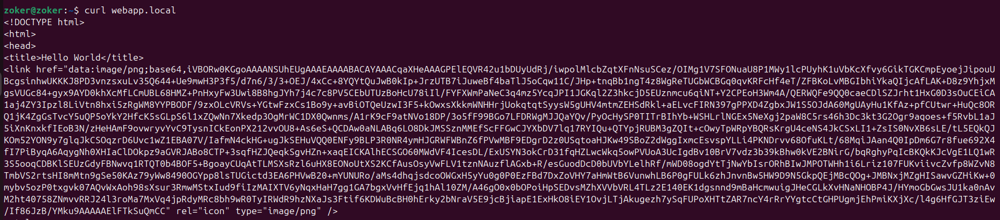
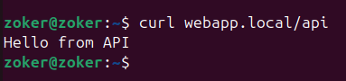

# Пара 5 — Kubernetes: Deployment, Service, Ingress

Мало времени, поэтому расписываю только по требованиям, что надо сдать преподавателю:\
kubectl get pods — 3 пода webapp Running\
\
kubectl rollout history deployment/webapp — минимум 2 ревизии\
\
curl webapp.local выводит нам вообще целый код html-страницы, поэтому мы можем увидеть следущее:\

а curl webapp.local/api выведет всего лишь одну строчку, потому что мы имитировали работу API

Собственно чем отличается ClusterIP от NodePort.\
Когда мы создаем кластер айпи, кубер выделяет приложению как бы внутренний айпишник, который знают только другие поды. Допустим, если мы введем этот айпишник в браузере, то должна быть ошибка, потому что наша линукс бубунта условная не знает, как попасть в закрытую сеть.\
NodePort открывает порт на всех нодах (как я понял). Плюс это небезопасно, потому что порт открыт извне и попасть на него можно просто вбив айпишник ноды и порт (http://192.168.49.2:30080).\
Еще очень интересное для меня наблюдение:\
Мы добавили в файл /etc/hosts айпишник нашего minikube. Когда мы вводим допустим webapp.local в браузер или в curl, то убунта смотрит /etc/hosts и понимает, что ей не нужно идти в интернет, а нужно постучаться по адресу миникуба. Запрос прилетает на стандартный под миникуба (80) и там его встречает Ingress Controller. Он обращается к webapp-svc. Сервис же в свою очередь выбирает один из трех подов, а затем перекидывает запрос внутрь контейнера. Запрос попадает в контейнер, а затем также на страничке генерируется имя пода, который нам ответил.