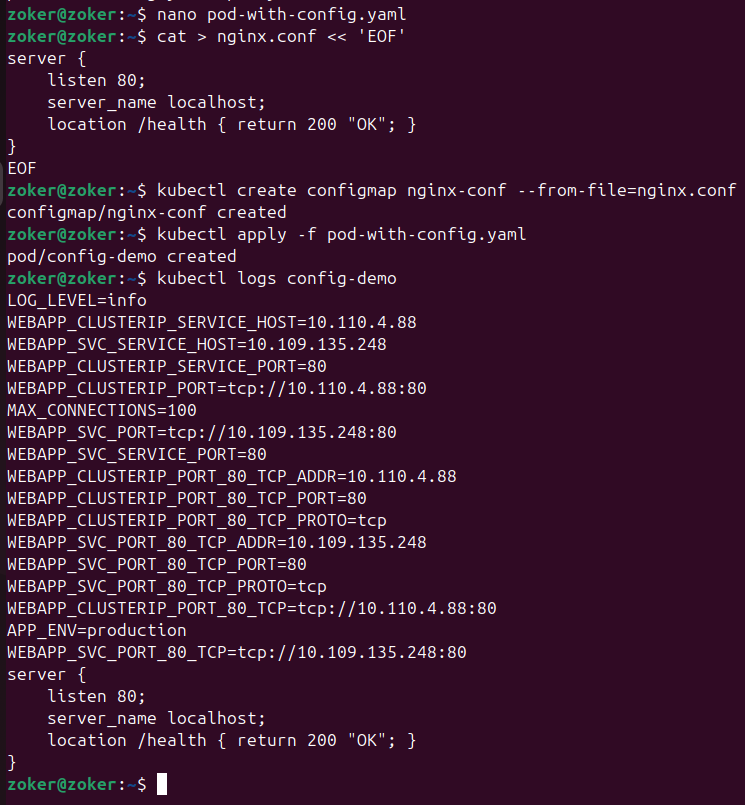
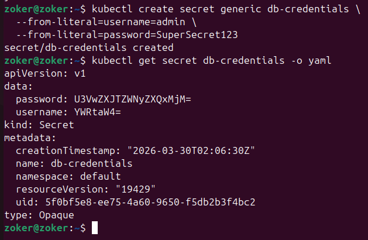
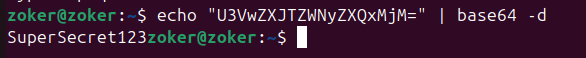
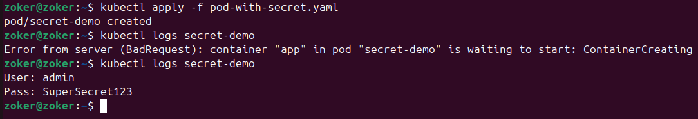
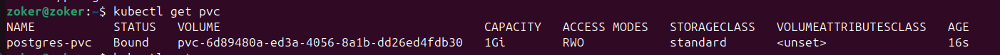
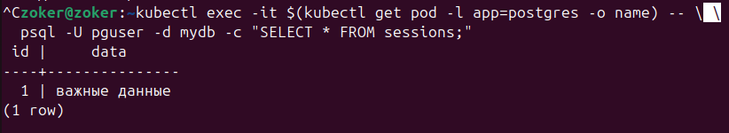

# Пара 6 — Kubernetes: ConfigMap, Secret, PersistentVolume

Итого по лабе по поводу того, что нужно сдать:\
\
все 3 способа передачи ConfigMap работают
\
Данные в base64\
\
Расшифрованные данные\
\
После создания пода pod-with-secret, мы видим, что внутри пода информация уже не зашифрованная, благодаря этому мы можем записать их в переменные окружения, как и было показано в pod-with-secret.yaml. Затем они логгируются, после чего можно это все посмотреть в логах.\
\
Это значит, что PV (Persistent Volume) связан с PVC (Persistent Volume Claim).\
\
Ну и под конец подтверждение того, что даже после удаления пода с бдшкой данные сохранились, потому что PVC не удалена и осталась в статусе Bound. Следовательно данные на PV точно так же остались, НО!!!! если удалить PVC в текущем случае у нас удалится и PV.