# Пара 7 — Безопасность Kubernetes: RBAC, NetworkPolicy, Falco

Создается namespace для демо нашего RBAC:\
kubectl create namespace rbac-demo

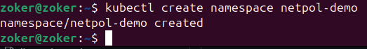


Создается конфигурация для пода rbac.yaml со следующим содержанием:
```
---
# ServiceAccount для нашего приложения
apiVersion: v1
kind: ServiceAccount
metadata:
  name: app-reader
  namespace: rbac-demo
---
# Role: только чтение подов в этом namespace
apiVersion: rbac.authorization.k8s.io/v1
kind: Role
metadata:
  name: pod-reader
  namespace: rbac-demo
rules:
- apiGroups: [""]
  resources: ["pods", "pods/log"]
  verbs: ["get", "list", "watch"]
# Специально НЕ даём: create, delete, update
---
# RoleBinding: связываем SA с Role
apiVersion: rbac.authorization.k8s.io/v1
kind: RoleBinding
metadata:
  name: app-reader-binding
  namespace: rbac-demo
subjects:
- kind: ServiceAccount
  name: app-reader
  namespace: rbac-demo
roleRef:
  kind: Role
  name: pod-reader
  apiGroup: rbac.authorization.k8s.io
```

Затем создается сам под командой kubectl apply -f rbac.yaml\
Проверяются также права доступа:
```
# Проверить права
kubectl auth can-i list pods \
  --namespace rbac-demo \
  --as=system:serviceaccount:rbac-demo:app-reader
# → yes

kubectl auth can-i delete pods \
  --namespace rbac-demo \
  --as=system:serviceaccount:rbac-demo:app-reader
# → no

kubectl auth can-i list pods \
  --namespace default \
  --as=system:serviceaccount:rbac-demo:app-reader
# → no (Role ограничена namespace rbac-demo)
```

Запускаем под от имени ServiceAccount:
```
# pod-rbac-demo.yaml
apiVersion: v1
kind: Pod
metadata:
  name: rbac-test
  namespace: rbac-demo
spec:
  serviceAccountName: app-reader
  containers:
  - name: kubectl
    image: bitnami/kubectl:latest
    command: ["/bin/sh", "-c", "sleep 3600"]
```
```
kubectl apply -f pod-rbac-demo.yaml

# Войти в под и попробовать API
kubectl exec -it rbac-test -n rbac-demo -- sh

  # Внутри — kubectl использует SA токен автоматически
  kubectl get pods -n rbac-demo     # ✓ работает
  kubectl delete pod rbac-test -n rbac-demo  # ✗ Forbidden!
  kubectl get pods -n default        # ✗ Forbidden!
  exit
```

## Блок 2 — NetworkPolicy

Создаем неймспейс для сетевых политик:\
kubectl create namespace netpol-demo\
Также запускаем тестовые поды:
```
# Frontend
kubectl run frontend -n netpol-demo --image=nginx:alpine --labels=role=frontend
kubectl expose pod frontend -n netpol-demo --port=80 --name=frontend-svc

# Backend
kubectl run backend -n netpol-demo --image=nginx:alpine --labels=role=backend
kubectl expose pod backend -n netpol-demo --port=80 --name=backend-svc

# Database
kubectl run database -n netpol-demo --image=nginx:alpine --labels=role=database
kubectl expose pod database -n netpol-demo --port=80 --name=database-svc
```


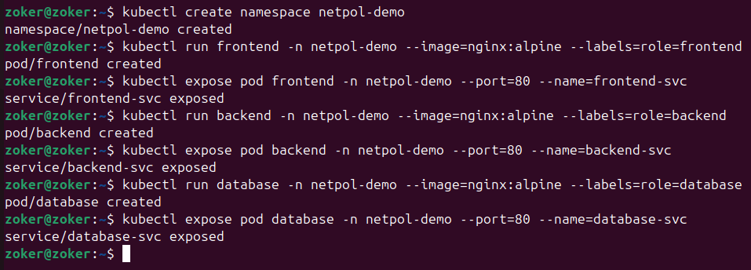


Проверим, что фронт может общаться с бэком (до создания политик):

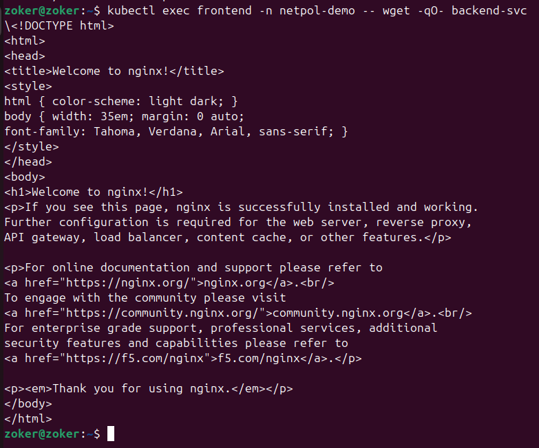

Это нормально

А вот то, что фронт может общаться с БДшкой, не очень хорошо (небезопасно)

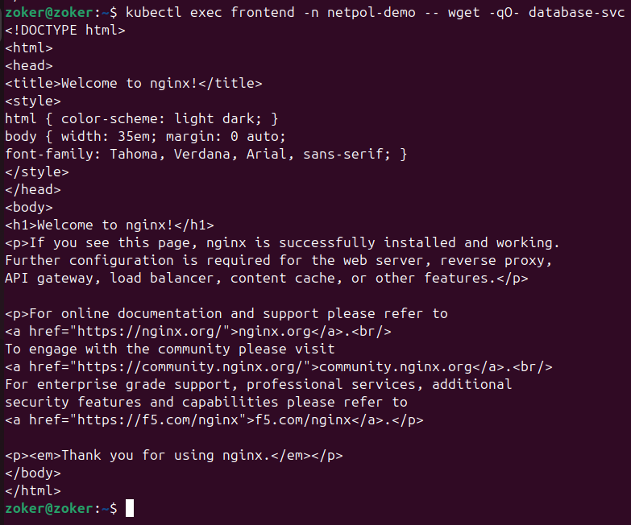

Создаем файл networkpolicies.yaml со следующим содержимым:
```
---
# 1. Default: запретить весь входящий трафик
apiVersion: networking.k8s.io/v1
kind: NetworkPolicy
metadata:
  name: default-deny-ingress
  namespace: netpol-demo
spec:
  podSelector: {}  # применить ко ВСЕМ подам
  policyTypes:
  - Ingress
  # ingress: []  — пустой список = ничего не разрешаем
---
# 2. Разрешить frontend принимать внешний трафик (от ingress)
apiVersion: networking.k8s.io/v1
kind: NetworkPolicy
metadata:
  name: allow-frontend-ingress
  namespace: netpol-demo
spec:
  podSelector:
    matchLabels:
      role: frontend
  policyTypes:
  - Ingress
  ingress:
  - {}  # разрешить всем
---
# 3. Backend принимает только от frontend
apiVersion: networking.k8s.io/v1
kind: NetworkPolicy
metadata:
  name: allow-backend-from-frontend
  namespace: netpol-demo
spec:
  podSelector:
    matchLabels:
      role: backend
  policyTypes:
  - Ingress
  ingress:
  - from:
    - podSelector:
        matchLabels:
          role: frontend
---
# 4. Database принимает только от backend
apiVersion: networking.k8s.io/v1
kind: NetworkPolicy
metadata:
  name: allow-database-from-backend
  namespace: netpol-demo
spec:
  podSelector:
    matchLabels:
      role: database
  policyTypes:
  - Ingress
  ingress:
  - from:
    - podSelector:
        matchLabels:
          role: backend
```

Затем мы применяем сетевые политики:
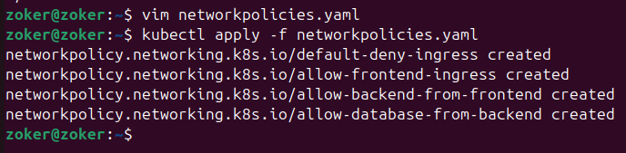

Проверим также изоляцию 

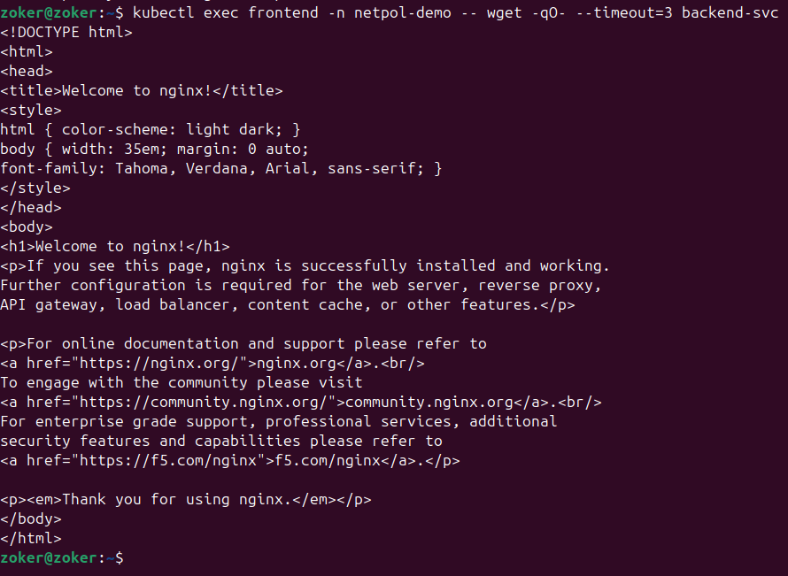

Работает, так как доступ из фронта в бек разрешен

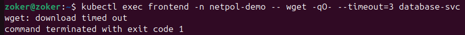

Не работает, так как доступ из фронта в БД запрещен.


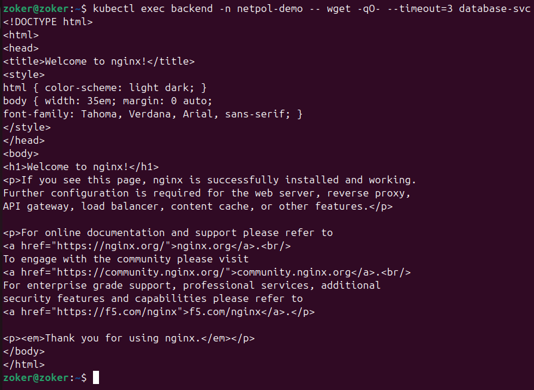


Работает, так как доступ из бэка в БД разрешен.

Выведем схему разрешенных потоков:\
kubectl get networkpolicies -n netpol-demo

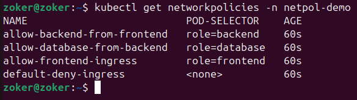

Требуется создать свой CA (Certification Authority)

```

Изначально создаем папку для работы по созданию самоподписанных ssl-сертификатов.
mkdir -p ~/ssl-lab && cd ~/ssl-lab
Затем мы генерируем приватный ключ для CA:
openssl genrsa -out ca.key 4096
# Или через ECDSA:
# openssl ecparam -name prime256v1 -genkey -noout -out ca.key

Создаем самоподписанный корневой сертификат CA на 10 лет:
# Самоподписанный корневой сертификат CA (10 лет)
openssl req -x509 -new -nodes \
  -key ca.key \
  -sha256 \
  -days 3650 \
  -out ca.crt \
  -subj "/C=RU/ST=Moscow/O=SiriusLab CA/CN=SiriusLab Root CA"

Только после этого смотрим, что получилось:
openssl x509 -in ca.crt -noout -text | grep -E "Issuer:|Subject:|Not (Before|After)"


```


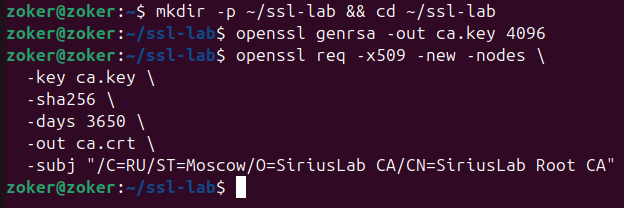

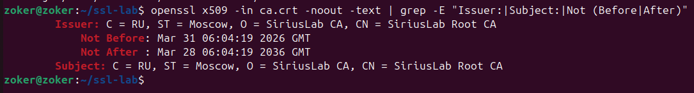

Создаем CSR (Certificate Signing Request) для веб-сервера:
```
# Конфигурационный файл с SAN (Subject Alternative Names)
cat > webapp.ext << 'EOF'
authorityKeyIdentifier=keyid,issuer
basicConstraints=CA:FALSE
keyUsage = digitalSignature, keyEncipherment
extendedKeyUsage = serverAuth
subjectAltName = @alt_names

[alt_names]
DNS.1 = webapp.local
DNS.2 = www.webapp.local
IP.1 = 127.0.0.1
EOF

# Ключ сервера
openssl genrsa -out webapp.key 2048

# CSR (Certificate Signing Request)
openssl req -new \
  -key webapp.key \
  -out webapp.csr \
  -subj "/C=RU/O=SiriusLab/CN=webapp.local"

# Посмотреть CSR
openssl req -in webapp.csr -noout -text | grep -E "Subject:|DNS:|IP:"
```


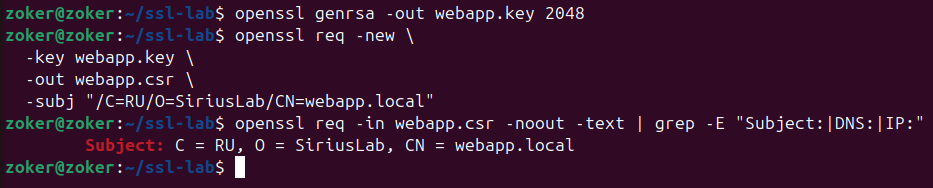


Подпишем сертификат нашим CA:

```
# Подписать CSR — CA выдаёт сертификат на 1 год
openssl x509 -req \
  -in webapp.csr \
  -CA ca.crt \
  -CAkey ca.key \
  -CAcreateserial \
  -out webapp.crt \
  -days 365 \
  -sha256 \
  -extfile webapp.ext

# Проверить результат
openssl x509 -in webapp.crt -noout -text | grep -A5 "Subject Alternative"
# Должно показать: DNS:webapp.local, IP:127.0.0.1

# Проверить цепочку доверия
openssl verify -CAfile ca.crt webapp.crt
# → webapp.crt: OK
```

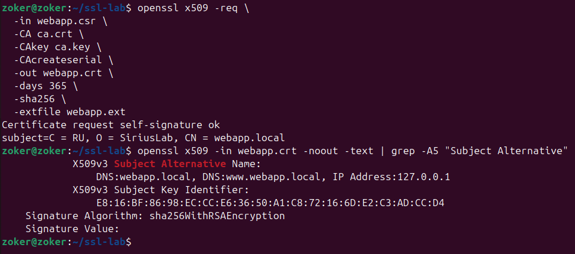

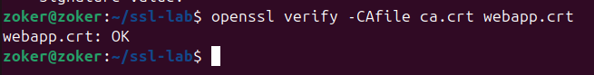

Подключаем сертификат к Kubernetes Ingress:
```
# Создать TLS (Transport Layer Security - это протокол шифрования, который защищает данные при их передаче по сети) Secret в Kubernetes
kubectl create secret tls webapp-tls \
  --cert=webapp.crt \
  --key=webapp.key \
  -n netpol-demo

#Приватный ключ всегда состоит из ключа и сертификата (в нашем случае это webapp.crt и webapp.key)

# Проверить Secret
kubectl get secret webapp-tls -n netpol-demo
kubectl describe secret webapp-tls -n netpol-demo
```

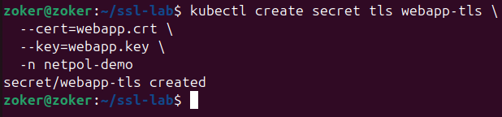

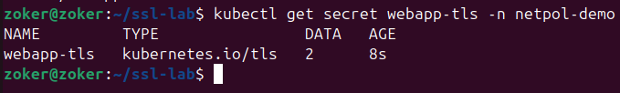

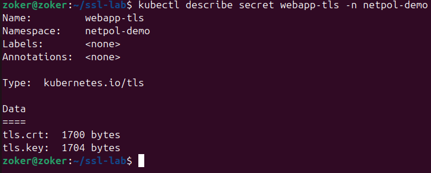

Создаем ingress-tls.yaml:
```
apiVersion: networking.k8s.io/v1
kind: Ingress
metadata:
  name: webapp-tls-ingress
  namespace: netpol-demo
  annotations:
    nginx.ingress.kubernetes.io/ssl-redirect: "true"
spec:
  ingressClassName: nginx
  tls:
  - hosts:
    - webapp.local
    secretName: webapp-tls    # наш Secret с сертификатом
  rules:
  - host: webapp.local
    http:
      paths:
      - path: /
        pathType: Prefix
        backend:
          service:
            name: frontend-svc
            port:
              number: 80
```
Это своеобразный конфиг или свод правил, согласно  которым Ingress будет управлять внешними запросами.\
Затем применяем конфиг для текущего кластера.

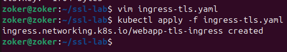


Проверим TSL соединение с нашим сертификатом доступа:\
curl --cacert ca.crt https://webapp.local

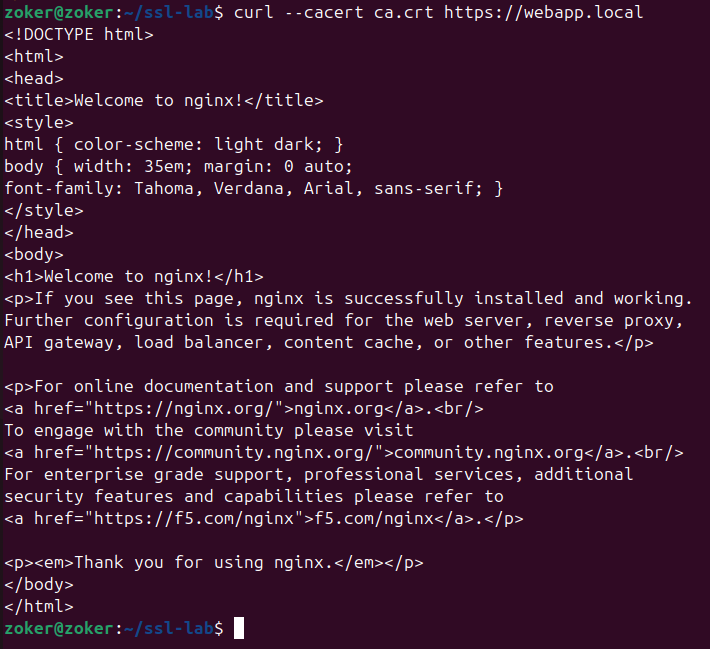

Доступ установлен, переходим к остальной проверке через openssl:\
openssl s_client -connect webapp.local:443 -CAfile ca.crt -showcerts 2>&1 | \
  grep -E "subject=|issuer=|Verify return code"\
Должен быть вывод "Verify return code: 0 (ok)"

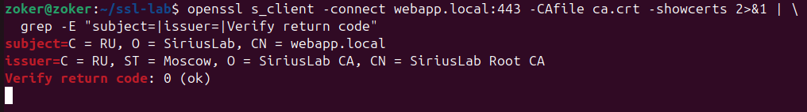

Декодируем сертификат из кубера:
```
# Посмотреть что хранится в Secret
kubectl get secret webapp-tls -n netpol-demo \
  -o jsonpath='{.data.tls\.crt}' | base64 -d | \
  openssl x509 -noout -text | \
  grep -E "Subject:|Issuer:|DNS:|IP:|Not "

# Проверить срок действия
kubectl get secret webapp-tls -n netpol-demo \
  -o jsonpath='{.data.tls\.crt}' | base64 -d | \
  openssl x509 -noout -enddate
```

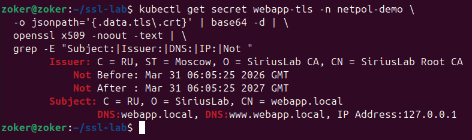

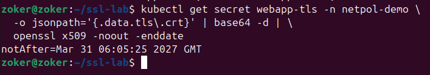

Установим Falco:

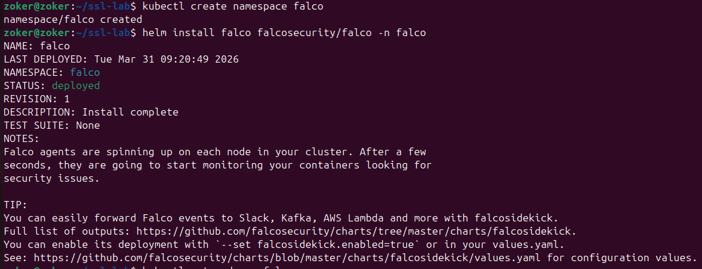

Пришлось чуть чуть заморочиться и установить helm, после чего добавить туда репозиторий с Falco

Просмотрим поды фалко:\
kubectl get pods -n falco


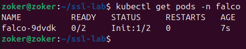


На моменте скрина они еще находились в состоянии инициализации, но потом поднялись\
Подключаемся к логам в реальном времени:
kubectl logs -n falco -l app.kubernetes.io/name=falco -f &\
И сгенерируем алерт: Зайдем в работающий контейнер:\
kubectl exec -it frontend -n netpol-demo -- sh

Фалко сгенерирует алерт:

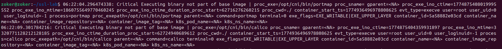

Прочитаем /etc/shadow, чтобы сгенерировать еще один алерт:\
kubectl exec frontend -n netpol-demo -- cat /etc/shadow 2>/dev/null || true

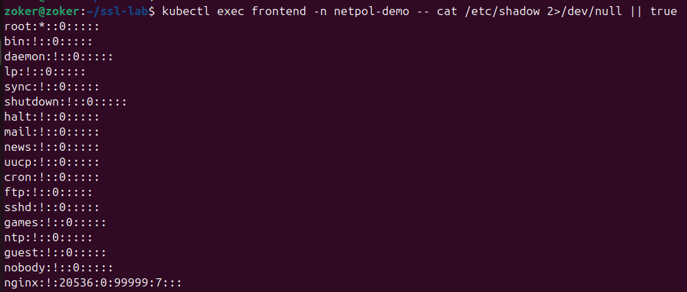

После этого как и на прошлом скрине возникает алерт.

