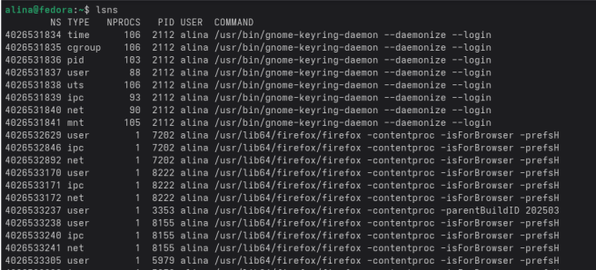
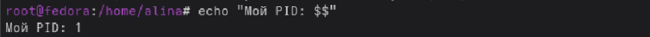
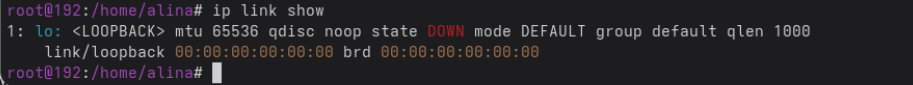
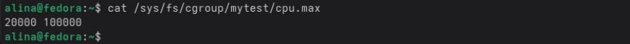
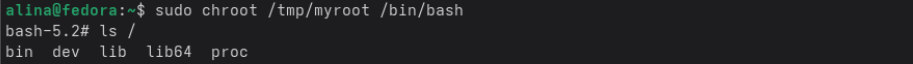

**`Практика 1`**

Команда `lsns` - выводит список всех неймспейсов, которые активны в системе

Команда `echo $$` - выводит PID текущей оболочки, в которой выполняется команда

Команда `ip link show` - показывает сетевые интерфейсы, но только внутри
неймспейса

Команда `cat /sys/fs/cgroup/mytest/cpu.max` - показывает ограничения цпу для сгрупса

Команда `ls /` - внутри чрута показывает корневую директорию, но в ней будут
находится только те директории, которые были скопированы заранеепоказывает ограничения цпу для сгрупса

**Контрольный вопрос:** Почему после `exit` процессы хоста остались нетронутыми?

Потому что работа была токо внтури изолированной среды, которая никак не
затрагивала осноные процессы системы и изменения, которые применились,
применялись только в рамках той среды

**Контрольный вопрос:** Что произойдёт если лимит памяти превысить? (OOM-killer)

Если процесс превышает лимит памяти, OOM-killer завершит самый тяжелый
процесс, чтоб все не поломалось