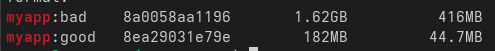
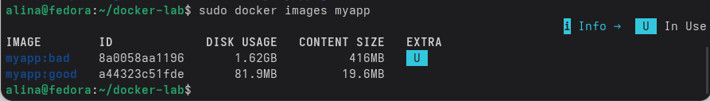
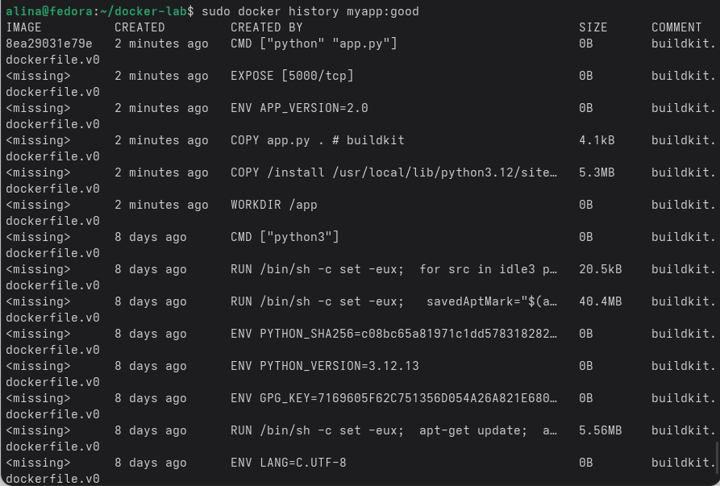
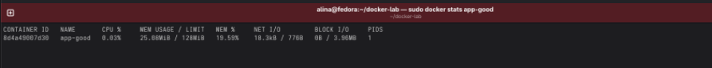

**`Практика 2`**

**Контрольный вопрос:** Почему образ такой большой?

Образ myapp:bad получается большим (~1.62 GB), потому что используется полный базовый образ python:3.12, который сам по себе оч много весит. Также отсутствует multistage build, из-за чего все инструменты сборки и временные файлы остаются в финальном образе. Нет .dockerignore, поэтому копируются все файлы, включая служебные и кееш

**Задания**

Команда `docker images myapp` - показывает список всех докер образов, у которых в названии есть "myapp", с информацией об их размере, ID и дате создания

Команда `docker history myapp:good` - показывает историю создания образа

Команда `docker stats app-good` - показывает статистику использования ресурсов контейнера

Мой юрл на что то там - `https://hub.docker.com/r/alinaaaaaaaa777/flask-demo`