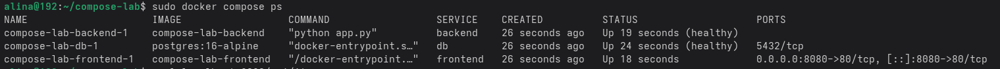
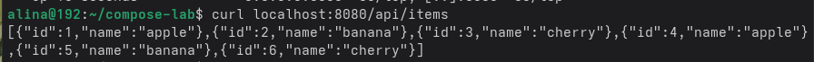
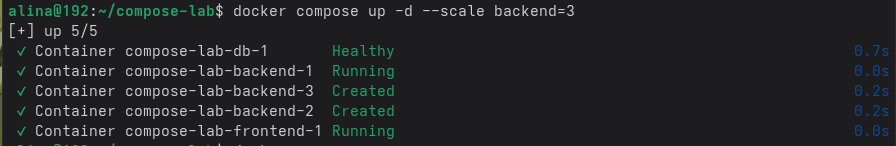
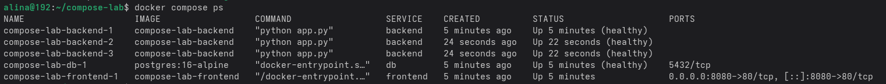

**`Практика 3`**

Команда `docker compose ps` — показывает список всех контейнеров текущего проекта

Команда `curl localhost:8080/api/items` — возвращает джсон всех записей из таблицы items

Комнада `--scale backend=3` — запускает три параллельных контейнера бекенд

Команда `docker compose ps` — показывает, что теперь запущено три экземпляра сервиса бекенд

