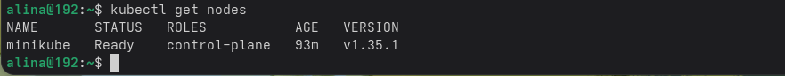
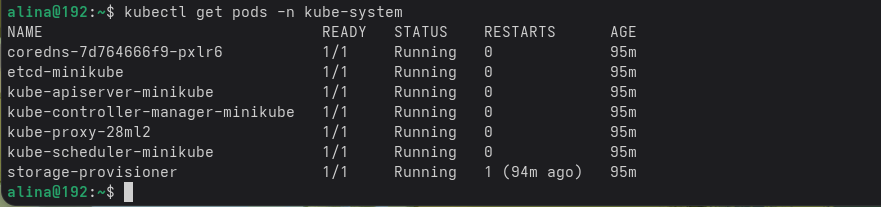
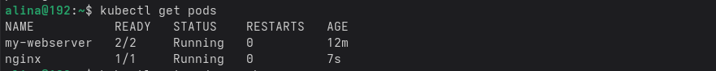
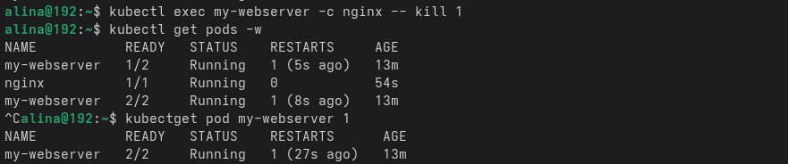

**`Практика 4`**

Команда `kubectl get nodes` — отображает все ноды в кубере

Команда `kubectl get pods -n kube-system` - отображает все поды

Команда `kubectl get pods` - отображает все поды в текущем пространстве

Команда `kubectl exec my-webserver -c nginx -- kill 1` - отправляет сигнал завершения процессу с PID 1 внутри контейнера nginx в поде my-webserver

Команда `kubectl get pod my-webserver` - отображает состояние пода my-webserver и показывает количество перезапусков контейнеров

**Контрольный вопрос:** Какие поды в `kube-system` всегда должны быть Running?

etcd, kube-apiserver, kube-controller-manager, kube-scheduler и coredns

**Контрольный вопрос:** Почему Pod не удалился, а перезапустился? Кто за это отвечает?

под не удалился, а перезапустился, потому что за перезапуск упавших контейнеров отвечает kubelet, который прост их перезапускает