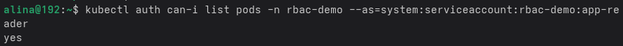
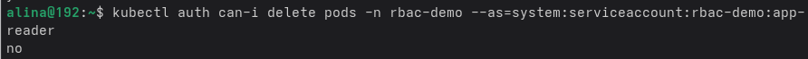
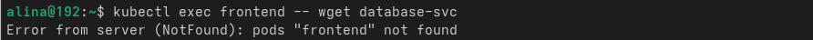
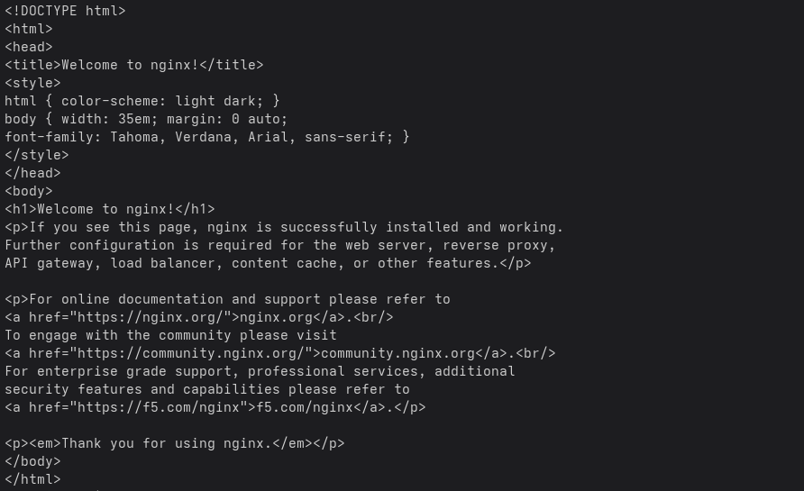
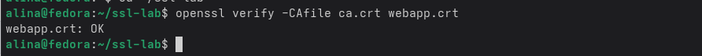
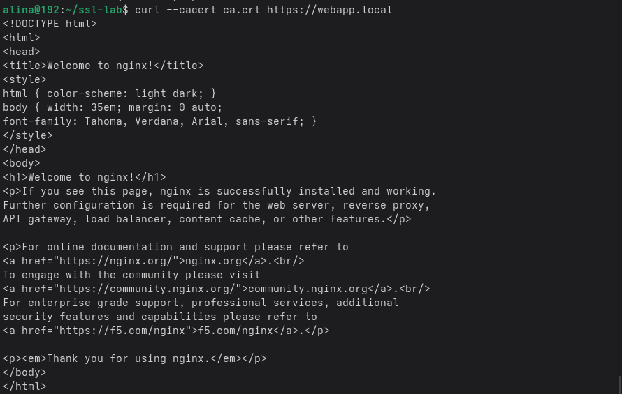

**`Практика 7`**

Команда `kubectl auth can-i list pods -n rbac-demo --as=system:serviceaccount:rbac-demo:app-reader` — проверяет можно ли от имени сервисаккаунт эпп ридер читать поды в наймспейсе рбак демо

вывод yes потому что мы разрешили это в ролях в файле rbac.yaml (мы там прописали list)

Команда `kubectl auth can-i delete pods -n rbac-demo --as=system:serviceaccount:rbac-demo:app-reader` - проверяет можно ли удалять поды в этом неймспейсе

ответ нет потому что опять же в файле rbac.yaml мы это не прописали

Команда `kubectl exec frontend -- wget database-svc` - проверяет может ли под фронтенд подключиться к database-svc

не работает потому что в NetworkPolicy мы запретили от фронтенда этот ход

Команда `kubectl exec backend -- wget database-svc` - проверяет может ли под бекенд подключиться к database-svc

работает потому что в NetworkPolicy мы разрешили бекенду этот ход

Команда `openssl verify -CAfile ca.crt webapp.crt` - проверяет доверяет ли ca.crt сертификату веб-сервера webapp.crt

Команда `curl --cacert ca.crt https://webapp.local` - проверяет HTTPS с моим сертификатом ca.crt

