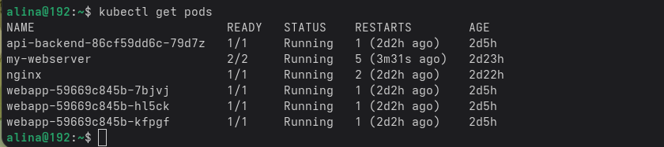
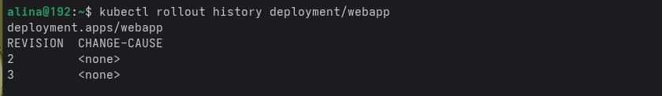
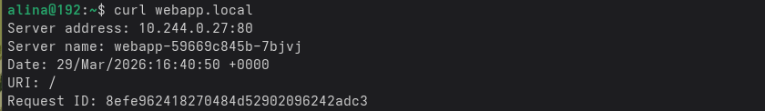
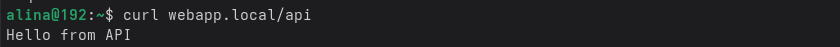
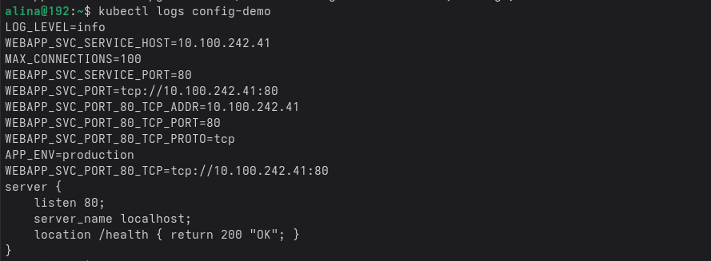
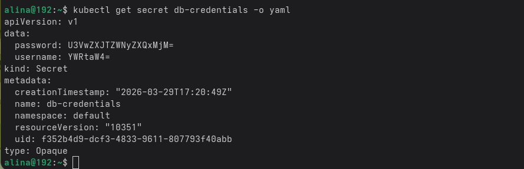
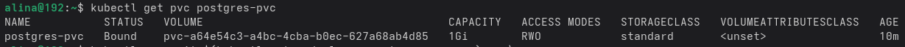
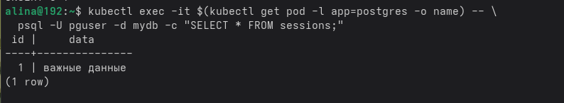

**`Практика 5`**

Команда `kubectl get pods` — отображает все поды и там три нижних это созданные

Команда `kubectl rollout history deployment/webapp` - показывает все обновления которые были командой kubectl set image deployment/webapp webapp=nginxdemos/hello:latest

Команда `curl webapp.local` - отправляет запрос на нгнкс и выводит апйшник и имя (у меня сначала ничего не заработало но я потом сделала minikube addons enable ingress от это и все получилось(просто это было наспиано не очень заметно я не сразу понла шо это надо выполнять))

Команда `curl webapp.local/api` - это отправляет запрос на бекенд сервера и выводит другое потому что без апи было на фронтенд

**Объяснить: в чём разница ClusterIP и NodePort**

кластерапи доступен токо внутри кластера и к нему обращаются только другие поды, но не я, а нодепорт это тот же кластерапи, но к нему можно обращаться снаружи через :номер порта

**`Практика 6`**

Команда `kubectl logs config-demo` — показывает способы передачи внутрь контейнера, которые задавлись туда когда я создавала файл конфиг мэп

Команда `kubectl get secret db-credentials -o yaml` - показывает информаицю в файле ямл для объекта сикрет, который нужен для хранения всяких разных данных секретных в кодировке! base64, не шифровании

Команда `kubectl get pvc postgres-pvc` - показывает статус пвс, а пвс это запрос для определенного чего то на место на диске

и оно показывает статус боунд, что значит что постгресу одобрили этот гиг на диске

Команда `kubectl exec -it $(kubectl get pod -l app=postgres -o name) -- \
  psql -U pguser -d mydb -c "SELECT * FROM sessions;"` - наличие чего либо в выводе доказывает что данные сохранились после удаления и не потерялися

**`Практика 7`**

Команда `kubectl auth can-i list pods -n rbac-demo --as=system:serviceaccount:rbac-demo:app-reader` — проверяет можно ли от имени сервисаккаунт эпп ридер читать поды в наймспейсе рбак демо

вывод yes потому что мы разрешили это в ролях в файле rbac.yaml (мы там прописали list)

Команда `kubectl auth can-i delete pods -n rbac-demo --as=system:serviceaccount:rbac-demo:app-reader` - проверяет можно ли удалять поды в этом неймспейсе

ответ нет потому что опять же в файле rbac.yaml мы это не прописали

Команда `kubectl exec frontend -- wget database-svc` - проверяет может ли под фронтенд подключиться к database-svc

не работает потому что в NetworkPolicy мы запретили от фронтенда этот ход

Команда `kubectl exec backend -- wget database-svc` - проверяет может ли под бекенд подключиться к database-svc

работает потому что в NetworkPolicy мы разрешили бекенду этот ход

Команда `openssl verify -CAfile ca.crt webapp.crt` - проверяет доверяет ли ca.crt сертификату веб-сервера webapp.crt

Команда `curl --cacert ca.crt https://webapp.local` - проверяет HTTPS с моим сертификатом ca.crt

