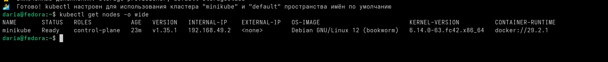
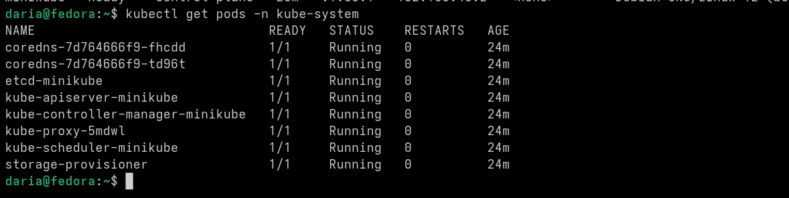
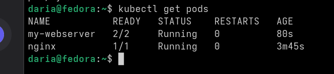
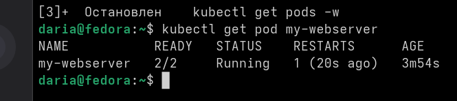

Сначала я проверила, работает ли сам кластер. Команда kubectl get nodes показала,
что все узлы в статусе Ready.

Потом проверила системные сервисы через kubectl get pods -n kube-system.
Все системные поды в статусе Running, ошибок нет.

Мои приложения тоже запустились: поды nginx и my-webserver тоже в статусе Running.

Потом я специально «убила» под my-webserver. Kubernetes сам его перезапустил. 
Когда я проверила его статус командой kubectl get pod my-webserver, увидела, что счетчик RESTARTS стал больше нуля. Это значит, что под действительно перезагружался после сбоя.

