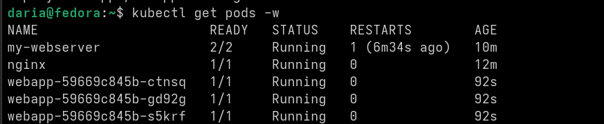
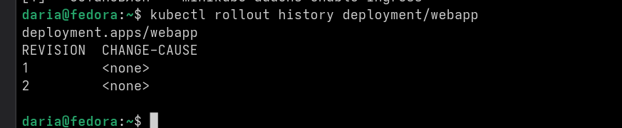
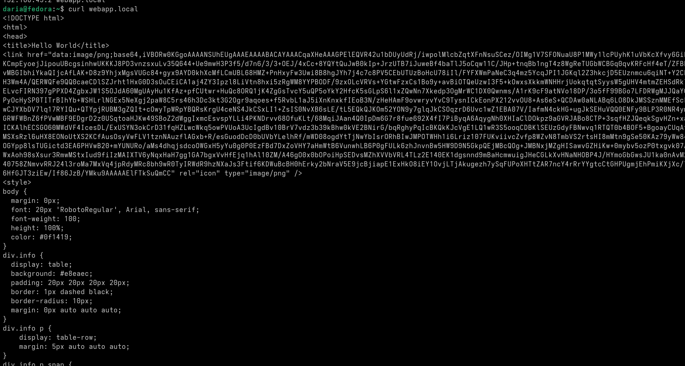
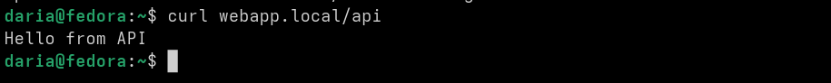

Сначала я делала деплоймент на три реплики. Написала yaml-файл, но он не сработал, потому что я накосячила с  отступами. Исправила файл и запустила, все три пода поднялись. Потом сделала обновление версии через set image, поды менялись по одному и сайт не ложился. Потом откатилась назад через rollout undo, всё вернулось как было.

Дальше делала сервис для доступа снаружи. Сделала тип NodePort и открыла порт 30080. Проверила через curl в цикле, видно что запросы ходят на разные поды. Тут всё получилось сразу, приложение доступно по IP и порту.

Дальше настраивала Ingress. Включила аддон в minikube, создала второй сервис для API. Написала правила: / - основное приложение, /api - API-сервис. Добавила webapp.local в /etc/hosts. В итоге всё работает и все вообще эшкере.

