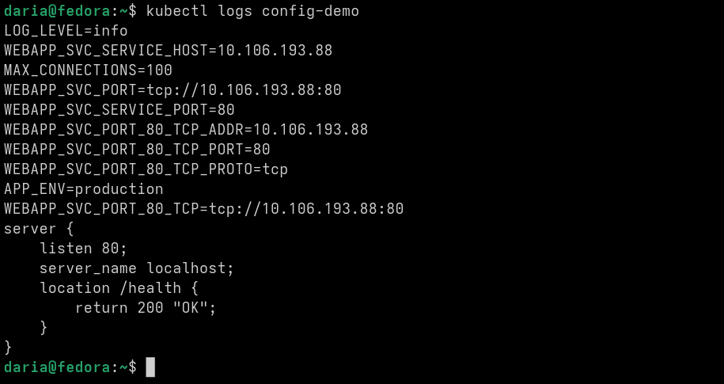
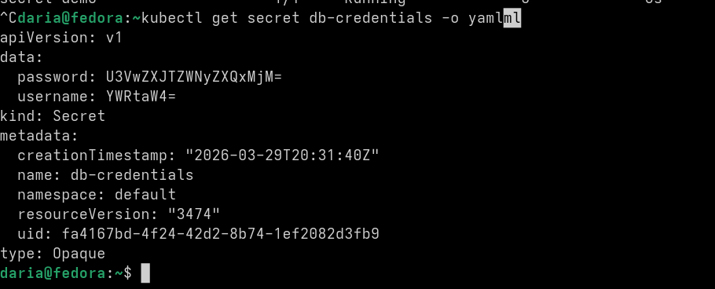
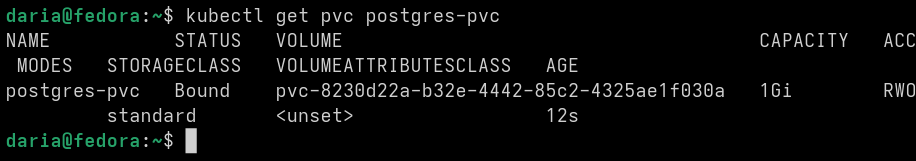
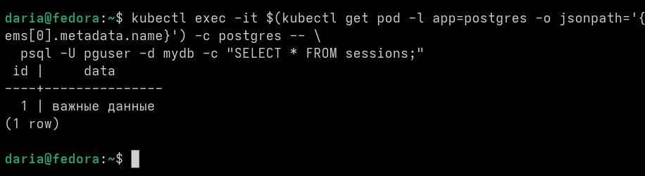

Сначала проверяла ConfigMap, посмотрела логи через kubectl logs config-demo. Все три способа передачи конфигурации сработали сразу: переменные окружения подхватились, аргументы командной строки передались, файлы через volume смонтировались в нужную папку. Никаких ошибок не возникло.

Потом смотрела Secret командой kubectl get secret db-credentials -o yaml. В выводе видно, что пароль и имя пользователя закодированы в base64, это не обычный текст а зашифрованная строка. Так и должно быть для секретов, чтобы данные не хранились в открытом виде. Дальше проверяла PVC через kubectl get pvc postgres-pvc, статус сразу стал Bound, значит том успешно привязался к поду и место выделено.

В конце проверяла сохранение данных. Удалила под с базой данных командой kubectl delete pod, кубернетес автоматически создал новый. Зашла внутрь нового пода и сделала SELECT запрос в базу, все данные остались на месте.

