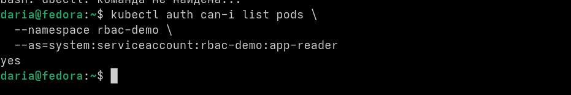
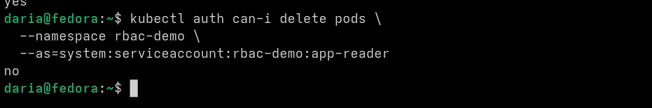
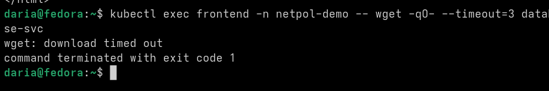
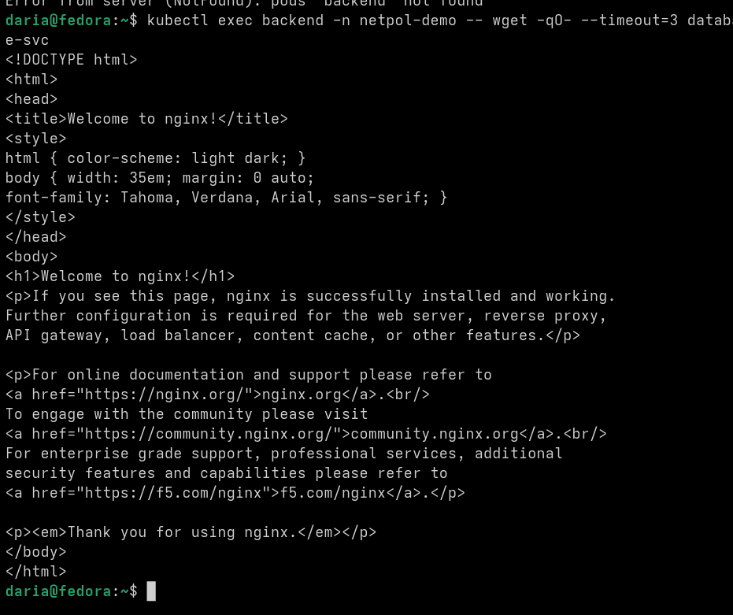
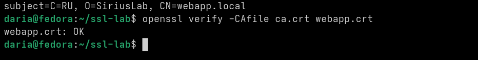
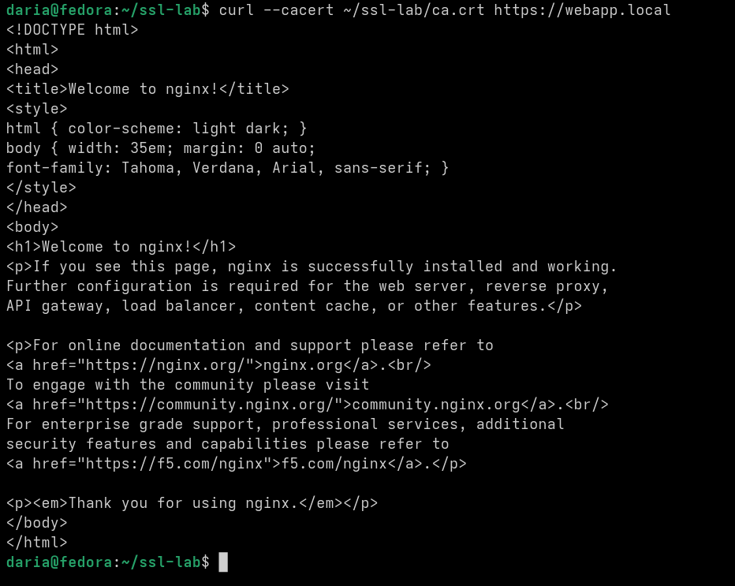

ого, последняя лаба на сегодня)))

Ну кароче, сначала разбиралась с RBAC и правами доступа. Проверяла через kubectl auth can-i что может делать service account. Оказалось что аккаунт app-reader может читать поды (list pods → yes), но не может их удалять (delete pods → no).

Потом настраивала NetworkPolicy для контроля сетевого трафика. Проверяла через wget из разных подов. Из frontend пода запрос к database-svc ушел в timeout — политика заблокировала соединение. А из backend пода тот же запрос вернулся с 200 OK — этому поду разрешен доступ к базе. 

Дальше работала с TLS сертификатами. Сгенерировала CA сертификат и подписала им сертификат для webapp. Проверила через openssl verify. Потом сделала curl с флагом --cacert на https://webapp.local и получила ответ от nginx. HTTPS работает, соединение зашифровано.

если честно, это была самая сложная, но интересная лаба. Сложная потому что пришлось разбираться сразу с тремя разными темами безопасности. NetworkPolicy вообще с первого раза не заработала (я очень психовала и хотела выкинуть ноут, но с помощью одногрупников + gemini + сила интернета, я поняла че не так (правда на это я потратила больше часа)). 

Но интересная потому что теперь в целом понимаю как в кубернетесе защищают приложения от несанкционированного доступа и как работает HTTPS на уровне сертификатов. На этом все, эшкере, я спать.

