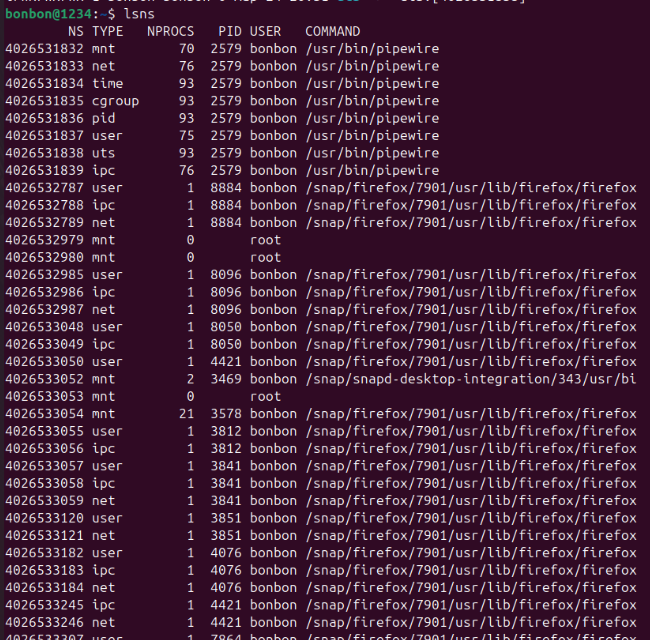
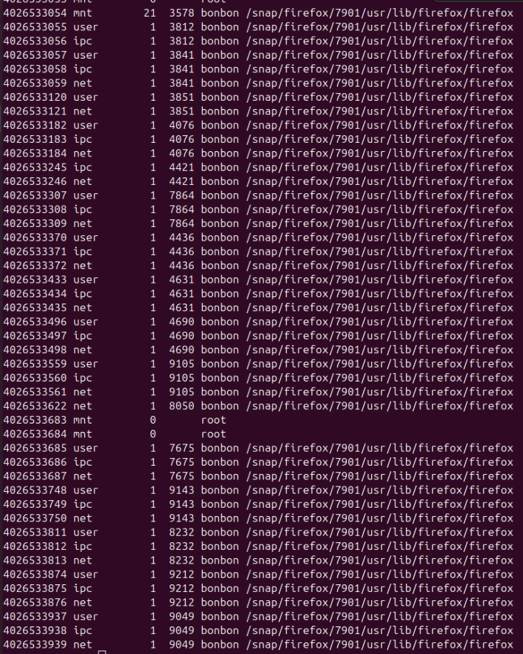
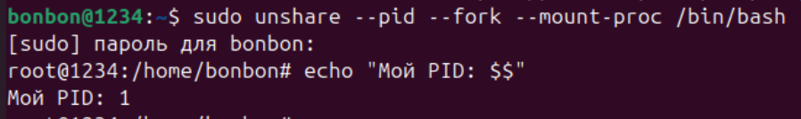
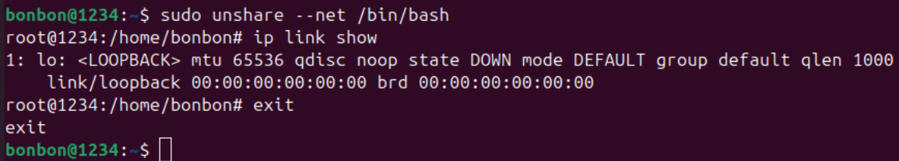
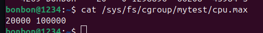
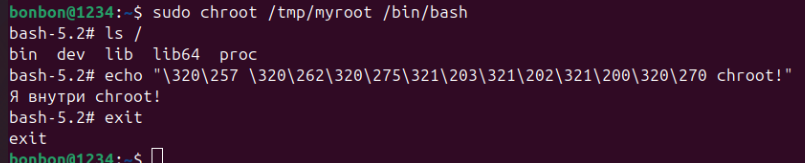

# Пара 1 — Linux-основы контейнеризации
lsns — список namespace-ов системы.

Вывод всех пространств имен показывает сводную таблицу всех активных пространств имен.
Фильтрация по типам: можно просматривать только определенные типы (например, только сетевые).
Просмотр процессов показывает, какой PID находится внутри какого пространства имен.

PID 1 — это самый первый процесс (инициализации), запускаемый ядром Linux при загрузке системы. Он является «родителем» для всех остальных процессов в системе. PID 1 управляет запуском служб, системой инициализации и корректно завершает «осиротевшие» процессы:

ip link в новом NET namespace. Запустив процесс во вложенном network namespace, можем быть уверены, что он изолирован от остальной системы в том, что касается сети. Процесс может общаться только через loopback. Это означает, что он может общаться только с процессами, которые также являются членами пространства, но в настоящее время других таких процессов нет (и, во имя изолированности, мы хотели бы, чтобы так и оставалось), так что он немного одинок.

Команда "cat /sys/fs/cgroup/mytest/cpu.max" выводит ограничения на использование процессорного времени (CPU) для группы процессов
mytest в cgroup v2. Формат max (обычно $quota \ period$) показывает, сколько микросекунд (
) процессы могут использовать за определенный период (
= 100 000 мкс по умолчанию). 

20000 100000 означает, что группа может использовать максимум 20% одного ядра CPU (20 000 мкс из 100 000).
    max (значение по умолчанию): Нет ограничений, процессы используют CPU свободно.

ls / внутри chroot:

## Контрольные вопросы:
При превышении лимита памяти (RAM) процесс, вызвавший перерасход,
будет принудительно завершен механизмом ядра Linux — OOM Killer (Out of Memory Killer), чтобы предотвратить зависание всей системы. Это вызывает ошибку OOMKilled (код 137), часто приводящую к перезапуску контейнера или падению приложения.

Когда делается exit в “внутреннем” bash, это завершает текущий процесс, но в мире PID-namespaces могут оставаться другие процессы. namespaces изолируют, но не “заменяют” процессы на хосте автоматически и не убивают их при выходе из одной оболочки.