# Docker: образы, Dockerfile, запуск
# Блок 1 — Первый Dockerfile
Создаём простое Flask-приложение:
mkdir ~/docker-lab && cd ~/docker-lab. Далее создаем файл app.py:
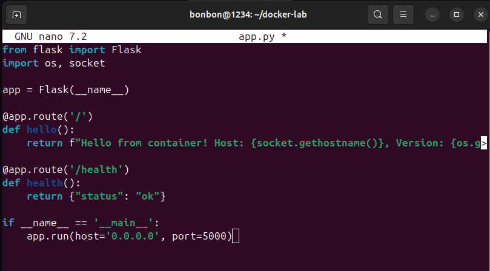
Затем создаем файл requirements.txt:
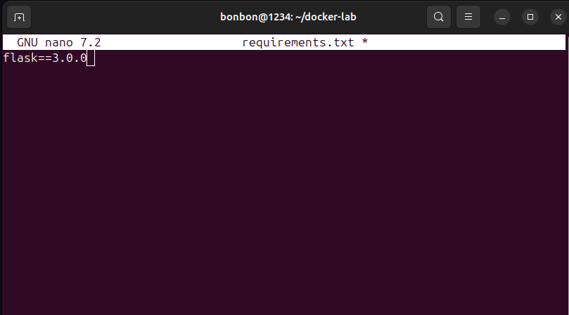
Создаем плохой Dockerfile:
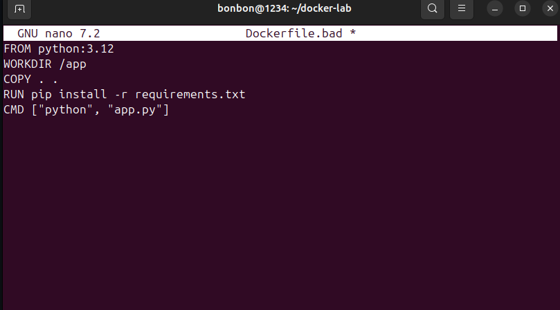
Команда "docker build -t myapp:bad ." - собирает Docker-образ из Dockerfile в текущей директории.
Команда "docker images myapp" показывает список образов, отфильтрованных по имени myapp.
Выводит таблицу с репозиторием, тегом, ID, размером и временем создания.
"docker run -d -p 5000:5000 --name app-bad myapp:bad" - запускает контейнер из образа myapp:bad.
"curl localhost:5000" - отправляет HTTP GET-запрос на локальный сервер по порту 5000.
Проверяет, что приложение внутри контейнера запустилось и отвечает на запросы.
# Блок 2 — Multistage build
Создаем хороший докер и файл .dockerignore:
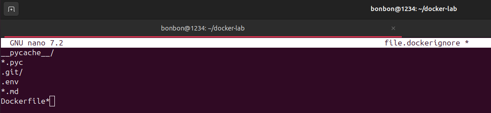
 Команда "docker build -t myapp:good ." собирает Docker-образ с тегом good из Dockerfile в текущей директории.
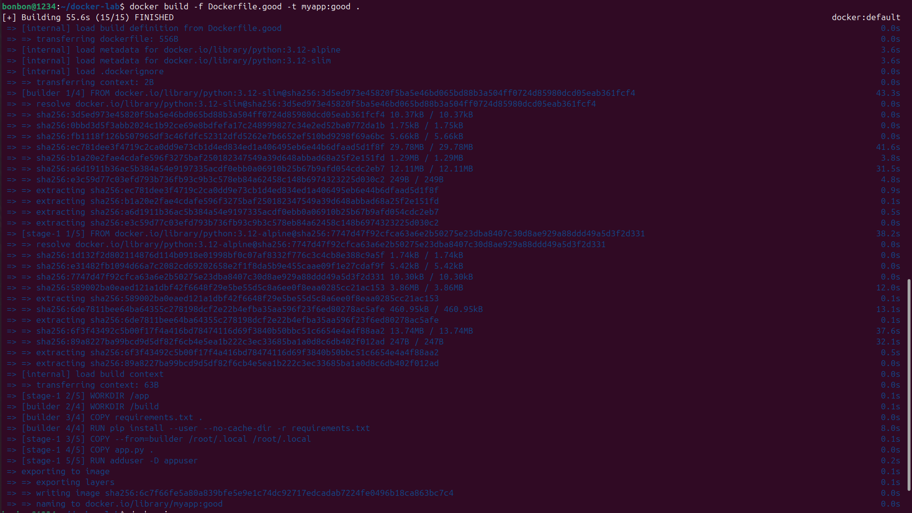
docker images myapp показывает список образов с именем myapp.
Сравнивает размеры образов myapp:bad и myapp:good, чтобы увидеть разницу в оптимизации.
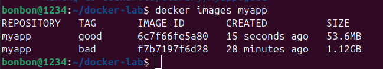
"docker run -d \" запускает контейнер в фоновом режиме (флаг -d).
Обратный слеш \ позволяет перенести команду на следующую строку для удобства чтения.
"-p 5001:5000" пробрасывает порты: порт 5001 на хосте → порт 5000 в контейнере.
Теперь приложение доступно по адресу localhost:5001.
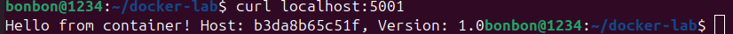
"docker stats app-good" показывает статистику использования ресурсов контейнера в реальном времени:
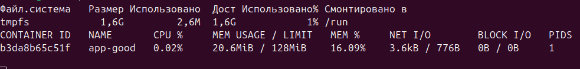
# Блок 3 — Исследование образа
docker history — показывает слои, из которых собран образ.

Каждая строка — это один слой (layer) Docker-образа. Слои складываются друг на друга как стопка, и каждый слой добавляет изменения к предыдущему.
myapp:bad использует тяжелый базовый образ Debian (120 МБ) и устанавливает Python дважды — сначала через apt-get (что тянет кучу системных зависимотей и оставляет кэш пакетов), а потом еще раз через wget из исходников (еще 68 МБ), плюс три отдельные команды apt-get создают три слоя с кэшем, который никогда не очищается. В myapp:good используется минималистичный Alpine Linux (всего 8 МБ), Python ставится один раз через apk, а флаг --no-cache-dir при установке pip-пакетов и удаление кэша apk после установки гарантируют, что в образ не попадает ничего лишнего.

Плюсы myapp:good: маленький размер (быстрая загрузка и развертывание), меньше поверхность для атак из-за минимального набора утилит, запуск от непривилегированного пользователя (безопасность), меньше слоев и чистая история сборки, экономия места на диске и памяти при запуске. Минусы myapp:good: Alpine использует musl libc вместо glibc, поэтому некоторые Python-пакеты с C-расширениями могут требовать дополнительной компиляции или вовсе не работать.

Плюсы myapp:bad  совместимость — Debian с glibc гарантирует, что практически любые Python-пакеты будут работать без проблем, и для отладки внутри контейнера есть все стандартные утилиты Linux. Минусы myapp:bad: огромный размер (1 ГБ+) — долгая загрузка, трата места на диске, медленный старт контейнеров, запуск от root (дыра в безопасности), дублирование установки Python, множество слоев с кэшем, который никогда не чистится, и потенциальный перерасход ресурсов на хосте.
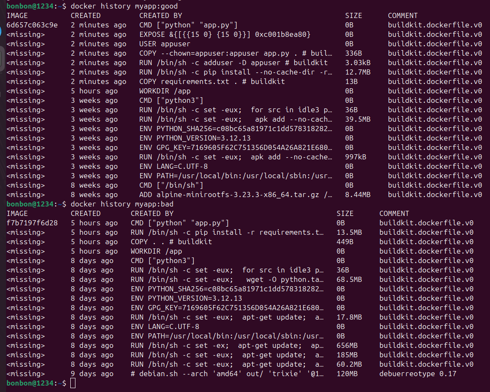
docker inspect myapp:good | jq '.[]|RootFS' — показывает слои файловой системы образа

Эта команда выводит структуру слоев (layers), из которых состоит образ myapp:good.
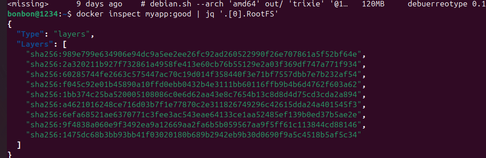
Установить dive для визуализации слоёв - wget -q https://github.com/wagoodman/dive/releases/download/v0.12.0/dive_0.12.0_linux_amd64.deb
sudo dpkg -i dive_0.12.0_linux_amd64.deb
dive myapp:good
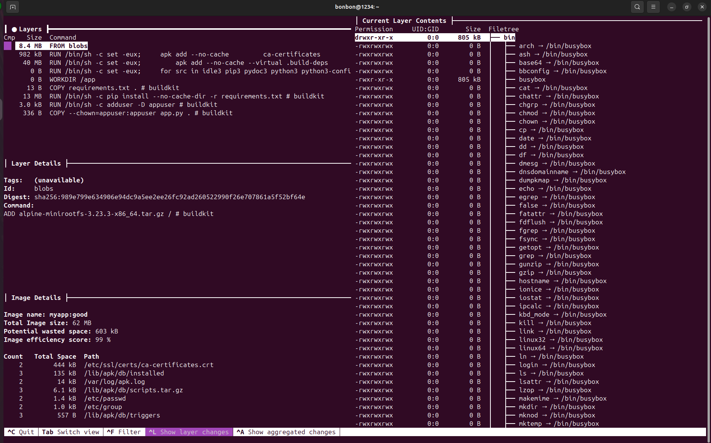
Посмотреть что внутри контейнера (без его запуска) - docker create --name inspect-me myapp:good
docker export inspect-me | tar -tv | head -30
docker rm inspect-me
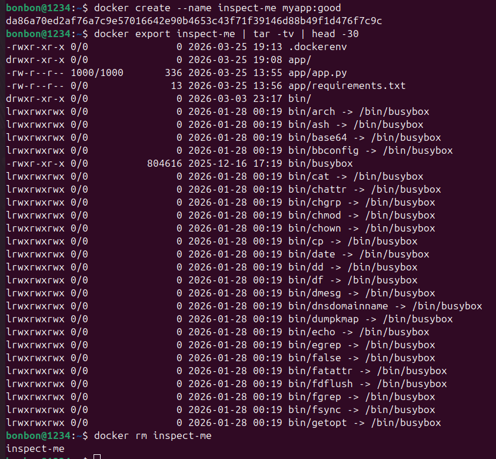
 # Блок 4 — Docker Hub
"docker pull kabanoshvili/flask-demo:v1.0" - скачивает Docker-образ из реестра (Docker Hub) с указанным именем и тегом.
Запускает контейнер из скачанного образа.
"curl localhost:5002" - отправляет HTTP GET-запрос на localhost:5002.
 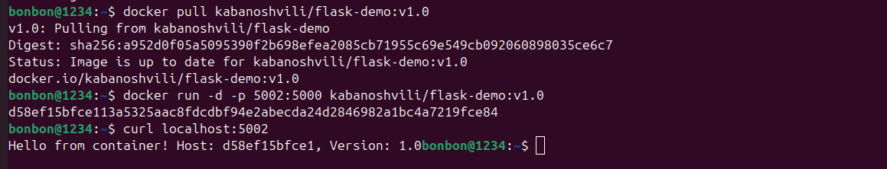
 Проверка на наличие докера на самом сайте:
 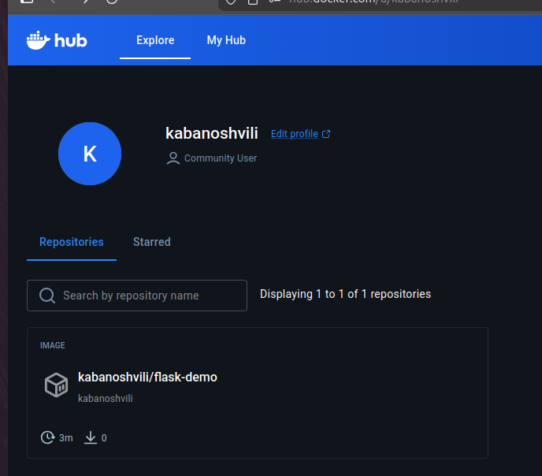
URL образа на Docker Hub:
 https://hub.docker.com/r/kabanoshvili/flask-demo