# Пара 3 — Docker: сети, volumes, docker-compose
## Блок 1 — Docker networking
Команда docker network ls показывает список сетей.

"Команда docker network inspect bridge" показывает подробности о сети bridge.
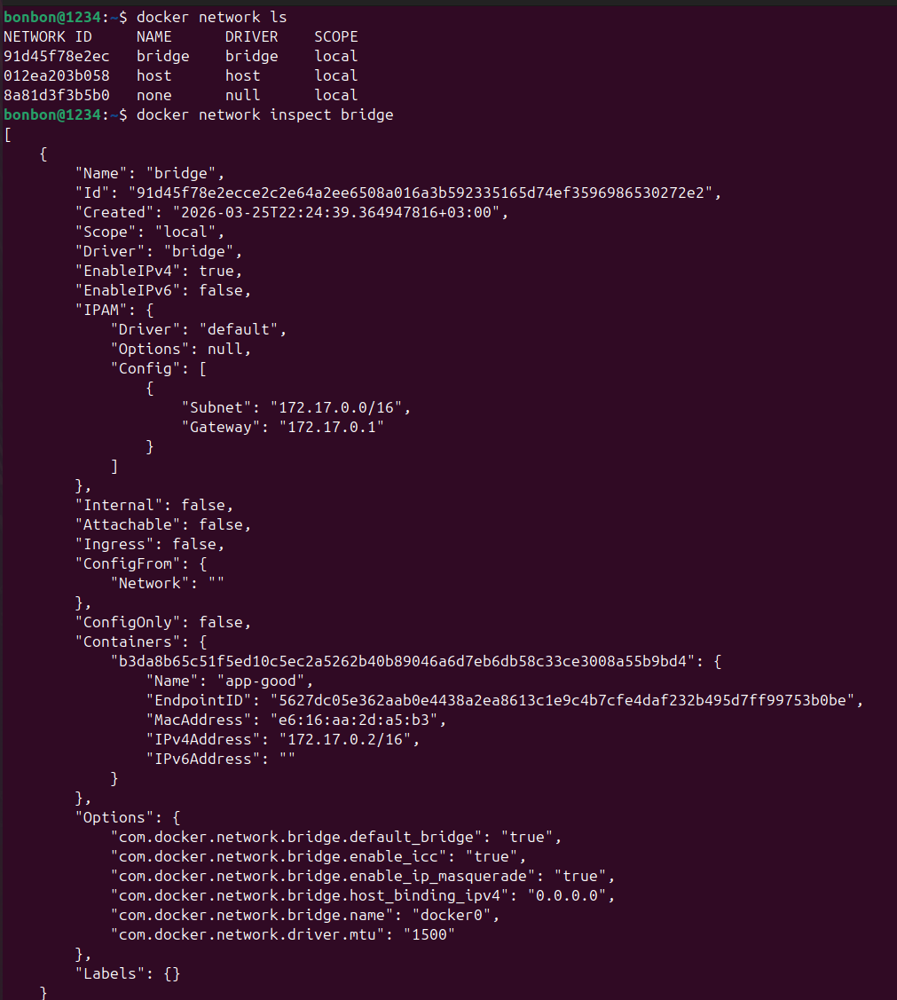

С помощью команды "docker network create --driver bridge app-network" была создана новая сеть с именем app-network и используется драйвер bridge.

Команда "docker run -d --name db --network app-network \
  -e POSTGRES_PASSWORD=secret \
  postgres:16-alpine" запускает контейнер баз данных.
  
  Контейнер с PostgreSQL запущен и доступен в сети app-network по имени db.
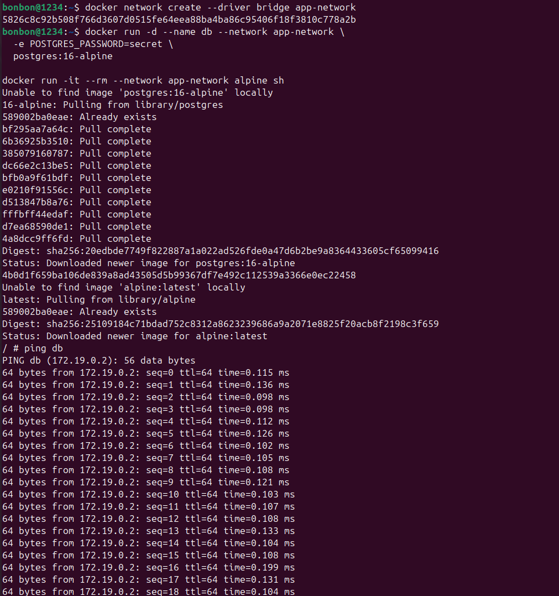
Проверка связи через ping внутри alpine: "ping db".
Проверка порта через сетевой интсрумент netcat с использованием стандартного порта PostgreSQL: "nc -zv db 5432".
"db (172.19.0.2:5432) open" команда подтверждает, что контейнер db доступен, PostgreSQL слушает на порту 5432 и соединение может быть установлено.
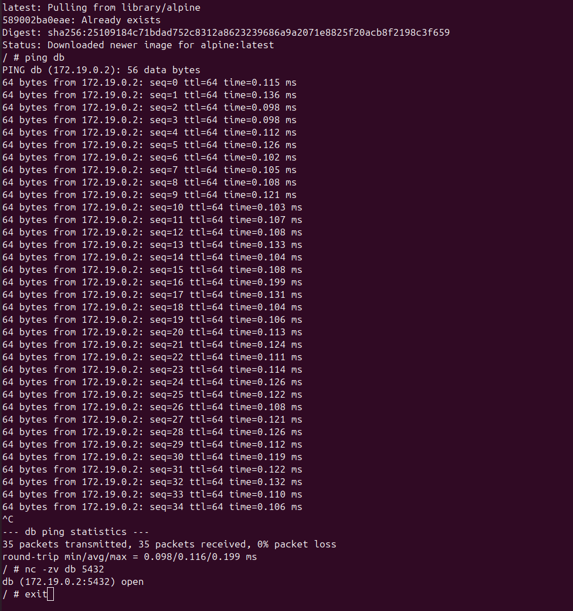
Команда не сработала, потому что контейнер alpine запущен без подключения к сети, где находится контейнер db: "docker run -it --rm alpine ping db".
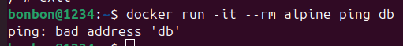
## Блок 2 — Volumes и persistent data
С помощью команды "docker volume create pgdata" был создан именованный том pgdata, докер выделил место на хосте для хранения данных.Том можно использовать в нескольких контейнерах.
Проверка с помощью команды "docker volume ls".

Запуск первого контейнера с подключением тома:
docker run -d \
  --name postgres-persistent \
  -e POSTGRES_DB=mydb \
  -e POSTGRES_USER=user \
  -e POSTGRES_PASSWORD=pass \
  -v pgdata:/var/lib/postgresql/data \
  postgres:16-alpine
  
  Том pgdata подключается к папке /var/lib/postgresql/data — именно там PostgreSQL хранит свои данные.

  Создание данных внутри контейнера:
docker exec -it postgres-persistent psql -U user -d mydb -c \
"CREATE TABLE items (id SERIAL, name TEXT); INSERT INTO items VALUES (1, 'test');"

 В контейнере выполняется SQL-команда.
 Создается таблица items.
 Вставляется запись (1, 'test').

 Удаление контейнера: docker rm -f postgres-persistent.

Контейнер удален, но том pgdata остался, а значит данные не потеряны.

Запуск нового контейнера с тем же томом:
docker run -d \
  --name postgres-restored \
  -e POSTGRES_DB=mydb \
  -e POSTGRES_USER=user \
  -e POSTGRES_PASSWORD=pass \
  -v pgdata:/var/lib/postgresql/data \
  postgres:16-alpine

Новый контейнер запускается с тем же томом pgdata.

PSQL видит существующие данные (файлы БД уже есть).

В отличие от первого запуска, PSQL не создает новую БД, а использует существующую.

Проверка сохранности данных: "docker exec postgres-restored psql -U user -d mydb -c "SELECT * FROM items;""

Данные сохранились, несмотря на удаление первого контейнера, таблица и записи остались.

Информация о томе:
"docker volume inspect pgdata"
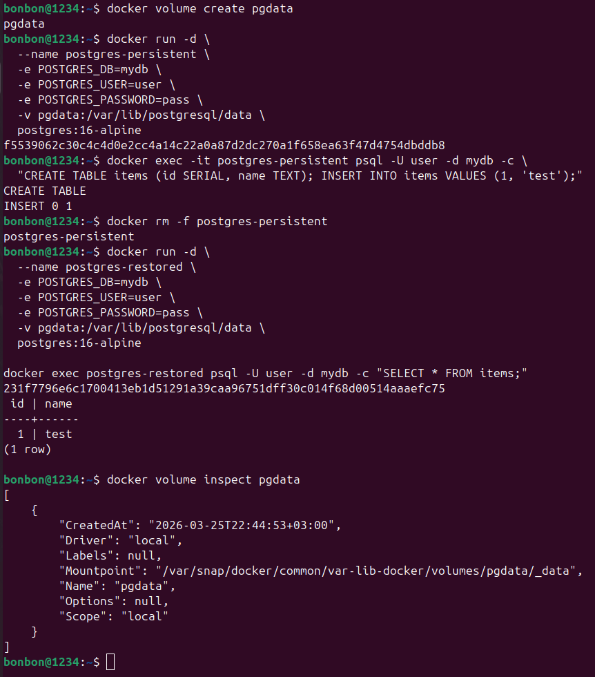
## Блок 3 — docker-compose
Код для бэкенд-приложения на Flask, которое подключается к базе данных PSQL и возвращает данные из таблицы items через REST API:
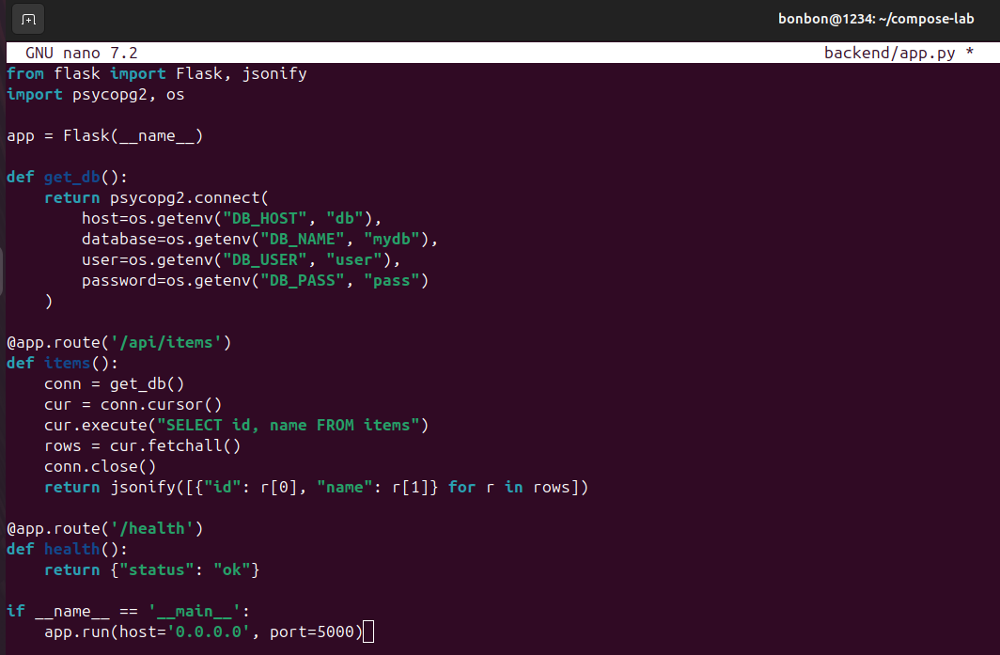
Код для файла зависимостей Python, который содержит список пакетов, необходимых для работы Flask-приложения:
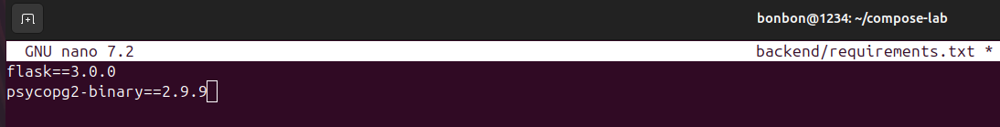
Код для Dockerfile, который описывает, как собрать образ для Flask-приложения:
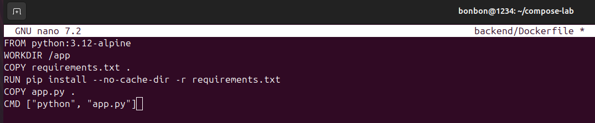
Код для файла Nginx, который работает как обратный прокси и фронтенд-сервер:
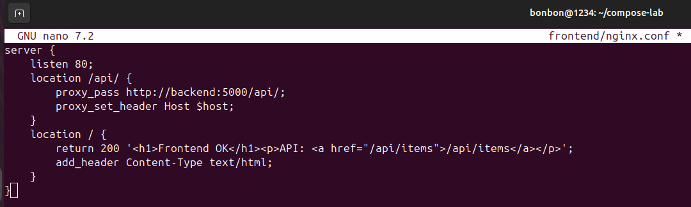
Код для файла Docker Compose, который описывает все сервисы приложения и их взаимодействие.
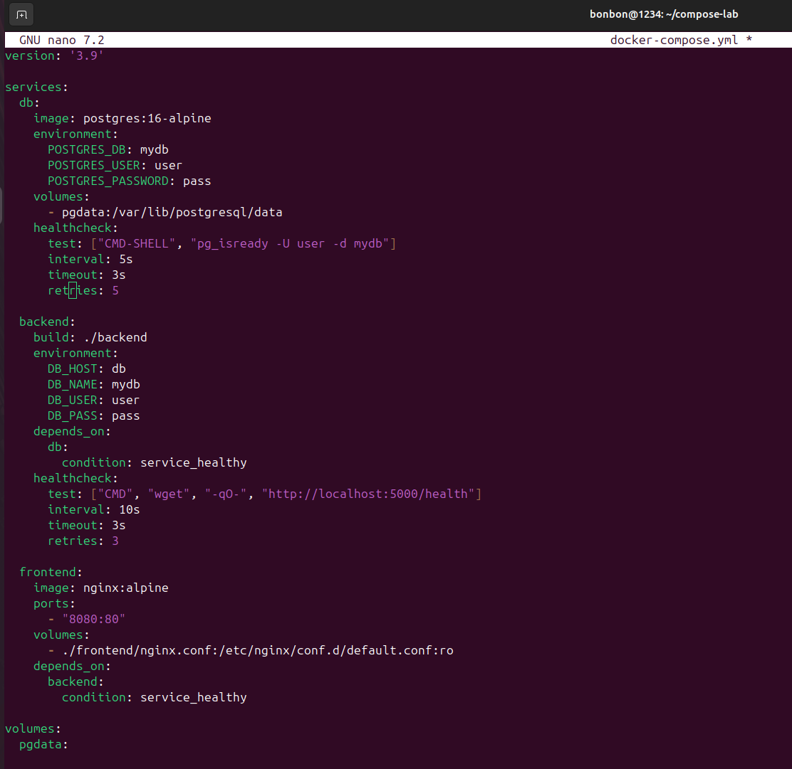
Запуск с пересборкой: "docker compose up -d --build"
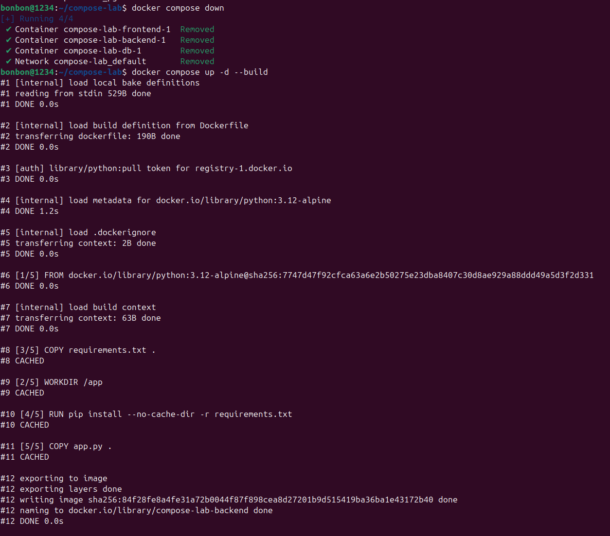
Все контейнеры запустились корректно:
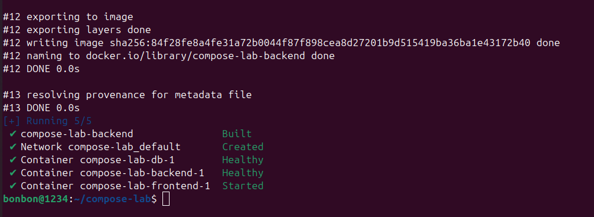
Следить за состоянием:
docker compose ps
docker compose logs -f
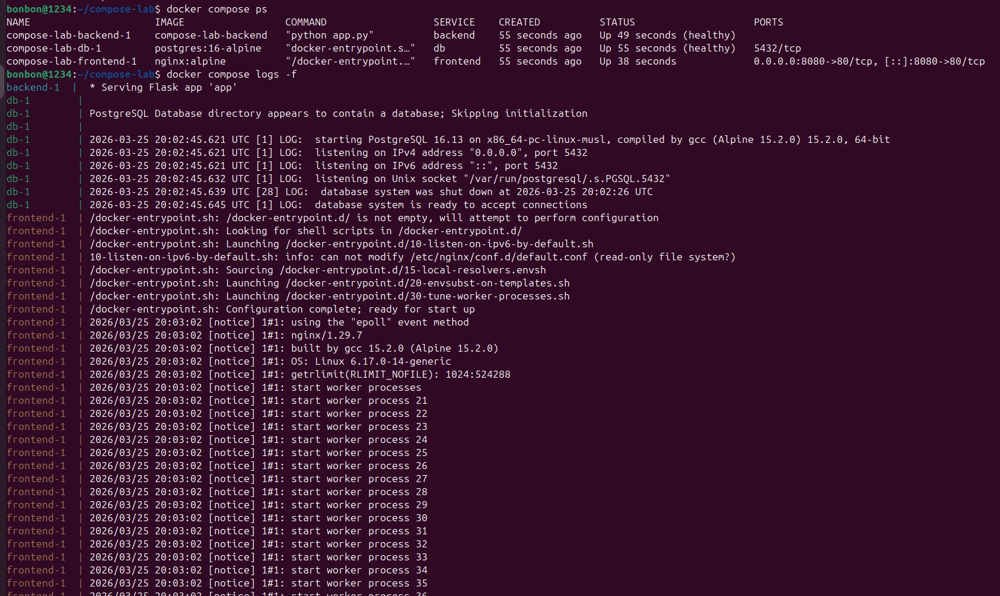
Создана таблица items и добавлены 3 записи.
Проверить цепочку: "curl localhost:8080/api/items".
Масштабирование backend (горизонтальное масштабирование):
"docker compose up -d --scale backend=3".
Остановка всех контейнеров: "docker compose down".
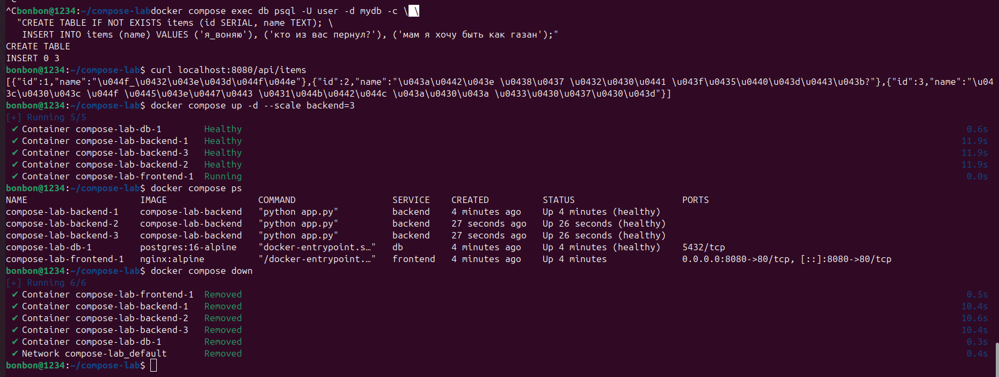
## Блок 4 — Итог
Просмотр томов: "docker volume ls".
Удаление compose-проекта с томом: "docker compose down -v".
Очистка системы: "docker system prune -f".
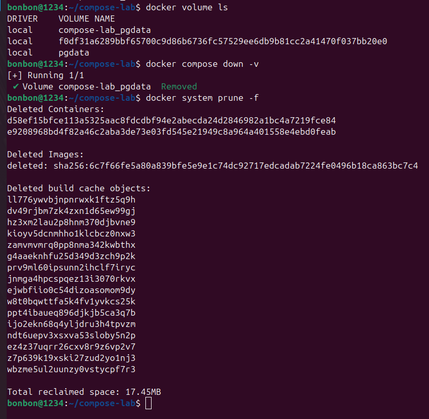