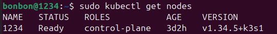
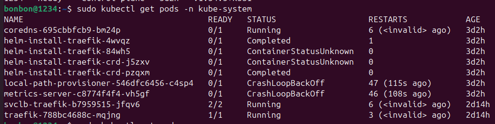
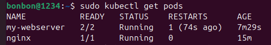
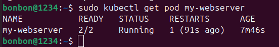

# Пара 4 — Kubernetes: установка кластера, первые поды
Состояние кластера Kubernetes. Команда "kubectl get nodes" показывает все узлы (ноды), которые есть в кластере. 

Имеется один нод с именем "1234", который находится в статусе "READY", это значит, что нода готова принимать поды. "control-plane" -	это главный (управляющий) узел, который управляет кластером:

Команда "kubectl get pods -n kube-system" показывает системные поды Kubernetes. Эти поды обеспечивают работу кластера (DNS, маршрутизацию, хранение, метрики).

coredns	Running - DNS внутри кластера. 

helm-install-traefik* - установщики Traefik (Ingress-контроллера). Они должны выполниться один раз и завершиться. 

local-path-provisioner - создаёт диски для подов. Падает и постоянно перезапускается.

metrics-server - собирает метрики (CPU/память). Падает и постоянно перезапускается.

svclb-traefik	-	Балансировщик нагрузки для Traefik. Работает нормально.

traefik	Running	- Ingress-контроллер (маршрутизация внешнего трафика). Работает нормально.

Команда "kubectl get pods" показывает все поды в пространстве.

В поде my-webserver оба контейнера работают.
В поде nginx работает один контейнер.

Команда "sudo kubectl get pod my-webserver" показывает состояние пода my-webserver.Счётчик RESTARTS увеличился до 1, что подтверждает автоматический перезапуск контейнера после его падения:

## Контрольные вопросы:
1.Какие поды в kube-system всегда должны быть Running?
kube-apiserver,
kube-controller-manager,
kube-scheduler,
etcd.

2.Почему Pod не удалился, а перезапустился? Кто за это отвечает?
kubelet отвечает за перезапуск контейнеров внутри пода. Сам под не удаляется, потому что политика перезапуска предписывает восстанавливать контейнер, а не удалять под.